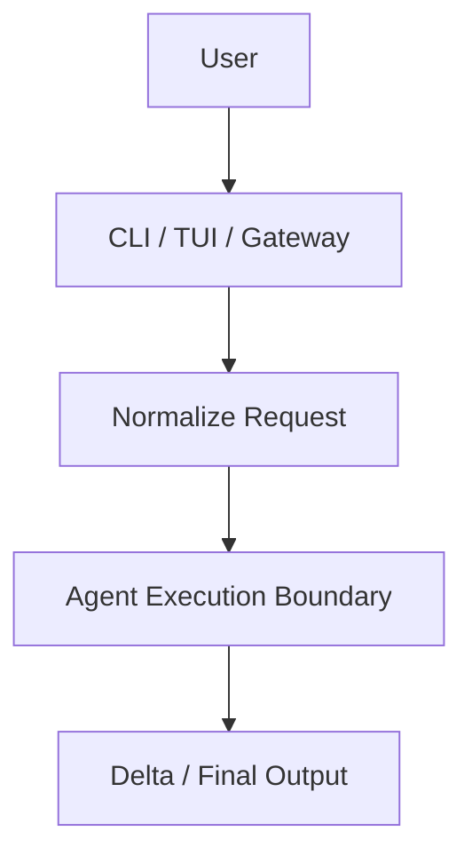
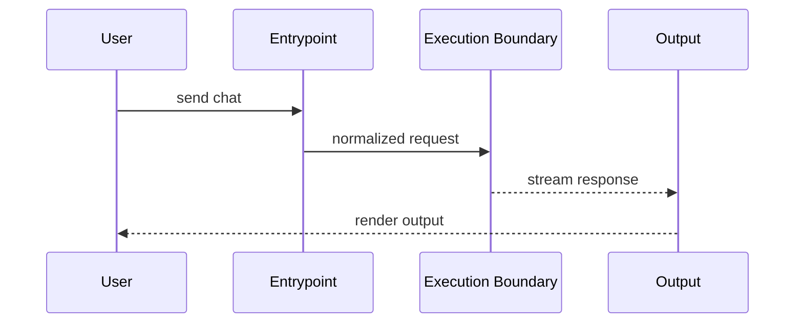

# Run A Chat Session

這個主題聚焦一個最核心的問題：一次 OpenClaw 聊天互動，是怎麼從使用者入口一路走到 agent 執行與回傳結果。

## 為什麼先讀這個

- 它是其他大多數功能的母流程
- 後續的 approval、provider、session、plugins 幾乎都會掛在這條路徑上

## 使用者入口

- CLI chat 類命令
- TUI 送出的 chat request
- Gateway 接到的 remote ingress

## 對應子系統

- [Entrypoints And CLI](../../subsystems/01-entrypoints-and-cli/README.md)
- [Agent Execution Pipeline](../../subsystems/03-agent-execution-pipeline/README.md)

## Mermaid 圖

## 文件目標

後續應補齊：

- 真實入口檔
- 控制路徑
- 決定行為的 runtime 模組
- session / payload 來源
- 錯誤與防呆點
- 對應測試
- 改寫風險

## 建議章節

- 功能入口
- 控制路徑
- 主要狀態與資料結構
- 設定面
- 測試與證據
- 版本演進
- 先讀哪些檔案

## 尚待補完

- 需以實際 source code 追出一條完整 chat path

## 版本異動紀錄

| 版本 | revision | 異動摘要 | 證據入口 |
|------|------|------|------|
| 尚待補完 | 尚待補完 | 尚待補完 | 尚待補完 |