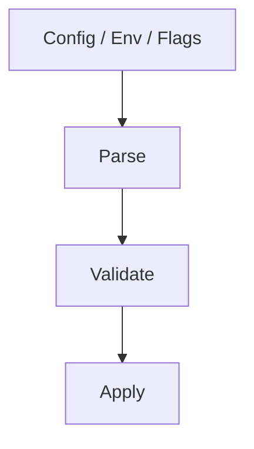
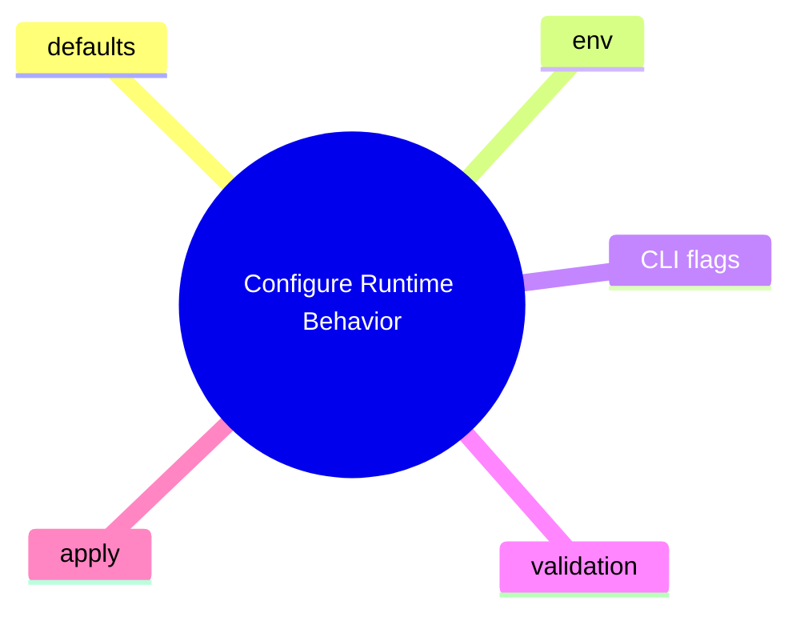

# Configure Runtime Behavior

這個主題聚焦設定系統怎麼影響實際執行結果，而不是只列 config 名詞。

## 要回答的問題

- config、env、CLI flags、runtime override 哪個優先
- 預設值在哪裡定義
- 哪一層做 parse / validate / apply
- 哪些設定只影響新 session，哪些會影響既有流程

## 對應子系統

- [Config And Runtime Policy](../../subsystems/02-config-and-runtime-policy/README.md)

## Mermaid 圖

## 後續應補內容

- 真實 config 入口檔
- 覆寫鏈表格
- 錯誤處理位置
- 高風險相依與互斥條件
- 測試證據

## 尚待補完

- 尚未建立穩定的 config feature-to-code map

## 版本異動紀錄

| 版本 | revision | 異動摘要 | 證據入口 |
|------|------|------|------|
| 尚待補完 | 尚待補完 | 尚待補完 | 尚待補完 |