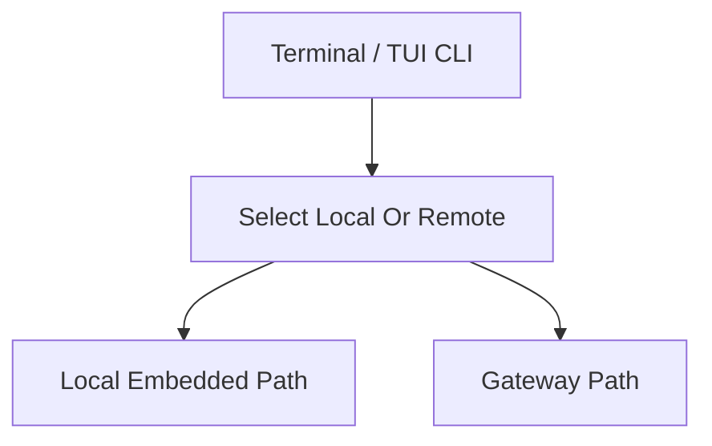
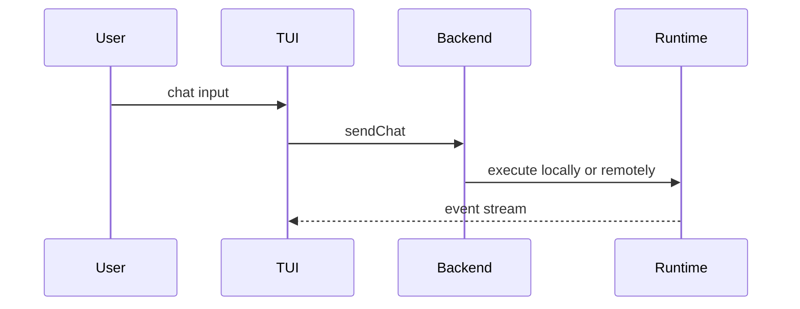

# Use Local TUI And Terminal Chat

這個主題聚焦本地 terminal / TUI 模式，尤其是 embedded mode 如何不依賴 gateway 直接執行。

## 要回答的問題

- `tui` / `terminal` 命令從哪裡進來
- local mode 與 remote mode 在哪一層分流
- 本地模式如何接上 agent runtime
- plugin approval gate 是否仍然生效

## 對應子系統

- [Entrypoints And CLI](../../subsystems/01-entrypoints-and-cli/README.md)
- [Agent Execution Pipeline](../../subsystems/03-agent-execution-pipeline/README.md)

## Mermaid 圖

## 已知線索

- [v2026.4.23/README.md](../../v2026.4.23/README.md)
- [v2026.4.23/core-modules.md](../../v2026.4.23/core-modules.md)
- [v2026.4.23/architecture.md](../../v2026.4.23/architecture.md)

## 尚待補完

- 需補測試與 docs 對照

## 版本異動紀錄

| 版本 | revision | 異動摘要 | 證據入口 |
|------|------|------|------|
| v2026.4.23 | 尚待補完 | local embedded TUI path partially analyzed | [v2026.4.23/core-modules.md](../../v2026.4.23/core-modules.md) |