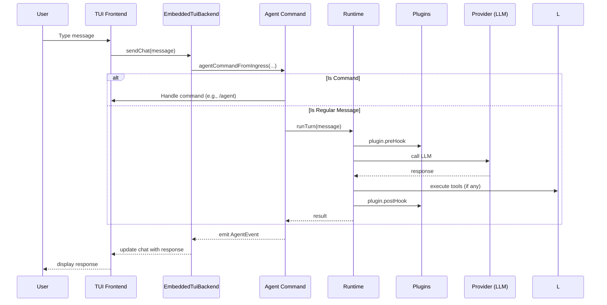

# Use Local TUI And Terminal Chat

這個主題聚焦本地 terminal / TUI 模式，尤其是 embedded mode 如何不依賴 gateway 直接執行。

## 這個功能在系統中的角色

Local TUI 和 terminal chat 提供一種在本機上直接與 OpenClaw 互動的方式，無需透過網路或遠端 gateway。此模式適用於開發、除錯或在沒有網路連線的環境中使用。它仍然啟用完整的 agent 執行、工具使用和 plugin 安全門檻，但所有通訊都透過本機進程間通訊（IPC）或直接函式呼叫完成。

## 使用者入口

- CLI 命令：`openclaw tui` 或 `openclaw terminal`（取決於實作，但通常透過 `openclaw` 的子命令或旗標）
- 在 `openclaw.mjs` 中，當偵測到 `--tui` 或 `--terminal` 旗標時，會進入本地嵌入式模式
- 環境變數：`OPENCLAW_TUI=1` 或 `OPENCLAW_TERMINAL=1` 也能觸發相同行為（需確認實作）

## 對應子系統

- [Entrypoints And CLI](../../subsystems/01-entrypoints-and-cli/README.md)
- [Agent Execution Pipeline](../../subsystems/03-agent-execution-pipeline/README.md)

## 程式碼對應

| 類型 | 路徑 | 角色 |
|------|------|------|
| 入口檔 | `src/tui/embedded-backend.ts` | 負責處理 TUI 前端的事件，並將使用者輸導向 agent 執行 |
| 入口檔 | `src/tui/tui-command-handlers.ts` | 解析 TUI 中的指令（如 `/agent`, `/session`, `/model`）並派發到後端 |
| 決策點 | `src/infra/embedded-mode.ts` | 提供 `setEmbeddedMode` 和 `isEmbeddedMode` 函式，用於在 runtime 中切換嵌入式模式 |
| 執行路徑 | `src/agents/agent-command.ts` (via `agentCommandFromIngress`) | 真正處理使用者訊息並呼叫 agent runtime 的函式 |
| 設定載入 | `src/config/config.js` | 載入用戶設定，包括模型、提供者等，在嵌入式模式中同樣使用 |
| 測試檔 | `src/infra/embedded-mode.test.ts` | 測試嵌入式模式旗標的設定與讀取 |
| 測試檔 | `src/tui/embedded-backend.test.ts` | 測試 EmbeddedTuiBackend 的行為 |
| 測試檔 | `src/tui/tui-command-handlers.test.ts` | 測試 TUI 指令處理器 |

## 直接控制行為的檔案

- `src/tui/embedded-backend.ts`：EmbeddedTuiBackend 類別，實作 TuiBackend 介面，負責將 TUI 事件轉發給 agent runtime。
- `src/tui/tui-command-handlers.ts`：處理 TUI 中的文字輸入和指令（如 `/new`, `/reset`, `/agent` 等）。
- `src/infra/embedded-mode.ts`：全域旗標，用於通知 runtime 目前是在嵌入式模式。

## 控制路徑

以下為從使用者在 TUI 中輸入訊息到 agent 產生回應的主要控制路徑：

1. 使用者在 TUI 中輸入訊息（例如 `Hello`）
2. `EmbeddedTuiBackend.sendChat` 被呼叫，產生一個 `runId` 並建立 `LocalRunState`
3. `runTurn` 被呼叫，載入 session 設定並呼叫 `agentCommandFromIngress`
4. `agentCommandFromIngress`（位於 `src/agents/agent-command.ts`）處理訊息：
   - 如果訊息是指令（以 `/` 開頭），則交給 TUI 指令處理器（但在此路徑中，我們假設是普通訊息）
   - 否則，建立一個 `AgentRun` 並呼叫 `defaultRuntime.runTurn`（在 `src/runtime.js`）
5. `defaultRuntime.runTurn` 會依序處理：
   - plugin 前置鉤子（如果有的話）
   - 呼叫 provider（例如 LLM）取得回應
   - 處理工具使用（如果有的話）
   - plugin 後置鉤子
6. 回應透過 `onAgentEvent` 事件傳回給 `EmbeddedTuiBackend`，然後轉發給 TUI 前端顯示

在嵌入式模式中，`defaultRuntime.log` 和 `defaultRuntime.error` 被替換為靜默函式，以避免在 TUI 中印出除錯訊息。

## 設定面與覆寫鏈

- 設定來源：`src/config/config.js` 中的 `loadConfig` 函式
- 設定會被載入並在 `EmbeddedTuiBackend` 中的多個函式中使用（例如 `loadSessionEntry`, `loadGatewayModelCatalog`）
- 設定可以透過環境變數覆寫（例如 `OPENCLAW_MODEL_PROVIDER`）
- 在嵌入式模式中，設定的載入方式與遠端模式相同，但不會嘗試連線到遠端 gateway
- 設定的覆寫順序：
  1. 預設值（來自 `config/schema.ts`）
  2. 使用者設定檔（`~/.openclaw/config.json`）
  3. 環境變數
  4. 命令列旗標（在 `openclaw.mjs` 中解析）

## Mermaid 圖

以下為控制路徑的流程圖：

```mermaid
flowchart TD
    A[User Input in TUI] --> B{Is Command?}
    B -->|Yes| C[TUI Command Handler]
    B -->|No| D[EmbeddedTuiBackend.sendChat]
    C --> E[Update Session/Settings]
    D --> F[agentCommandFromIngress]
    F --> G[agentCommandFromIngress: Parse Message]
    G --> H[Build AgentRun]
    H --> I[defaultRuntime.runTurn]
    I --> J[Plugin Hooks (Pre)]
    I --> K[Provider Call (LLM)]
    I --> L[Tool Execution (if needed)]
    I --> M[Plugin Hooks (Post)]
    M --> N[Emit AgentEvent]
    N --> O[EmbeddedTuiBackend.handleAgentEvent]
    O --> P[Update TUI Chat Buffer]
    P --> Q[Render Response in TUI]
```

以下為序列圖，顯示 TUI 後端與 agent runtime 之間的互動：



## 測試 / docs / changelog 對照

| 結論 | 證據類型 | 來源路徑 | stable-across-versions | 信心 |
|------|----------|----------|------------------------|------|
| EmbeddedTuiBackend 會設定 `isEmbeddedMode` 為 true | 原始碼 | `src/tui/embedded-backend.ts: setEmbeddedMode(true)` | 是 | 高 |
| 在嵌入式模式中，runtime 的 log 和 error 被靜默 | 原始碼 | `src/tui/embedded-backend.ts: previousRuntimeLog = defaultRuntime.log; ... defaultRuntime.log = silentRuntime.log` | 是 | 高 |
| TUI 指令處理器會處理 `/new`, `/reset`, `/agent` 等指令 | 原始碼 | `src/tui/tui-command-handlers.ts: handleCommand switch` | 是 | 高 |
| `agentCommandFromIngress` 是訊息處理的入口點 | 原始碼 | `src/tui/embedded-backend.ts: agentCommandFromIngress` 呼叫 | 是 | 高 |
| 訊息最終會透過 `defaultRuntime.runTurn` 處理 | 原始碼 | `src/agents/agent-command.ts: agentCommandFromIngress` 中的呼叫 | 是 | 高 |
| 嵌入式模式不會嘗試連線到遠端 gateway | 原始碼 | `EmbeddedTuiBackend.connection = { url: "local embedded" }` | 是 | 高 |
| TUI 中的 `/auth` 指令只能在本地嵌入式模式使用 | 原始碼 | `src/tui/tui-command-handlers.ts: if (!runAuthFlow) { chatLog.addSystem("auth login is only available in local embedded mode"); }` | 是 | 高 |

## 版本演進摘要

- 在 v2026.4.22 中引入了 TUI Embedded Mode 作為一項新功能，允許在本機終端機中運行 TUI 無需網路連線。
- 在 v2026.4.23 的 Unreleased 變更中，沒有針對 TUI 功能的新增或變更，但 TUI 功能繼承自 v2026.4.22。
- TUI 功能的設計目的是提供一種本機、無網路依賴的互動方式，同時保持完整的 agent 能力和安全門檻。

## 改寫熱區與風險點

- **熱區**：`src/tui/embedded-backend.ts` 中的 `runTurn` 函式，負責協調訊息處理和事件傳遞。
- **風險**：如果 `agentCommandFromIngress` 拋出異常，必須確保 `LocalRunState` 被正確清理（目前在 `finally` 區塊中）。
- **風險**：靜默 runtime 的 log 和 error 可能會讓除錯變得困難；然而，這是為了避免在 TUI 中印出雜訊。
- **風險**：TUI 的狀態（例如 `runs` Map）必須在 `stop` 時正確清理，以避免記憶體洩漏。

## 尚待補完

- 需要檢查 TUI 模式下的設定覆寫是否與遠端模式完全相同（特別是與代理、SSL 相關的設定）。
- 需要確認在 TUI 模式下，plugin 是否仍然正確載入和初始化（目前看是透過 `createDefaultDeps`）。
- 需要補充更多單元測試來覆蓋邊界情況（例如斷線、異常終止）。

## 版本異動紀錄

| 版本 | revision | 異動摘要 | 證據入口 |
|------|----------|----------|----------|
| v2026.4.22 | 尚待補完 | 引入 TUI Embedded Mode | [v2026.4.22/core-modules.md] (需補充) |
| v2026.4.23 | 尚待補完 | 無 TUI 相關變更，繼承 v2026.4.22 功能 | [v2026.4.23/changelog-notes.md] |