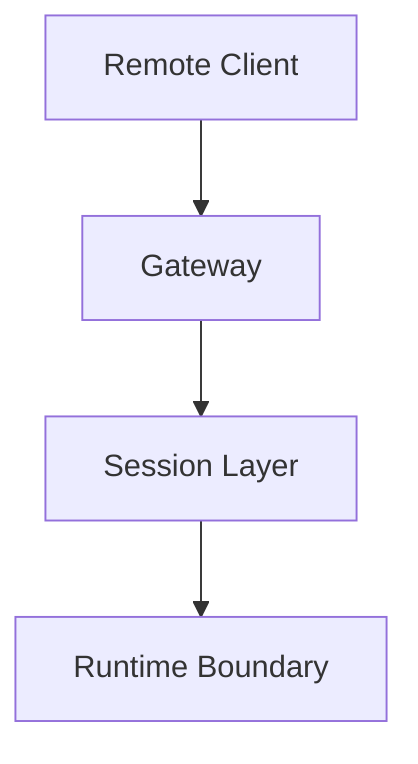
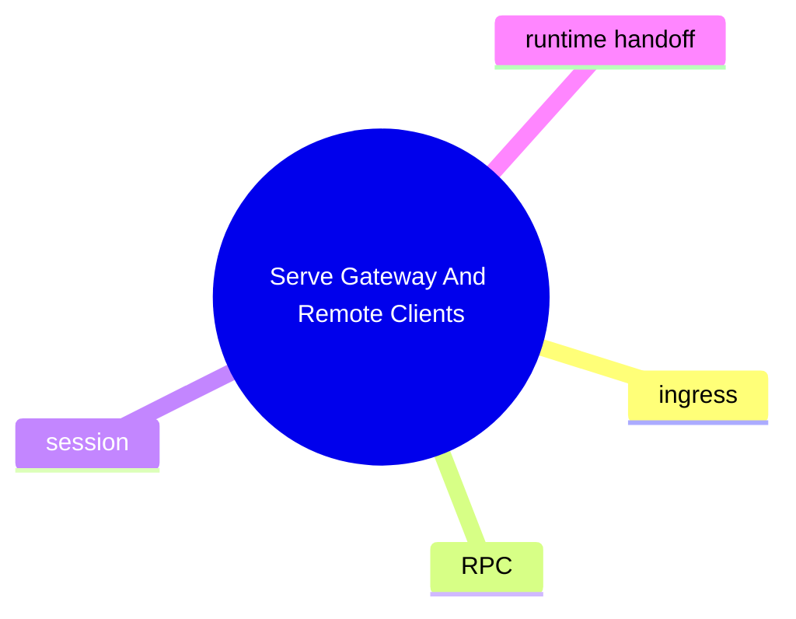

# Serve Gateway And Remote Clients

這個主題聚焦 remote client 如何透過 gateway 進入 OpenClaw，以及 session、RPC、ingress 和後端執行如何接起來。

## 要回答的問題

- gateway 入口在哪裡
- remote request 怎麼被轉成 agent command
- session patch / load / persist 哪裡發生
- 哪些模組只是傳輸層，哪些才是控制點

## 對應子系統

- [Gateway And Remote Transport](../../subsystems/04-gateway-and-remote-transport/README.md)

## Mermaid 圖

## 尚待補完

- 需建立 gateway 主流程圖與版本差異表

## 版本異動紀錄

| 版本 | revision | 異動摘要 | 證據入口 |
|------|------|------|------|
| 尚待補完 | 尚待補完 | 尚待補完 | 尚待補完 |