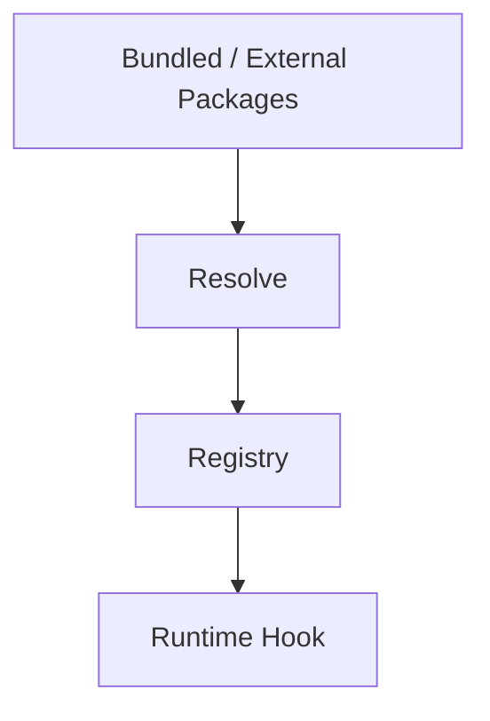
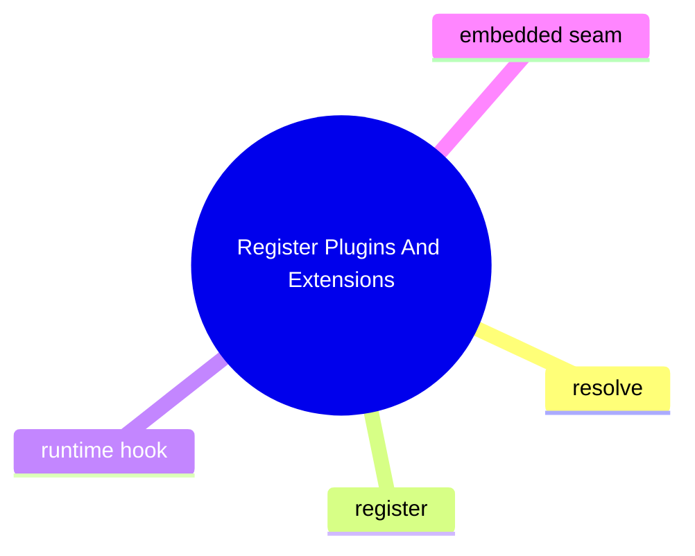

# Register Plugins And Extensions

這個主題聚焦擴充能力如何被接入，而不是抽象地說「有 plugin system」。

## 要回答的問題

- plugin registry 在哪裡
- extension contract / SDK seam 在哪裡定義
- runtime 如何發現和載入 plugin
- 哪些類型的 extension 會影響 chat、tool、provider、embedded run

## 對應子系統

- [Plugin And Extension Runtime](../../subsystems/07-plugin-and-extension-runtime/README.md)

## Mermaid 圖

## 尚待補完

- 需補 feature slice 對應的真實控制路徑

## 版本異動紀錄

| 版本 | revision | 異動摘要 | 證據入口 |
|------|------|------|------|
| v2026.4.23 | 尚待補完 | plugin resolution startup fix identified | [v2026.4.23/README.md](../../v2026.4.23/README.md) |