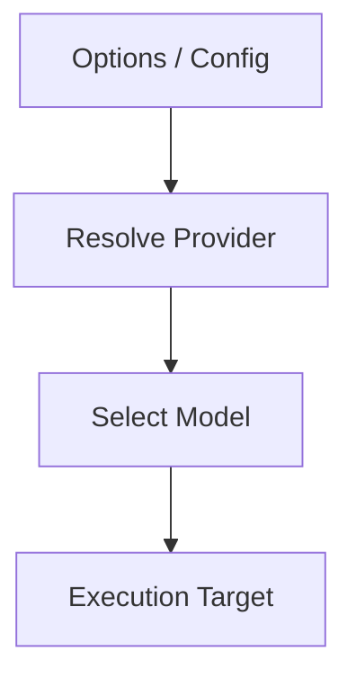
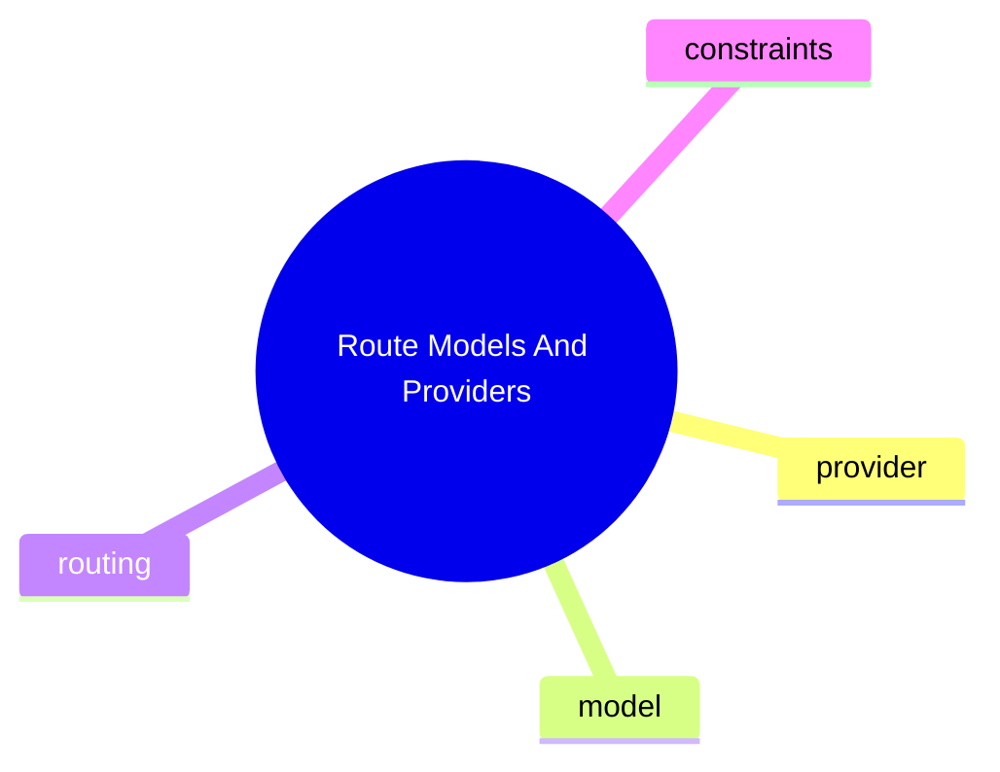

# Route Models And Providers

這個主題聚焦 provider / model 如何被選取與套用到實際執行，不是列供應商名單。

## 要回答的問題

- provider 選擇在哪裡做
- model listing 與 execution routing 是否在同一層
- config 如何影響 provider resolution
- fallback、限制或安全邊界在哪裡

## 對應子系統

- [Provider And Model Routing](../../subsystems/06-provider-and-model-routing/README.md)

## Mermaid 圖

## 尚待補完

- 需補 provider routing 的實作入口與測試證據

## 版本異動紀錄

| 版本 | revision | 異動摘要 | 證據入口 |
|------|------|------|------|
| 尚待補完 | 尚待補完 | 尚待補完 | 尚待補完 |