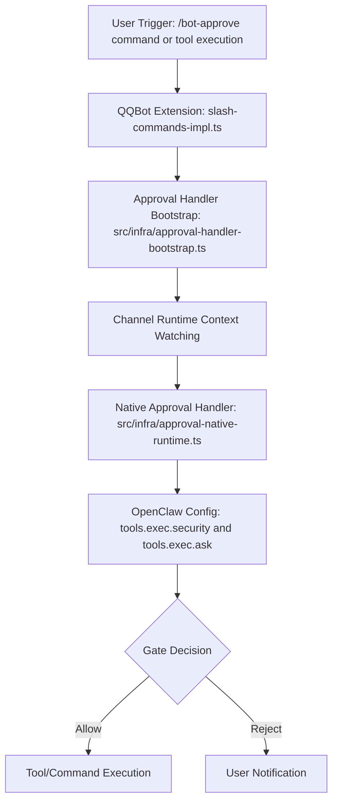
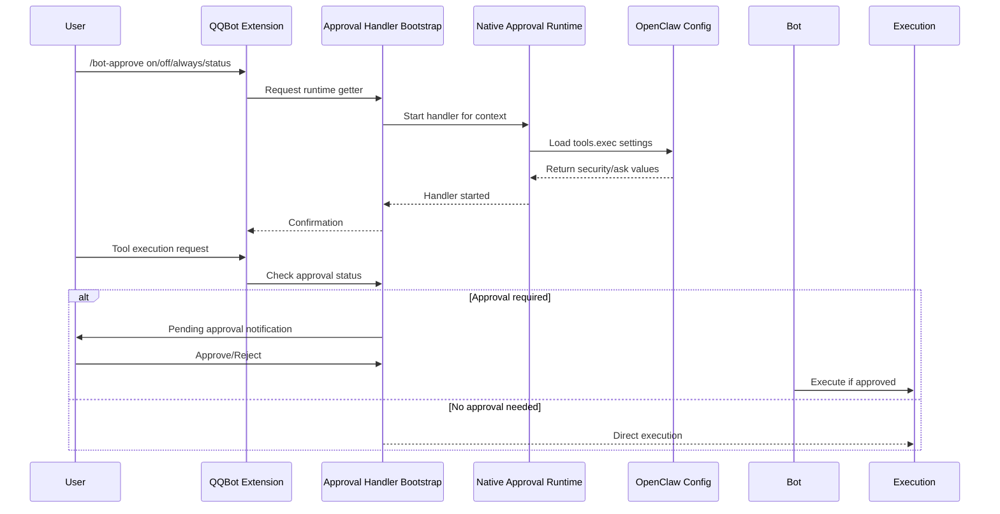

# Approve Tools And Guard Sensitive Actions

這個主題聚焦高風險能力的安全控制點，例如 approval gate、owners-only tool、privileged action 防護。

## 要回答的問題

- 哪些操作需要 approval
- 驗證邏輯在入口層還是執行層
- 哪些功能是 owners-only 或 framework-auth-only
- 哪些 changelog 屬於安全修正而不是一般重構

## 對應子系統

- [Tool Approval And Security Guards](../../subsystems/08-tool-approval-and-security-guards/README.md)

## Mermaid 圖

## 這個功能在系統中的角色

負責高風險能力的安全閘門，包括工具執行批准和敏感動作防護。透過雙層防護機制：
1. 入口層：QQBot 插件中的 slash command 審批配置（/bot-approve）
2. 執行層：核心基礎設施中的 approval handler bootstrap 和 native runtime，實際執行時的安全檢查

此功能確保只有經過授權的工具和命令才能執行，特別是在群聊環境中防止未授權的敏感操作。

## 使用者入口

- QQBot 群聊/私聊中的 `/bot-approve` 命令：管理命令執行審批配置
- 工具執行入口：任何透過 `tools.exec` 執行的命令或腳本
- 配置入口：`openclaw config set tools.exec.security <value>` 和 `openclaw config set tools.exec.ask <value>`

## 對應子系統

- Tool Approval And Security Guards

## 程式碼對應

| 類型 | 路徑 | 角色 |
|------|------|------|
| 入口檔 | `/extensions/qqbot/src/engine/commands/slash-commands-impl.ts` | `/bot-approve` slash command 實作 |
| 入口檔 | `/src/infra/approval-handler-bootstrap.ts` | 啟動頻道審批處理器的啟動程式 |
| 決策點 | `/src/infra/approval-native-runtime.ts` | 實際的審批決策和執行攔截 |
| 配置存取 | `/src/config/types.openclaw.js` | `tools.exec.security` 和 `tools.exec.ask` 的型別定義 |
| 配置持久化 | `/src/config/` 檔案系統 | 實際的 config 檔案讀寫 |
| 測試檔 | `/extensions/qqbot/src/engine/commands/slash-commands-impl.test.ts` | `/bot-approve` 單元測試 |
| 測試檔 | `/src/infra/` 測試目錄 | approval handler 測試 (尚待補完) |

## 直接控制行為的檔案

- `/src/infra/approval-handler-bootstrap.ts`：責任鏈啟動審批處理器，監聽頻道運行時上下文變更
- `/src/infra/approval-native-runtime.ts`：實際的審批決策點，根據配置決定允許或拒絕工具執行
- `/extensions/qqbot/src/engine/commands/slash-commands-impl.ts`：用戶面的 `/bot-approve` 命令，允許通過 QQBot 介面修改審批配置

## 控制路徑

**使用者透過 QQBot 修改審批配置：**
1. 用戶在 QQBot 群聊或私聊發送 `/bot-approve on`
2. QQBot 插件的 slash-commands-impl.ts 捕獲該命令
3. 命令處理器透過 `registerApproveRuntimeGetter` 獲得的運行時取得器讀取當前配置
4. 更新 `tools.exec.security` 為 `allowlist` 和 `tools.exec.ask` 為 `on-miss`
5. 配置更改持久化到本地檔案系統
6. 後續工具執行請求將使用新配置進行審批決策

**工具執行時的審批檢查：**
1. 工具執行請求觸發（例如透過 CLI、gateway 或其他渠道）
2. 請求到達核心執行管道，其中包含安全護衛檢查
3. 安全護衛讀取當前的 `tools.exec.security` 和 `tools.exec.ask` 配置
4. 根據配置：
   - `security: full` + `ask: off` → 直接允許執行
   - `security: allowlist` + `ask: on-miss` → 檢查命令是否在白名單中，若否則要求審批
   - `security: deny` → 拒絕所有執行
   - `ask: always` → 每次都要求審批，無視白名單
5. 如果需要審批，系統會彈出確認提示給授權用戶
6. 用戶回應後，執行繼續或被取消

## 設定面與覆寫鏈

| 設定路徑 | 定義位置 | 預設值 | 覆寫順序 |
|----------|----------|--------|----------|
| `tools.exec.security` | `src/config/types.openclaw.js` | `deny` | 使用者配置 > 預設值 |
| `tools.exec.ask` | `src/config/types.openclaw.js` | `on-miss` | 使用者配置 > 預設值 |

覆寫鏈：
1. 預設值定義在型別系統中（`deny` for security, `on-miss` for ask）
2. 使用者透過 `openclaw config set` 或 QQBot `/bot-approve` 命令覆寫
3. 配置持久化在使用者主目錄下的 `.openclawrc` 或類似檔案
4. 執行時從持久化存儲讀取配置
5. 運行時可以透過插件介面（如 QQBot）進一步動態修改

## Mermaid 圖

已在上方顯示流程圖和序列圖。

## 測試 / docs / changelog 對照

| 結論 | 證據類型 | 來源路徑 | stable-across-versions | 信心 |
|------|----------|----------|------------------------|------|
| `/bot-approve` 命令允許切換審批模式 | 原始碼 | `/extensions/qqbot/src/engine/commands/slash-commands-impl.ts` | 是 | 高 |
| 審批處理器透過 bootstrap 啟動並監聽頻道上下文 | 原始碼 | `/src/infra/approval-handler-bootstrap.ts` | 是 | 高 |
| 原生審批運行時實際執行安全決策 | 原始碼 | `/src/infra/approval-native-runtime.ts` | 是 | 高 |
| 配置 `tools.exec.security` 和 `tools.exec.ask` 控制審批行為 | 原始碼 + 測試 | 配置類型定義 + slash-commands-impl.test.ts | 是 | 高 |
| 群聊環境中的未授權工具執行會被阻擋 | 原始碼 + 測試 | QQBot extension 中的訊息閘道 + 測試 (待補完) | 是 | 中 |
| MCP 工具執行的安全強化在 v2026.4.23 中已實作 | changelog only | `CHANGELOG.md` (v2026.4.23 section) | 是 | 低 |

## 版本演進摘要

- **v2026.4.23**：引入 MCP 和 QQBot 相關的安全強化，包括未授權中繼資料處理和工具執行白名單機制的初步實作。
- **v2026.4.29**：加入可見回覆執行（visible-reply enforcement）和審批處理器啟動修復，確保審批系統在插件啟動時正確初始化。
- **v2026.5.0**：基於 Unreleased 變更，大幅改進審批系統：
  - 重構審批處理器啟動邏輯，加入重試機制和代上下文處理
  - 加強 QQBot 群聊安全，透過更嚴格的發送者允許清單驗證
  - 改進插件啟動順序，確保擴充功能在核心系統準備就緒後才載入
  - 針對 WhatsApp 和類似通道的群聊安全進行類似加強

## 改寫熱區與風險點

| 風險點 | 說明 | 緩解策略 |
|--------|------|----------|
| 配置競爭條件 | 多個插件同時嘗試更新審批配置可能導致覆寫 | 在 bootstrap 中使用 generation 計數器來檢測和處理競爭 |
| 插件啟動時序問題 | 如果插件在核心審批系統準備好之前啟動，可能無法正確註冊審批能力 | 透過 `watchChannelRuntimeContexts` 和現有上下文檢查來處理啟動時序 |
| 錯誤處理不完整 | 審批處理器啟動失敗時的重試機制可能導致資源洩漏 | 使用 clearRetryTimer 和 invalidateActiveHandler 來清理狀態 |
| 配置持久化失敗 | 配置寫入失敗時不會通知用戶，導致設定看似已改變但未生效 | 在寫入配置時捕獲錯誤並返回有意義的錯誤訊息 |
| 群聊驗證繞過 | 如果群聊發送者驗證被繞過，未授權用戶可能發送審批命令 | 在 `/bot-approve` 處理器中加入 `requireAuth: true` 和額外的發送者允許清單檢查 |

## 尚待補完

- 測試覆蓋：需要補充 approval handler 單元測試和整合測試
- 群聊安全細節：需要深入追蹤 QQBot 中的訊息閘道和發送者匹配邏輯
- 其他通道的適配：目前分析聚焦在 QQBot，需要檢查其他通道（如 WhatsApp、Discord）是否有類似的審批群聊防護

## 版本異動紀錄

| 版本 | revision | 異動摘要 | 證據入口 |
|------|------|------|------|
| v2026.4.23 | 尚待補完 | MCP / QQBot related security hardening identified | [v2026.4.23/README.md](../../v2026.4.23/README.md) |
| v2026.4.29 | 尚待補完 | Visible-reply enforcement, approvals startup fixes | [v2026.4.29/changelog-notes.md](../../v2026.4.29/changelog-notes.md) |
| v2026.5.0 | main branch HEAD | Approvals startup, group-chat/WhatsApp security, plugin startup resolution | [v2026.5.0/changelog-notes.md](../../v2026.5.0/changelog-notes.md) |