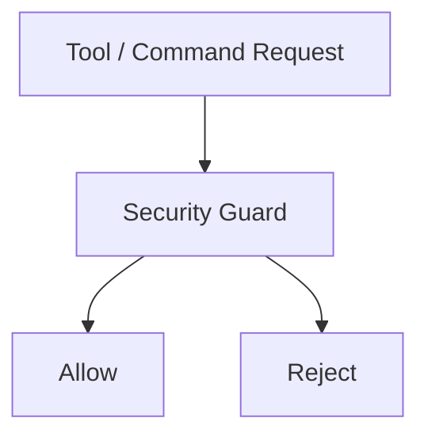
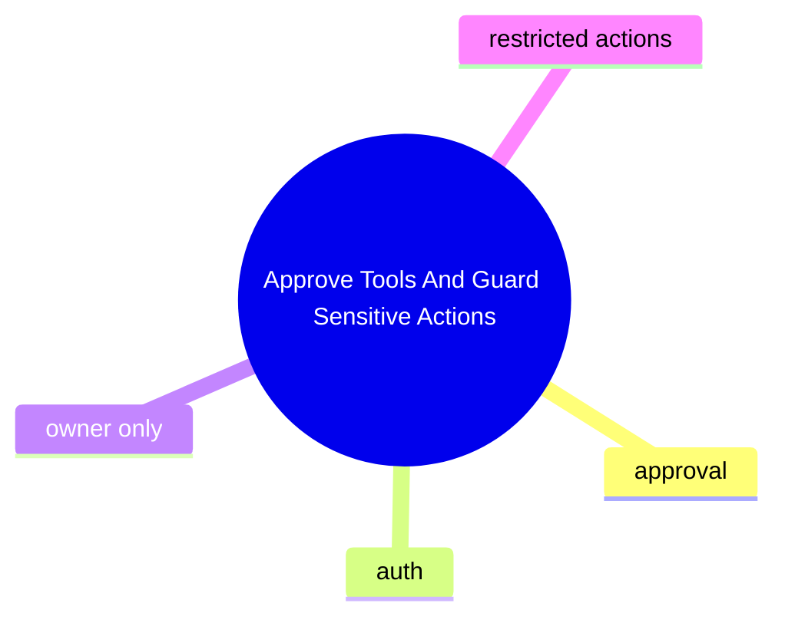

# Approve Tools And Guard Sensitive Actions

這個主題聚焦高風險能力的安全控制點，例如 approval gate、owners-only tool、privileged action 防護。

## 要回答的問題

- 哪些操作需要 approval
- 驗證邏輯在入口層還是執行層
- 哪些功能是 owners-only 或 framework-auth-only
- 哪些 changelog 屬於安全修正而不是一般重構

## 對應子系統

- [Tool Approval And Security Guards](../../subsystems/08-tool-approval-and-security-guards/README.md)

## Mermaid 圖

## 尚待補完

- 需補安全相關 feature slice 與測試對照

## 版本異動紀錄

| 版本 | revision | 異動摘要 | 證據入口 |
|------|------|------|------|
| v2026.4.23 | 尚待補完 | MCP / QQBot related security hardening identified | [v2026.4.23/README.md](../../v2026.4.23/README.md) |