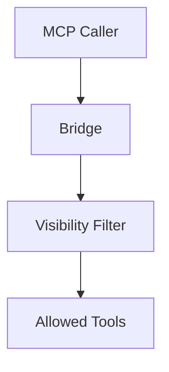
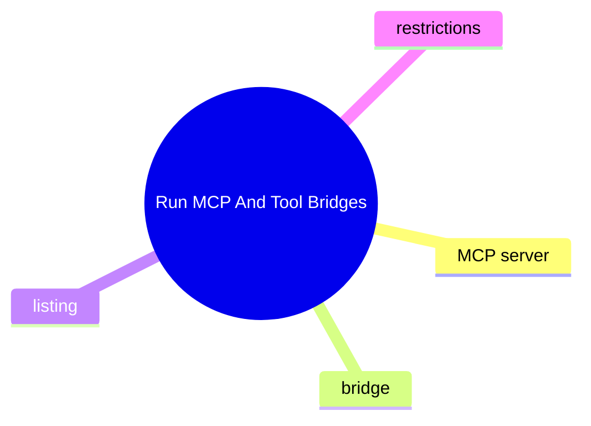

# Run MCP And Tool Bridges

這個主題聚焦 MCP 與內部 tool bridge 的暴露邊界，特別是哪些工具能被列出、哪些工具不能被外部呼叫。

## 要回答的問題

- MCP tools 的入口與註冊點在哪裡
- bridge 只負責轉發，還是會做權限裁決
- 哪些工具屬於特權工具
- 版本變更如何影響可見性與安全邊界

## 對應子系統

- [MCP And Bridge Surface](../../subsystems/09-mcp-and-bridge-surface/README.md)
- [Tool Approval And Security Guards](../../subsystems/08-tool-approval-and-security-guards/README.md)

## Mermaid 圖

## 尚待補完

- 需補 owners-only / bridge restriction 的原始碼證據

## 版本異動紀錄

| 版本 | revision | 異動摘要 | 證據入口 |
|------|------|------|------|
| v2026.4.23 | 尚待補完 | owners-only tool bridge restriction identified | [v2026.4.23/README.md](../../v2026.4.23/README.md) |