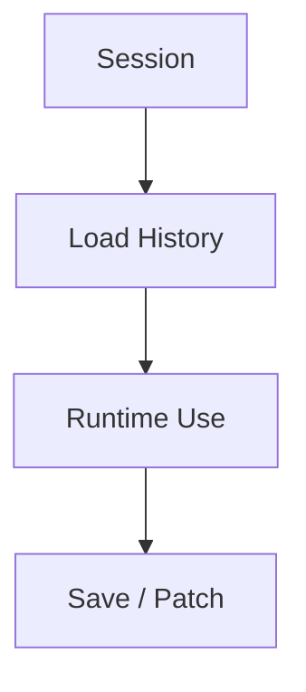
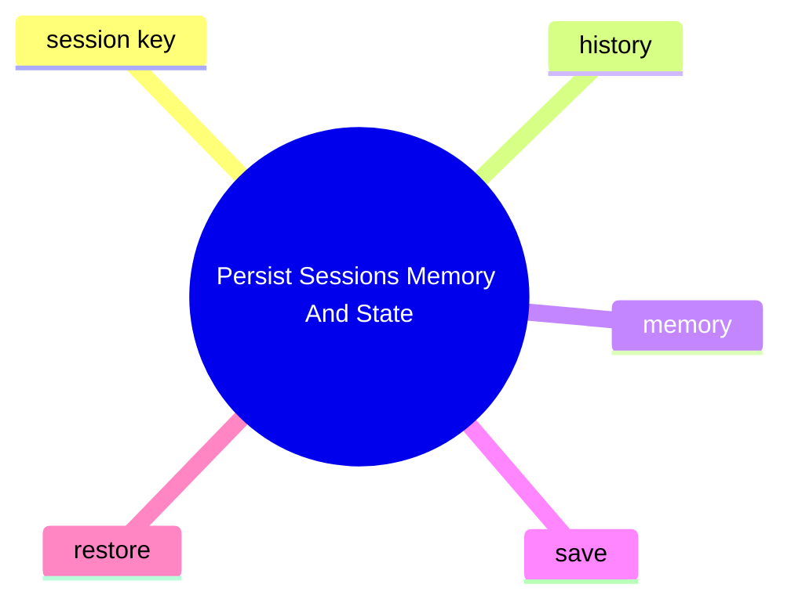

# Persist Sessions Memory And State

這個主題聚焦 OpenClaw 怎麼保存和恢復狀態，包含 session、memory 與其他持久化資訊。

## 要回答的問題

- session key 如何對應實際資料
- history load / patch / save 在哪裡做
- memory 功能如何與主流程互動
- 哪些狀態是 runtime-only，哪些會被寫回

## 對應子系統

- [Session Memory And Persistence](../../subsystems/05-session-memory-and-persistence/README.md)

## Mermaid 圖

## 尚待補完

- 需補 session 與 memory 的來源路徑與測試證據

## 版本異動紀錄

| 版本 | revision | 異動摘要 | 證據入口 |
|------|------|------|------|
| 尚待補完 | 尚待補完 | 尚待補完 | 尚待補完 |