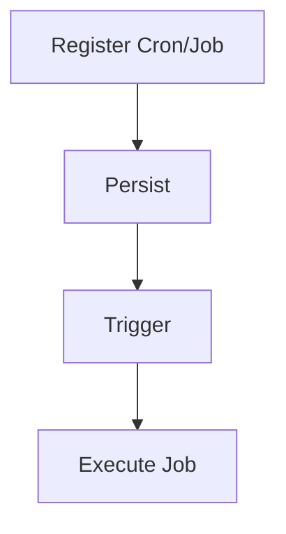
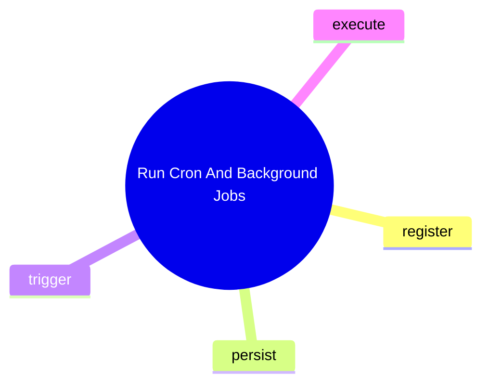

# Run Cron And Background Jobs

這個主題聚焦排程與背景工作，而不是只把 `cron` 當名詞看待。

## 要回答的問題

- cron / background job 的使用者入口是什麼
- 工作怎麼被註冊、持久化、觸發
- 哪些工作能透過 tool bridge 或 MCP 被看到
- 哪些安全限制是為了防止非預期執行

## 對應子系統

- [Cron And Background Work](../../subsystems/10-cron-and-background-work/README.md)
- [MCP And Bridge Surface](../../subsystems/09-mcp-and-bridge-surface/README.md)

## Mermaid 圖

## 尚待補完

- 需補 cron feature slice 的控制路徑與版本演進整理

## 版本異動紀錄

| 版本 | revision | 異動摘要 | 證據入口 |
|------|------|------|------|
| 尚待補完 | 尚待補完 | 尚待補完 | 尚待補完 |