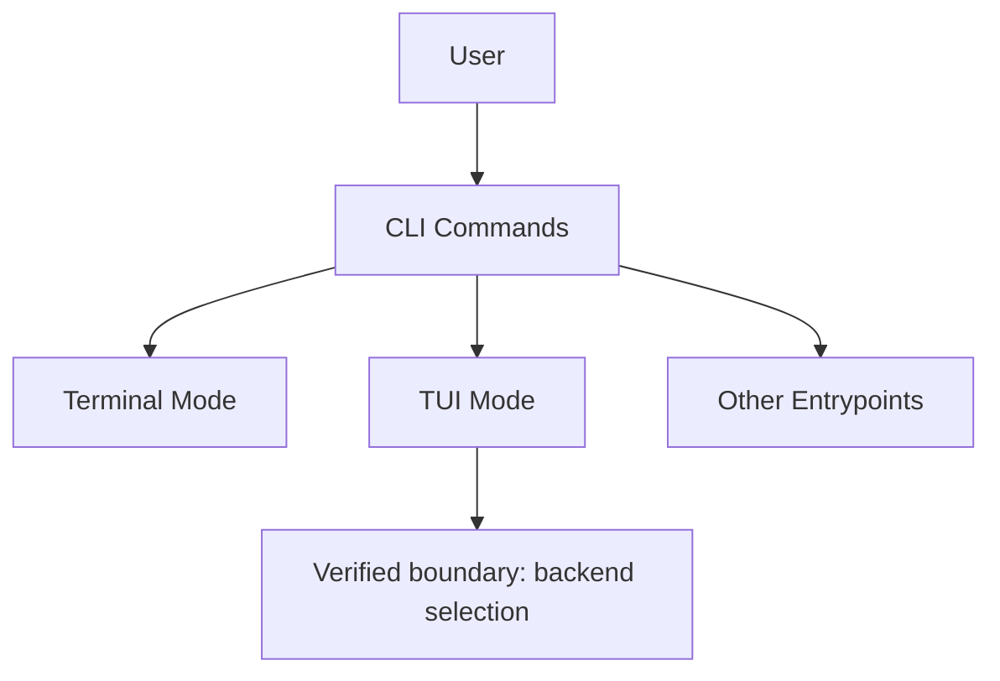
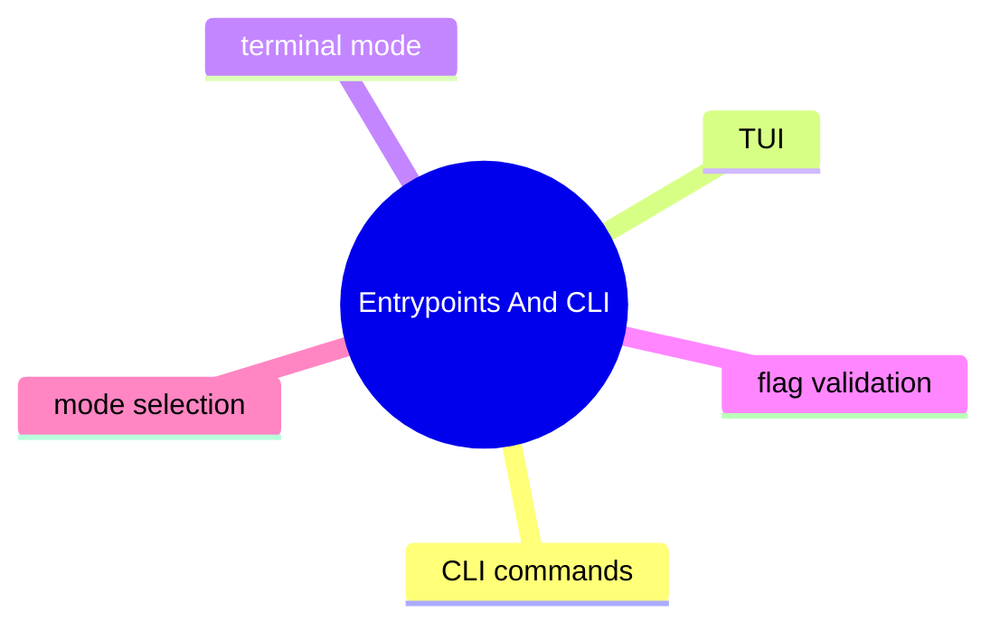

# Entrypoints And CLI

## 子系統角色

這個子系統聚焦所有直接面向使用者的入口：CLI、terminal、TUI，以及它們如何在入口層完成命令分流與參數驗證。

## 子系統邊界

- 上游：終端使用者、腳本呼叫者
- 下游：runtime config、TUI backend、gateway client 或 local execution path

## 相關功能主題

- [Run A Chat Session](../../features/01-run-a-chat-session/README.md)
- [Use Local TUI And Terminal Chat](../../features/03-use-local-tui-and-terminal-chat/README.md)

## Mermaid 圖

## 深追進度

- 已知 local TUI entry 存在部分證據
- 尚未建立完整 CLI 命令總表

## 尚待補完

- 真實 CLI chat path
- CLI flag precedence 與 config interplay

## 版本異動紀錄

| 版本 | revision | 異動摘要 | 證據入口 |
|------|------|------|------|
| v2026.4.23 | 尚待補完 | local TUI related evidence surfaced in existing analysis | [v2026.4.23/core-modules.md](../../v2026.4.23/core-modules.md) |