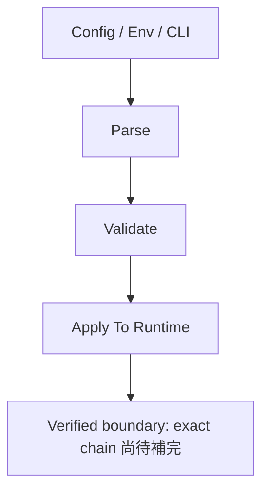
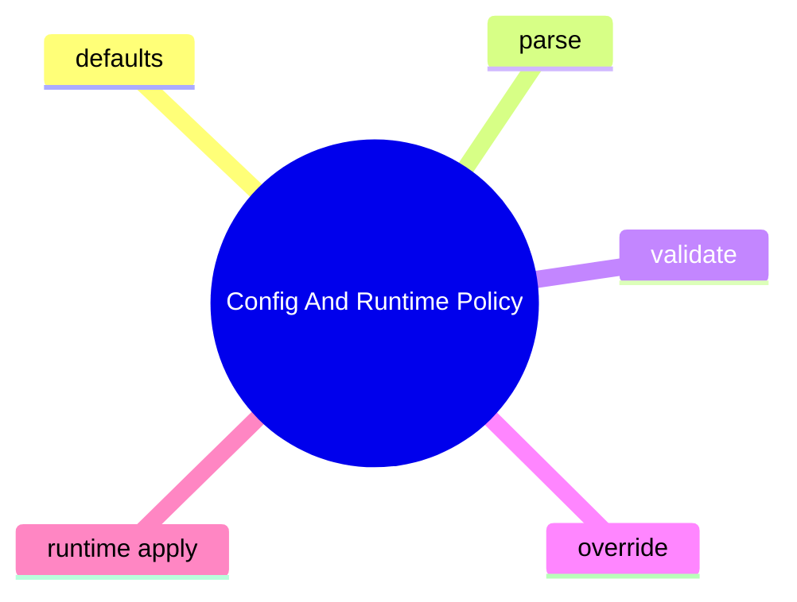

# Config And Runtime Policy

## 子系統角色

這個子系統聚焦設定值如何被載入、驗證、覆寫與生效。

## 子系統邊界

- 上游：config files、env、CLI flags
- 下游：runtime behavior、provider routing、approval policy

## 相關功能主題

- [Configure Runtime Behavior](../../features/02-configure-runtime-behavior/README.md)

## Mermaid 圖

## 深追進度

- 尚未建立完整證據

## 尚待補完

- config path mapping
- override order
- policy gates

## 版本異動紀錄

| 版本 | revision | 異動摘要 | 證據入口 |
|------|------|------|------|
| 尚待補完 | 尚待補完 | 尚待補完 | 尚待補完 |