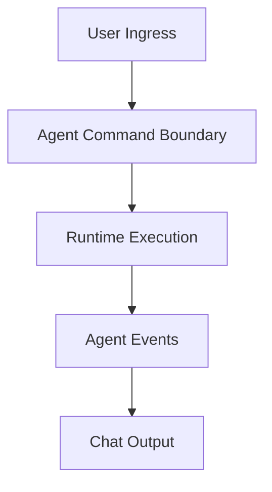
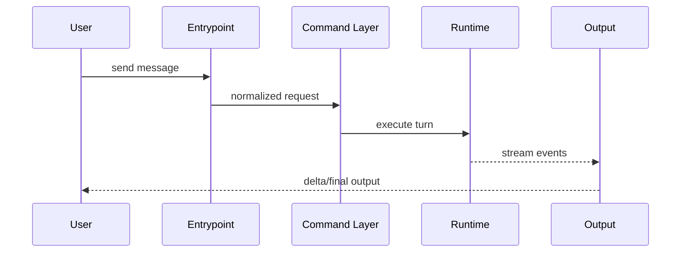

# Agent Execution Pipeline

## 子系統角色

這個子系統聚焦一次 agent turn 如何被建立、執行、串流回傳與中止。

## 子系統邊界

- 上游：CLI/TUI/gateway ingress
- 下游：runtime、providers、tool execution、state update

## 相關功能主題

- [Run A Chat Session](../../features/01-run-a-chat-session/README.md)
- [Use Local TUI And Terminal Chat](../../features/03-use-local-tui-and-terminal-chat/README.md)

## Mermaid 圖

## 深追進度

- embedded mode local path 有部分證據

## 尚待補完

- runtime instantiation
- provider dispatch
- tool step integration

## 版本異動紀錄

| 版本 | revision | 異動摘要 | 證據入口 |
|------|------|------|------|
| v2026.4.23 | 尚待補完 | embedded mode execution path partially traced | [v2026.4.23/core-modules.md](../../v2026.4.23/core-modules.md) |