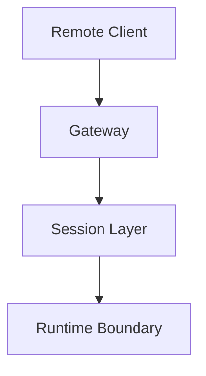
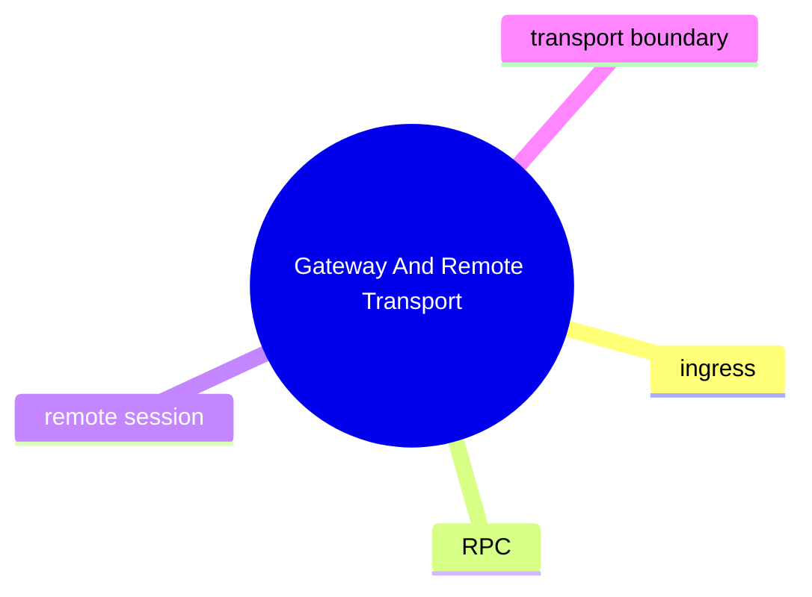

# Gateway And Remote Transport

## 子系統角色

這個子系統聚焦 remote client 如何透過 gateway 進入 OpenClaw。

## 子系統邊界

- 上游：remote clients
- 下游：session handling、agent execution pipeline

## 相關功能主題

- [Serve Gateway And Remote Clients](../../features/04-serve-gateway-and-remote-clients/README.md)

## Mermaid 圖

## 深追進度

- 尚未建立完整證據

## 尚待補完

- gateway entry
- RPC chain
- remote session persistence

## 版本異動紀錄

| 版本 | revision | 異動摘要 | 證據入口 |
|------|------|------|------|
| 尚待補完 | 尚待補完 | 尚待補完 | 尚待補完 |