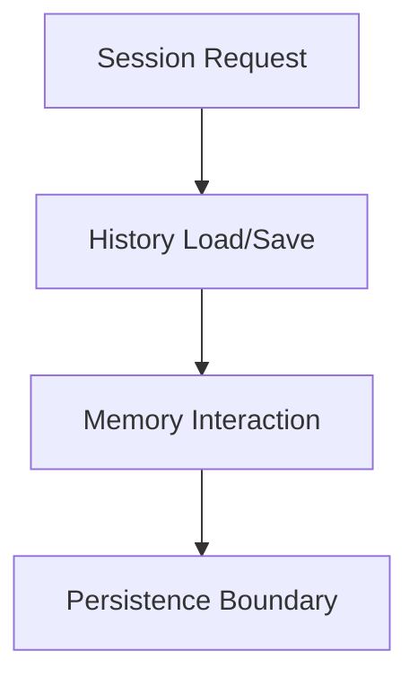
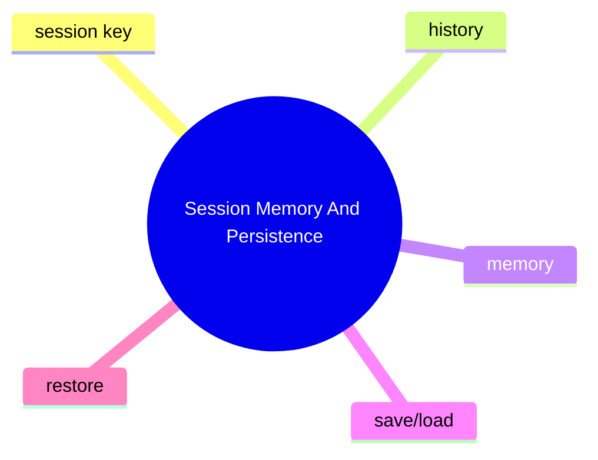

# Session Memory And Persistence

## 子系統角色

這個子系統聚焦 session、history、memory 與其他狀態資料如何被保存與恢復。

## 子系統邊界

- 上游：chat session / gateway / TUI
- 下游：storage、memory tools、runtime restore logic

## 相關功能主題

- [Persist Sessions Memory And State](../../features/09-persist-sessions-memory-and-state/README.md)

## Mermaid 圖

## 深追進度

- 尚未建立完整證據

## 尚待補完

- persistence backend
- session patching rules
- memory coupling

## 版本異動紀錄

| 版本 | revision | 異動摘要 | 證據入口 |
|------|------|------|------|
| 尚待補完 | 尚待補完 | 尚待補完 | 尚待補完 |