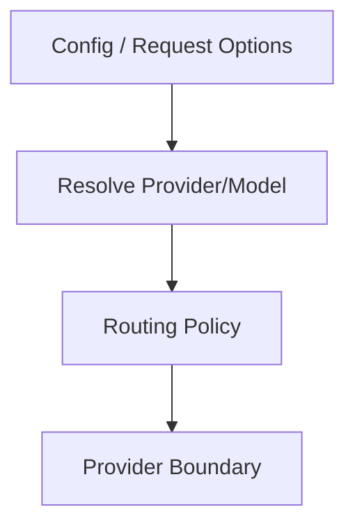
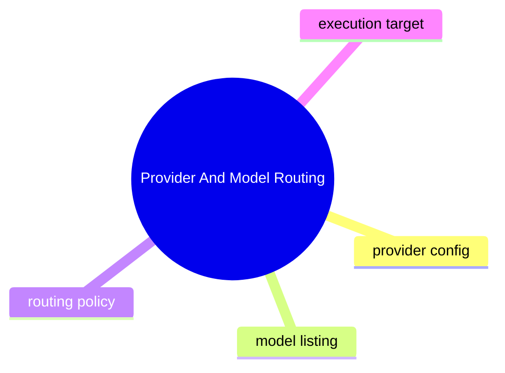

# Provider And Model Routing

## 子系統角色

這個子系統聚焦 provider 與 model 如何被列出、選取與路由到實際執行。

## 子系統邊界

- 上游：config、session options、runtime selection
- 下游：provider implementation、tool support constraints

## 相關功能主題

- [Route Models And Providers](../../features/06-route-models-and-providers/README.md)

## Mermaid 圖

## 深追進度

- 尚未建立完整證據

## 尚待補完

- provider registry
- fallback / constraints
- model metadata path

## 版本異動紀錄

| 版本 | revision | 異動摘要 | 證據入口 |
|------|------|------|------|
| 尚待補完 | 尚待補完 | 尚待補完 | 尚待補完 |