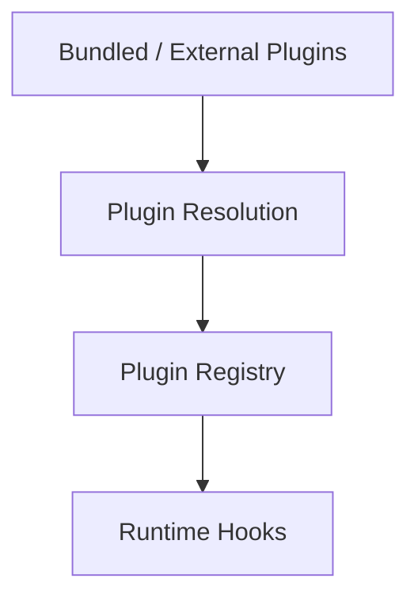
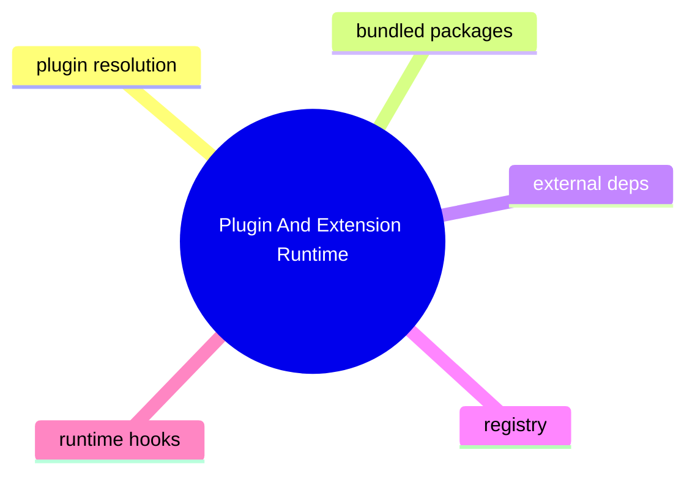

# Plugin And Extension Runtime

## 子系統角色

這個子系統聚焦 plugin 與 extension 如何被發現、解析、註冊與掛接到 runtime。

## 子系統邊界

- 上游：plugin configuration、bundled packages、external runtime dependencies
- 下游：registry、hooks、embedded extension seams

## 相關功能主題

- [Register Plugins And Extensions](../../features/05-register-plugins-and-extensions/README.md)

## Mermaid 圖

## 深追進度

- v2026.4.23 已識別 plugin resolution 修復

## 尚待補完

- registry loading path
- exact hook contract
- tests for startup resolution

## 版本異動紀錄

| 版本 | revision | 異動摘要 | 證據入口 |
|------|------|------|------|
| v2026.4.23 | 尚待補完 | restore bundled plugin resolution from install/runtime dependency stage roots | [v2026.4.23/README.md](../../v2026.4.23/README.md) |