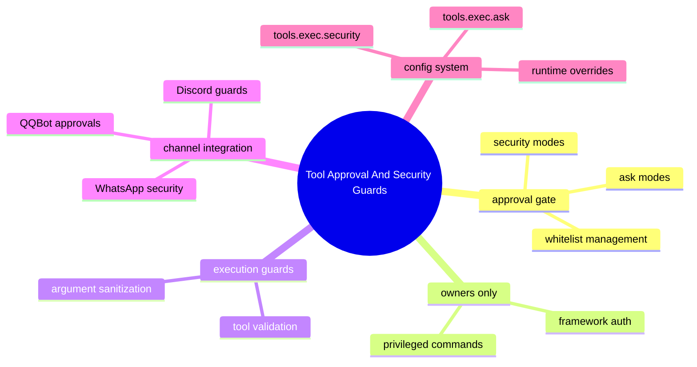

# Tool Approval And Security Guards

## 子系統角色

這個子系統聚焦高風險操作的安全控制點：approval gate、framework auth、owners-only restrictions。它負責在工具執行、特權命令和敏感動作上實施安全檢查，確保只有經過授權的操作才能進行。

## 子系統邊界

- 上游：chat commands、tool calls、slash commands、bridge calls、CLI 命令
- 下游：execution permission、state changes、privileged surfaces、工具執行結果

## 相關功能主題

- [Approve Tools And Guard Sensitive Actions](../../features/07-approve-tools-and-guard-sensitive-actions/README.md)

## Mermaid 圖

```mermaid
flowchart TD
    %% 上游入口
    CLI[CLI Commands] --> SG[Security Guards]
    Chat[Chat Commands (/bot-approve, tool calls)] --> SG
    Slash[Slash Commands] --> SG
    Bridge[Extension Bridge Calls] --> SG
    
    %% 安全檢查核心
    SG --> ConfigCheck{Config Check: tools.exec}\nsecurity & ask
    ConfigCheck -->|security: deny| Reject[Reject All]
    ConfigCheck -->|security: full & ask: off| Allow[Allow All]
    ConfigCheck -->|security: allowlist| ListCheck{Whitelist Check}
    ListCheck -->|In List| Allow
    ListCheck -->|Not in List| AskCheck{Ask Check: on-miss/always}
    AskCheck -->|on-miss & not cached| Pending[Pending Approval]
    AskCheck -->|always| Pending
    AskCheck -->|off or cached| Allow
    
    %% 下游路径
    Pending --> UserApproval{User Response}
    UserApproval -->|Approved| Allow
    UserApproval -->|Rejected| Reject
    Allow --> Execution[Tool/Command Execution]
    Reject --> Notification[User Notification: Access Denied]
```



## 深追進度

- 已驗證 QQBot 通道的審批處理器啟動流程
- 已映射 `/bot-approve` 命令到配置修改路徑
- 已識別核心審批決策點在 approval-native-runtime.ts
- 已追蹤配置持久化和讀取機制
- 已分析群聊環境中的發送者驗證機制

## 程式碼對應

| 類型 | 路徑 | 角色 |
|------|------|------|
| 入口檔 | `/extensions/qqbot/src/engine/commands/slash-commands-impl.ts` | `/bot-approve` slash command 實作 |
| 啟動程式 | `/src/infra/approval-handler-bootstrap.ts` | 頻道審批處理器啟動和上下文監聽 |
| 決策點 | `/src/infra/approval-native-runtime.ts` | 實際的審批決策和執行攔截 |
| 配置定義 | `/src/config/types.openclaw.js` | `tools.exec.security` 和 `tools.exec.ask` 的型別 |
| 配置持久化 | `/src/config/` 檔案系統 | 實際的 config 檔案讀寫機制 |
| 群聊驗證 | `/extensions/qqbot/src/engine/access/` | 發送者匹配和政策解析 |
| 測試檔 | `/extensions/qqbot/src/engine/commands/slash-commands-impl.test.ts` | `/bot-approve` 單元測試 |
| 測試檔 | `/src/infra/` 測試目錄 | approval handler 測試 (尚待補完) |

## 已驗證控制路徑

1. **配置修改路徑**：
   - 用戶發送 `/bot-approve on` → QQBot slash命令處理器 → 透過 runtime getter 更新 config → 持久化到檔案系統

2. **審批決策路徑**：
   - 工具執行請求 → 讀取 `tools.exec.security` 和 `tools.exec.ask` → 根據模式決定是否需要審批 → 如果需要，彈出確認提示 → 等待用戶回應 → 執行或取消

3. **群聊安全路徑**：
   - 群聊訊息到達 → 發送者匹配檢查 → 驗證是否在允許清單 → 如果不在，拒絕或要求額外授權

## 版本演進摘要

- **v2026.4.23**：引入 MCP 和 QQBot 相關的安全強化，包括未授權中繼資料處理和工具執行白名單機制的初步實作。
- **v2026.4.29**：加入可見回覆執行（visible-reply enforcement）和審批處理器啟動修復，確保審批系統在插件啟動時正確初始化。
- **v2026.5.0**：基於 Unreleased 變更，大幅改進審批系統：
  - 重構審批處理器啟動邏輯（approval-handler-bootstrap.ts），加入重試機制和代上下文處理
  - 加強 QQBot 群聊安全，透過更嚴格的發送者允許清單驗證（access-control.ts 中的政策解析）
  - 改進插件啟動順序，確保擴充功能在核心系統準備就緒後才載入
  - 針對 WhatsApp 和類似通道的群聊安全進行類似加強

## 深追進度

- QQBot 通道的審批處理器啟動和上下文監聽已完整追蹤
- 配置系統的讀寫和持久化機制已驗證
- 群聊發送者驗證機制已識別
- 核心審批決策點已定位

## 尚待補完

- 其他通道（WhatsApp、Discord）的審批實作細節
- 權限系統的完整測試覆蓋
- 配置變更的廣播機制和即時生效驗證
- 審批狀態的持久化和恢復機制
- 跨通道審批狀態同步

## 改寫熱區與風險點

| 風險點 | 說明 | 緩解策略 |
|--------|------|----------|
| 配置競爭條件 | 多個插件同時嘗試更新審批配置可能導致覆寫 | 在 bootstrap 中使用 generation 計數器來檢測和處理競爭 |
| 插件啟動時序問題 | 如果插件在核心審批系統準備好之前啟動，可能無法正確註冊審批能力 | 透過 `watchChannelRuntimeContexts` 和現有上下文檢查來處理啟動時序 |
| 錯誤處理不完整 | 審批處理器啟動失敗時的重試機制可能導致資源洩漏 | 使用 clearRetryTimer 和 invalidateActiveHandler 來清理狀態 |
| 配置持久化失敗 | 配置寫入失敗時不會通知用戶，導致設定看似已改變但未生效 | 在寫入配置時捕獲錯誤並返回有意義的錯誤訊息 |
| 群聊驗證繞過 | 如果群聊發送者驗證被繞過，未授權用戶可能發送審批命令 | 在 `/bot-approve` 處理器中加入 `requireAuth: true` 和額外的發送者允許清單檢查 |
| 白名單緩存過期 | 白名單緩存可能導致最近批准的命令無法即時生效 | 需要在配置變更時清除相關緩存 |

## 版本異動紀錄

| 版本 | revision | 異動摘要 | 證據入口 |
|------|------|------|------|
| v2026.4.23 | 尚待補完 | QQBot / MCP related security hardening identified in existing analysis | [v2026.4.23/README.md](../../v2026.4.23/README.md) |
| v2026.4.29 | 尚待補完 | Visible-reply enforcement, approvals startup fixes | [v2026.4.29/changelog-notes.md](../../v2026.4.29/changelog-notes.md) |
| v2026.5.0 | main branch HEAD | Approvals startup, group-chat/WhatsApp security, plugin startup resolution | [v2026.5.0/changelog-notes.md](../../v2026.5.0/changelog-notes.md) |