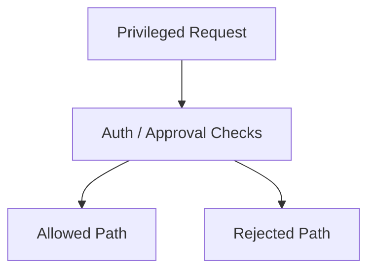
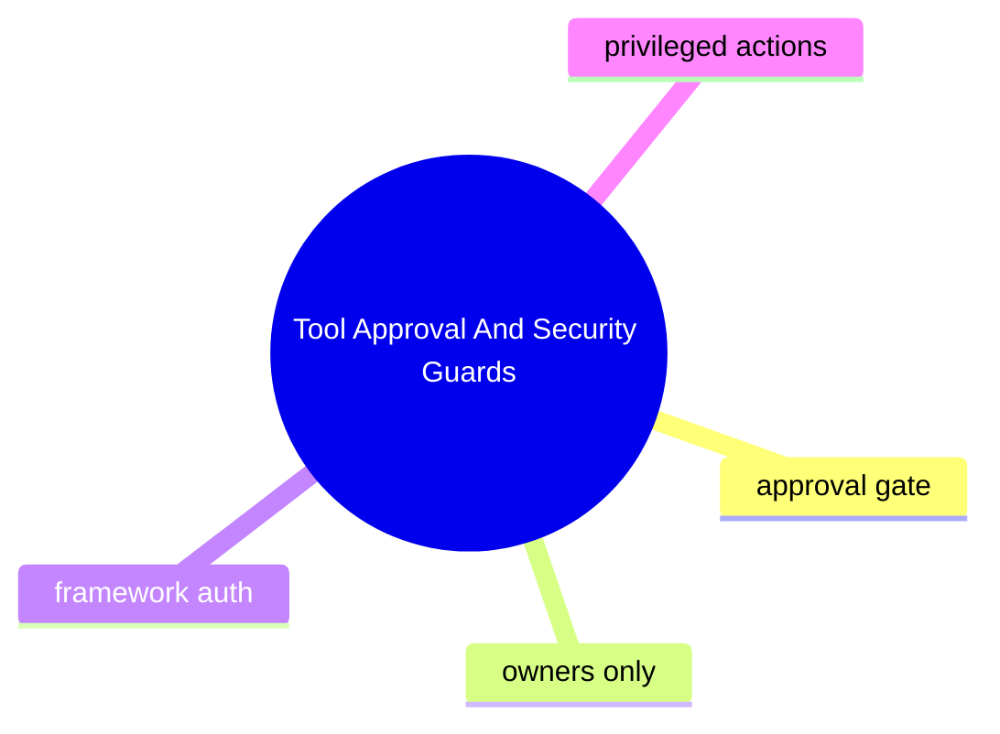

# Tool Approval And Security Guards

## 子系統角色

這個子系統聚焦高風險操作的安全控制點：approval gate、framework auth、owners-only restrictions。

## 子系統邊界

- 上游：chat commands、tool calls、slash commands、bridge calls
- 下游：execution permission、state changes、privileged surfaces

## 相關功能主題

- [Approve Tools And Guard Sensitive Actions](../../features/07-approve-tools-and-guard-sensitive-actions/README.md)

## Mermaid 圖

## 深追進度

- 尚未建立完整證據

## 尚待補完

- approval enforcement chain
- security regression tests

## 版本異動紀錄

| 版本 | revision | 異動摘要 | 證據入口 |
|------|------|------|------|
| v2026.4.23 | 尚待補完 | QQBot / MCP related security hardening identified in existing analysis | [v2026.4.23/README.md](../../v2026.4.23/README.md) |