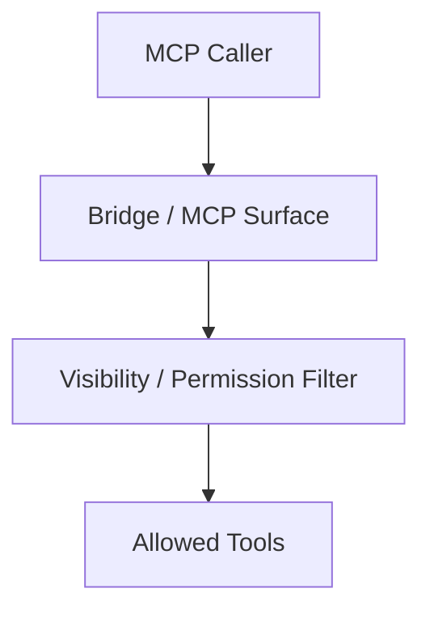
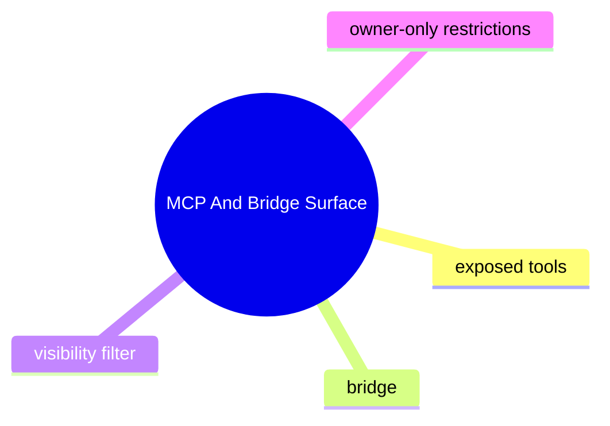

# MCP And Bridge Surface

## 子系統角色

這個子系統聚焦 MCP server 與 bridge 對外暴露哪些能力、在哪一層做可見性與權限限制。

## 子系統邊界

- 上游：MCP callers、tool bridge clients
- 下游：internal tool execution、security guards

## 相關功能主題

- [Run MCP And Tool Bridges](../../features/08-run-mcp-and-tool-bridges/README.md)

## Mermaid 圖

## 深追進度

- 尚未建立完整證據

## 尚待補完

- listing path
- call path
- bridge security rules

## 版本異動紀錄

| 版本 | revision | 異動摘要 | 證據入口 |
|------|------|------|------|
| v2026.4.23 | 尚待補完 | restrict ACPX bridge from exposing owners-only tools | [v2026.4.23/README.md](../../v2026.4.23/README.md) |