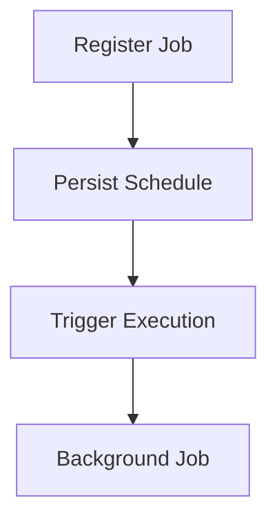
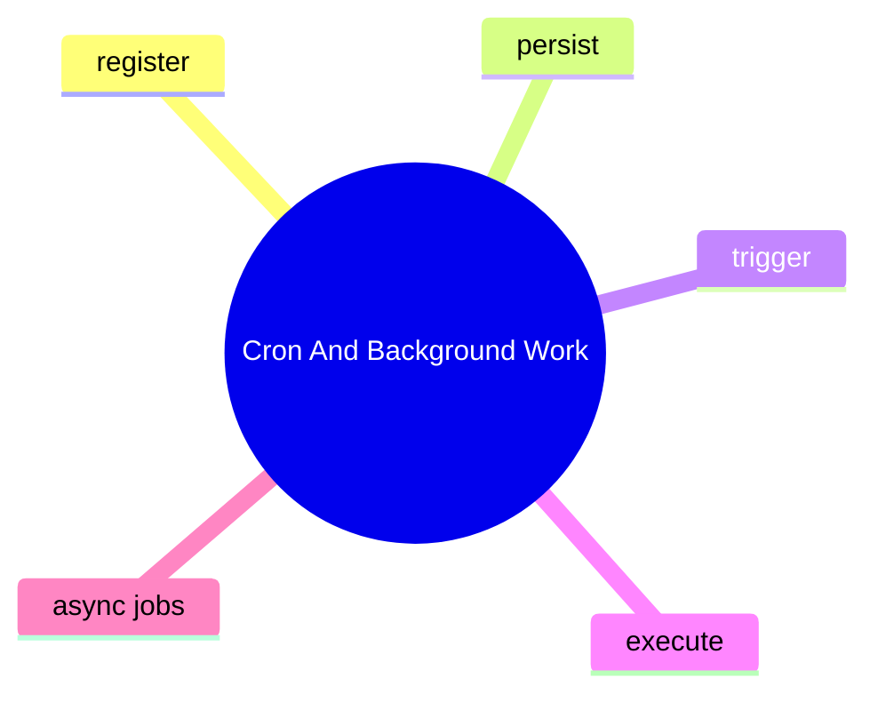

# Cron And Background Work

## 子系統角色

這個子系統聚焦排程與背景工作如何被註冊、保留與觸發。

## 子系統邊界

- 上游：cron tools、async request paths
- 下游：job execution、persistence、security restrictions

## 相關功能主題

- [Run Cron And Background Jobs](../../features/10-run-cron-and-background-jobs/README.md)

## Mermaid 圖

## 深追進度

- 尚未建立完整證據

## 尚待補完

- cron registration path
- storage path
- execution restrictions

## 版本異動紀錄

| 版本 | revision | 異動摘要 | 證據入口 |
|------|------|------|------|
| 尚待補完 | 尚待補完 | 尚待補完 | 尚待補完 |