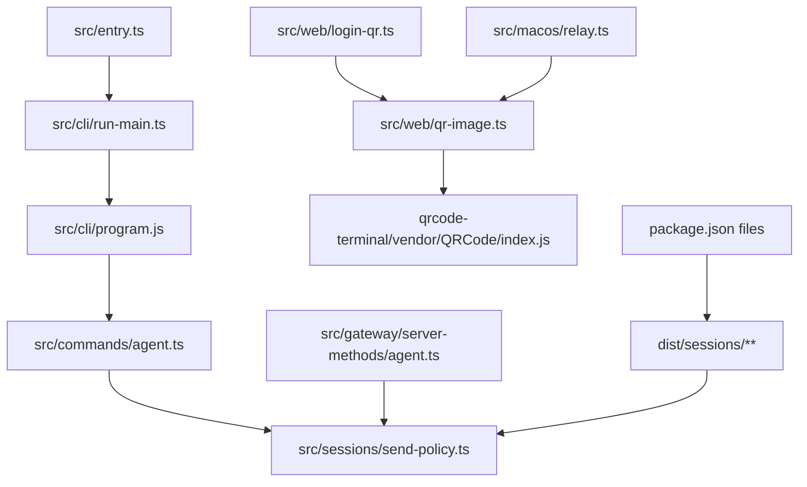
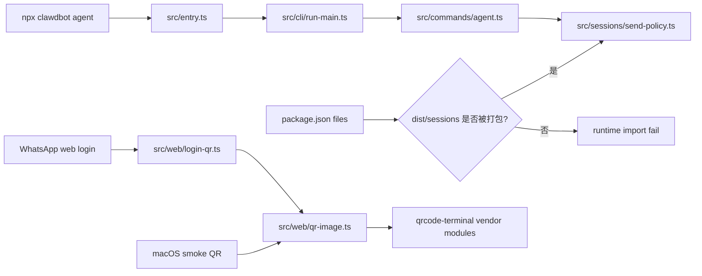

# OpenClaw v2026.1.5-1 架構分析

## 概覽

這個 patch 版沒有重構 OpenClaw 的大架構；真正需要理解的是兩個「邊界層」為什麼會壞，以及這版如何補洞：

1. **發佈包邊界**：`package.json` 的 `files` 決定 npx 安裝後哪些編譯產物會存在。`dist/sessions/**` 先前漏包，讓已編譯的 CLI / gateway code 在 runtime 解析 `sessions/send-policy.js` 時有機會失敗。
2. **ESM vendor import 邊界**：`src/web/qr-image.ts` 直接匯入 `qrcode-terminal/vendor/QRCode`，在 Node 25 對目錄匯入較嚴格時會出問題，因此改成明確指向 `index.js`。

這版最有價值的架構理解，不是重新講一次 agent / gateway / channel，而是看出 OpenClaw 在 2026.1.5-1 時已經高度依賴 Node ESM + 已編譯 dist tree 的穩定模組路徑。一旦 package surface 或 vendor path 不精確，功能本身不需要變，啟動就會先壞。

## 核心理念 / 系統設計取捨

- **把功能邏輯與發佈表面分開**：agent/gateway 的 send policy 邏輯本身沒改，壞的是「這個邏輯在發佈後是否還找得到」。
- **把 QR 產生邏輯壓成單一 helper**：`renderQrPngBase64` 被 `src/web/login-qr.ts` 與 `src/macos/relay.ts` 共用，因此修 import path 時不需要改多個 caller。
- **優先修 module boundary，而不是重寫功能**：這是一種低風險 patch 風格，只改匯入路徑與 package files，不碰上層 UX / session / gateway 行為。

## 模組依賴圖

## 核心資料流圖

## 功能切片到模組對照表

| 功能切片 | 使用者入口 | 真正決定行為的檔案 | 設定/狀態來源 |
|----------|------------|--------------------|---------------|
| Agent / gateway send policy | `clawdbot agent`、gateway `agent` method | `src/sessions/send-policy.ts` | `cfg.session.sendPolicy`、`SessionEntry.sendPolicy` |
| WhatsApp login QR 產生 | `startWebLoginWithQr()` | `src/web/qr-image.ts` | `scale`、`marginModules`、QR 字串 |
| macOS QR smoke | `CLAWDBOT_SMOKE_QR=1` | `src/macos/relay.ts` + `src/web/qr-image.ts` | env flag |
| npx 發佈表面 | npm 安裝 / npx 執行 | `package.json` | `files` 陣列 |

## 各 workspace package / module 職責說明

| 模組 | 職責 |
|------|------|
| `src/entry.ts` | CLI 最外層 entrypoint，解析 profile 後延遲匯入 `run-main` |
| `src/cli/run-main.ts` | 載入 env、runtime guard、建立 CLI program |
| `src/commands/agent.ts` | CLI agent 執行路徑，會解析 session 與 send policy |
| `src/gateway/server-methods/agent.ts` | gateway 版 agent handler，會依 session key 解析 send policy |
| `src/sessions/send-policy.ts` | send policy 的裁決邏輯與 rule matching |
| `src/web/login-qr.ts` | 產生 WhatsApp 連線 QR，將字串交給 `renderQrPngBase64` |
| `src/web/qr-image.ts` | 將 QR matrix 轉成 PNG base64 |
| `src/macos/relay.ts` | macOS bundled relay；可透過 smoke flag 直接驗證 QR helper |
| `package.json` | 決定 npm 發佈包會包含哪些 dist 子樹 |

## 技術棧清單（附證據來源）

| 技術/機制 | 用途 | 證據 |
|-----------|------|------|
| Node ESM | runtime module resolution | `package.json` 的 `type: module` |
| 已編譯 dist tree 發佈 | npx / npm 安裝後執行 | `package.json` 的 `files` 清單 |
| `qrcode-terminal` vendor modules | 產生 QR matrix | `src/web/qr-image.ts`、`package.json` dependencies |
| Vitest | 測試 QR helper 與 send policy | `src/web/qr-image.test.ts`、`src/web/login-qr.test.ts`、`src/sessions/send-policy.test.ts` |

## 已驗證部分 / 尚待補完

### 已驗證

- `dist/sessions/**` 在這版被加回 `package.json` 發佈清單。
- `src/commands/agent.ts` 與 `src/gateway/server-methods/agent.ts` 真的直接依賴 `src/sessions/send-policy.ts`。
- `src/web/login-qr.ts` 與 `src/macos/relay.ts` 都會走到 `src/web/qr-image.ts`。
- `src/web/qr-image.ts` 在這版把 `QRCode` vendor import 改成明確 `index.js`。

### 尚待補完

- CHANGELOG 提到的 onboarding CLI entrypoint 修補，沒有在 `v2026.1.5..v2026.1.5-1` diff 中找到對應 source change。
- 這份文件沒有重新驗證整個 extension tree、UI 架構與所有 agent 路徑，只驗證 patch 直接影響的功能切片。