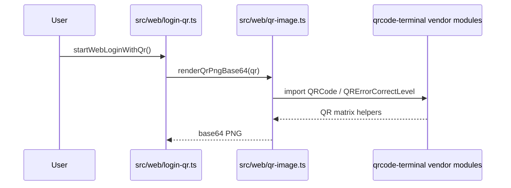
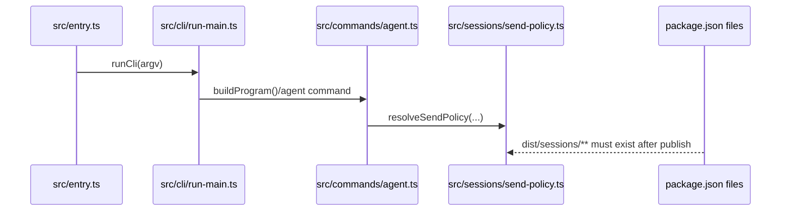

# OpenClaw v2026.1.5-1 核心模組分析：QR 登入相容性與 sessions 打包修補

## 職責定義

這個 patch 版最重要的不是新增功能，而是修補兩個「原本邏輯沒錯，但發佈或 runtime 邊界會壞」的區塊：

1. **QR 登入相容性切片**：`src/web/qr-image.ts` 負責把 QR 字串轉成 PNG base64，供 `src/web/login-qr.ts` 與 `src/macos/relay.ts` 使用。這版改的是 vendor import 的精確度。
2. **sessions 打包切片**：`src/sessions/send-policy.ts` 決定 agent/gateway 是否允許送出訊息；這版改的是發佈包是否包含這個模組，而不是它的裁決邏輯本身。

## 對應功能切片與使用者入口

| 功能切片 | 使用者入口 | 入口檔 |
|----------|------------|--------|
| WhatsApp Web QR 登入 | `startWebLoginWithQr()` | `src/web/login-qr.ts` |
| macOS QR smoke | `CLAWDBOT_SMOKE_QR=1` | `src/macos/relay.ts` |
| CLI agent send policy | `clawdbot agent --to ...` | `src/entry.ts` -> `src/cli/run-main.ts` -> `src/commands/agent.ts` |
| Gateway agent send policy | gateway `agent` method | `src/gateway/server-methods/agent.ts` |

## 關鍵型別與介面

### QR helper

```typescript
export async function renderQrPngBase64(
  input: string,
  opts: { scale?: number; marginModules?: number } = {},
): Promise<string>
```

它接收 QR 字串與渲染參數，輸出 base64 PNG。這個函式本身不負責連線或配對，只負責將 QR matrix 轉成圖像資料。

### Send policy

```typescript
export function resolveSendPolicy(params: {
  cfg: ClawdbotConfig;
  entry?: SessionEntry;
  sessionKey?: string;
  surface?: string;
  chatType?: SessionChatType;
}): SessionSendPolicyDecision
```

這個函式負責裁決某個 session 是否可以送訊息，回傳 `allow` 或 `deny`。

## 核心邏輯說明

### 功能切片 A：QR 登入相容性

1. `src/web/login-qr.ts` 在 `startWebLoginWithQr()` 中向 WhatsApp 取得 QR 字串。
2. 它把字串交給 `renderQrPngBase64()`。
3. `src/web/qr-image.ts` 使用 `qrcode-terminal` vendor module 產生 QR matrix，自己做 RGBA buffer、PNG chunk 與 deflate。
4. `src/macos/relay.ts` 也用同一個 helper 做 smoke 測試，因此這個 helper 一壞，web login 與 macOS bundle smoke 都會受影響。
5. v2026.1.5-1 將 `QRCode` 的 import 從目錄路徑改成明確 `index.js`，避免 Node 25 對 vendor directory import 的問題。

### 功能切片 B：sessions 打包修補

1. `src/entry.ts` 會把 CLI 交給 `src/cli/run-main.ts`。
2. `run-main` 會建立 program，進一步走到 `src/commands/agent.ts`。
3. `agent.ts` 會匯入 `resolveSendPolicy` 來決定 send policy。
4. gateway 的 `src/gateway/server-methods/agent.ts` 也直接依賴同一個 `resolveSendPolicy`。
5. 因為 `resolveSendPolicy` 實作位於 `src/sessions/send-policy.ts`，所以編譯後必須有 `dist/sessions/**`。這版在 `package.json` 補上這個 subtree，修補 npx 安裝時的 runtime 缺件問題。

## 功能入口與設定面

### QR 路徑

| 項目 | 位置 | 說明 |
|------|------|------|
| QR 內容來源 | `src/web/login-qr.ts` | 由 WhatsApp 連線流程提供 |
| 圖像渲染選項 | `renderQrPngBase64()` 的 `scale` / `marginModules` | 只影響輸出圖大小與外框 |
| macOS smoke 開關 | `CLAWDBOT_SMOKE_QR=1` | 直接驗證 QR helper 是否可執行 |

### Send policy 路徑

| 設定/狀態 | 位置 | 說明 |
|-----------|------|------|
| `entry.sendPolicy` | `SessionEntry` | 每個 session entry 的 override，優先級最高 |
| `cfg.session.sendPolicy.default` | config | 無規則命中時的 fallback |
| `cfg.session.sendPolicy.rules[].match.surface` | config | 依 channel / surface 比對 |
| `cfg.session.sendPolicy.rules[].match.chatType` | config | 依 group / room 等比對 |
| `cfg.session.sendPolicy.rules[].match.keyPrefix` | config | 依 `sessionKey` prefix 比對 |

## 設計理念 / 演進目的

- **QR 相容性修補的目的**：保留既有 QR helper API，不動上游 login 流程，只把不安全的 vendor import 目錄路徑改成明確檔案路徑，降低 Node 25 / bundle runtime 的模組解析風險。
- **sessions 打包修補的目的**：既有 source import 是合理的，問題在發佈包少了一整個 dist subtree。這版透過 package surface 修補，而不是把 `send-policy` 搬位置或內聯到 caller。
- **核心理念**：patch release 優先修 module boundary，而不是重寫功能。這讓行為風險集中在 import / packaging 層，降低對 agent/gateway 主邏輯的回歸風險。

## 可改寫熱區與風險點

| 熱區 | 為什麼危險 | 改寫注意事項 |
|------|------------|--------------|
| `src/web/qr-image.ts` 的 vendor imports | Node ESM 對目錄匯入敏感 | 不要把顯式 `.js` / `index.js` 再改回目錄匯入 |
| `src/types/qrcode-terminal.d.ts` | 型別宣告必須跟 runtime import path 一致 | 改 import path 時要同步更新 declaration |
| `package.json files` | 會直接影響 npm/npx 執行結果 | 移動 source subtree 時要同步檢查 dist 打包清單 |
| `src/sessions/send-policy.ts` | CLI 與 gateway 共用控制點 | 若搬移檔案，除了 source import 還要檢查發佈包與 tests |

## 呼叫鏈圖





## 錯誤處理模式

- `src/web/login-qr.ts` 會在取不到 QR、連線失敗或遇到 status 515 時回傳使用者可理解的訊息，並在 515 時做一次 restart。
- `renderQrPngBase64()` 本身偏純函式，主要失敗面來自 vendor module import 或 PNG 生成過程。
- `resolveSendPolicy()` 不會丟例外做流程控制；它偏 deterministic rule resolution，回傳 `allow` 或 `deny`。
- `dist/sessions` 漏包屬於發佈期錯誤，不是 `resolveSendPolicy()` 內部邏輯錯誤；失敗點在 runtime module resolution。

## 測試覆蓋與未覆蓋空白

| 行為/規則 | 證據類型 | 來源 | 可下的結論 |
|-----------|----------|------|------------|
| QR helper 能產出 PNG base64 | 測試 | `src/web/qr-image.test.ts` | 可確定 helper 會輸出 PNG signature |
| QR helper 避免 dynamic require，且改成 `QRCode/index.js` | 測試 | `src/web/qr-image.test.ts` | 可確定這版至少固定了一個 vendor import path |
| login-qr 在 status 515 會重啟一次 | 測試 | `src/web/login-qr.test.ts` | 可確定上游 caller 有 restart 邏輯 |
| send policy 預設 allow / entry override / rule matching | 測試 | `src/sessions/send-policy.test.ts` | 可確定 send-policy 的基本裁決規則 |
| npm package 漏包 `dist/sessions` 會壞 npx | 原始碼 + package diff | `package.json` + import callers | 高信心，但未看到 end-to-end packaging test |
| Node 25 真機 / DMG boot 已被整合測試驗證 | 未看到測試 | — | 尚待補完 |

## 已知限制與 TODO

- 還沒有找到能直接證明 changelog 中 onboarding CLI entrypoint 敘述的 source diff。
- 沒有看到 npm packed artifact 或 npx end-to-end 測試，因此打包修補的最終效果仍屬「高信心原始碼推論」，不是整合測試證明。
- v2026.1.5-1 只深追到 patch 直接影響的切片；更廣的 agent / provider / extension 行為仍待獨立分析。