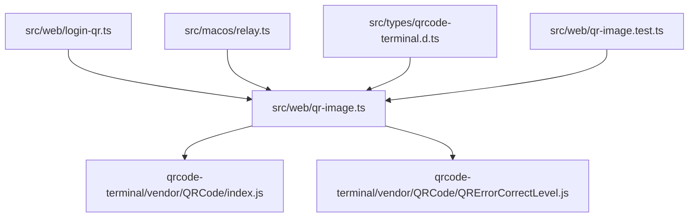
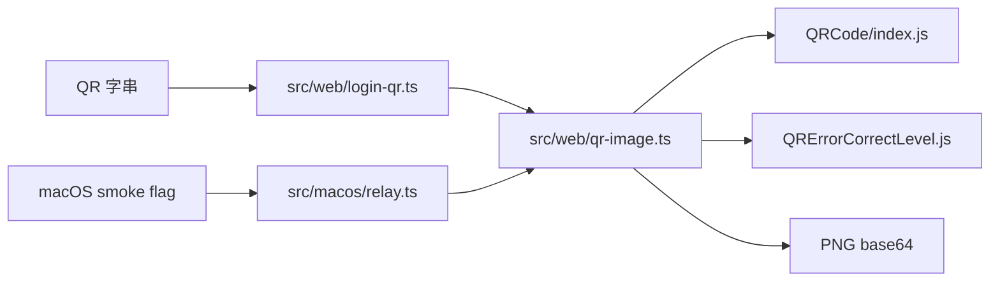

# OpenClaw v2026.1.5-2 架構分析

## 概覽

`v2026.1.5-2` 幾乎可以視為 `v2026.1.5-1` 的 follow-up patch。它沒有擴張系統邊界，而是把上一版未完全收斂的 QR vendor import 路徑補完：`QRCode/index.js` 在前一版已經顯式化，這一版把 `QRErrorCorrectLevel` 也改成顯式 `.js`，並讓型別宣告與測試同步跟上。

從架構角度看，重點不是系統多了一層，而是 OpenClaw 在這個時期對 vendor module resolution 的要求變得更精確：只要 helper 走的是 ESM runtime，就必須連二級 vendor dependency 都寫成實際檔案路徑，不能只靠目錄或隱式副檔名解析。

## 核心理念 / 系統設計取捨

- **延續上一版 patch strategy**：不改 login flow、不改 caller，只修 helper 的 module boundary。
- **型別宣告與 runtime import 一起演進**：如果 runtime import 改成 `.js`，宣告檔也必須跟著改，不然 TypeScript 與 runtime 會分裂。
- **測試把相容性修補鎖死**：這版不是只改 source，還把新 import path 寫進測試，降低回歸風險。

## 模組依賴圖

## 核心資料流圖

## 功能切片到模組對照表

| 功能切片 | 使用者入口 | 真正決定行為的檔案 | 設定/狀態來源 |
|----------|------------|--------------------|---------------|
| WhatsApp web login QR 產生 | `startWebLoginWithQr()` | `src/web/qr-image.ts` | QR 內容、`scale`、`marginModules` |
| macOS QR smoke | `CLAWDBOT_SMOKE_QR=1` | `src/macos/relay.ts` + `src/web/qr-image.ts` | env flag |
| QR vendor typing | TypeScript 編譯期 | `src/types/qrcode-terminal.d.ts` | module declaration |

## 各 workspace package / module 職責說明

| 模組 | 職責 |
|------|------|
| `src/web/login-qr.ts` | 取得 QR 字串、轉成 data URL |
| `src/web/qr-image.ts` | 建立 QR matrix 並編碼成 PNG |
| `src/macos/relay.ts` | 用 smoke flag 驗證 QR helper 可執行 |
| `src/types/qrcode-terminal.d.ts` | 讓 TypeScript 能接受 vendor `.js` import |
| `src/web/qr-image.test.ts` | 鎖定 runtime import path 與輸出格式 |

## 技術棧清單（需附證據來源）

| 技術/機制 | 用途 | 證據 |
|-----------|------|------|
| Node ESM 顯式 `.js` import | vendor module resolution | `src/web/qr-image.ts`、`src/types/qrcode-terminal.d.ts` |
| `qrcode-terminal` vendor modules | QR matrix 生成 | `src/web/qr-image.ts` |
| Vitest | 防回歸 | `src/web/qr-image.test.ts` |

## 已驗證部分 / 尚待補完

### 已驗證

- `QRErrorCorrectLevel` 在這版改成 `QRErrorCorrectLevel.js`。
- 宣告檔同步改成 `declare module "...QRErrorCorrectLevel.js"`。
- 測試新增對 `.js` import 的斷言。

### 尚待補完

- 這版沒有重新驗證整體 agent/gateway/extension 架構。
- 沒有看到針對實際 Node 25 runtime 的整合測試，只有 source-level import assertions。
