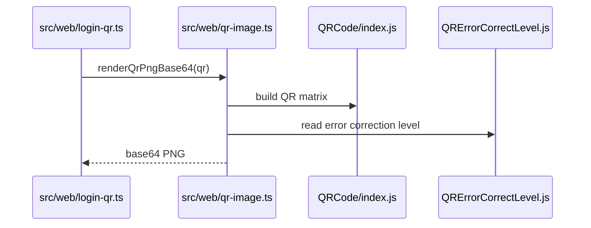

# OpenClaw v2026.1.5-2 核心模組分析：QR vendor import 完整化

## 職責定義

這個版本實際變更的核心模組只有一條：`src/web/qr-image.ts` 及其型別/測試配套。它的職責是把 QR 字串轉成 PNG base64，提供給 web login 與 macOS bundle smoke 使用。v2026.1.5-2 的重點不是改 QR 演算法，而是把上一版尚未顯式化的 vendor import 也收斂成 `.js` 路徑。

## 對應的使用者功能 / feature slice

| 功能 | 使用者入口 | 入口檔 |
|------|------------|--------|
| WhatsApp Web QR 顯示 | `startWebLoginWithQr()` | `src/web/login-qr.ts` |
| macOS QR smoke | `CLAWDBOT_SMOKE_QR=1` | `src/macos/relay.ts` |

## 關鍵型別與介面

### QR helper API

```typescript
export async function renderQrPngBase64(
  input: string,
  opts: { scale?: number; marginModules?: number } = {},
): Promise<string>
```

### 型別宣告同步

```typescript
declare module "qrcode-terminal/vendor/QRCode/QRErrorCorrectLevel.js" {
  const QRErrorCorrectLevel: Record<string, unknown>;
  export default QRErrorCorrectLevel;
}
```

這個宣告不是附帶細節，而是 patch 本身的一部分。runtime path 改了，declare module 也必須同步。

## 核心邏輯說明

1. `src/web/login-qr.ts` 取得 QR 字串後呼叫 `renderQrPngBase64()`。
2. `renderQrPngBase64()` 依賴兩個 vendor module：
   - `qrcode-terminal/vendor/QRCode/index.js`
   - `qrcode-terminal/vendor/QRCode/QRErrorCorrectLevel.js`
3. helper 產生 QR matrix，將 RGBA buffer 編碼成 PNG，回傳 base64。
4. `src/macos/relay.ts` 用 smoke flag 直接呼叫同一 helper，確保 bundle runtime 不會在 import 時崩潰。

## 功能入口與設定面

| 項目 | 位置 | 說明 |
|------|------|------|
| QR 內容 | `src/web/login-qr.ts` | 來自 WhatsApp login 流程 |
| 渲染選項 | `renderQrPngBase64()` 的 `scale` / `marginModules` | 控制輸出圖大小與留白 |
| smoke flag | `src/macos/relay.ts` | `CLAWDBOT_SMOKE_QR=1` 時直接驗 helper |

## 設定面與覆寫鏈

這條功能切片幾乎沒有複雜 config surface；真正影響行為的是：

- runtime 是否能正確解析 vendor `.js` 模組
- caller 是否把 QR 字串交給 helper
- helper 的渲染選項是否被覆寫

換句話說，這版的風險不在 config，而在 import boundary。

## 設計理念 / 演進目的

- **演進目的**：完成 `v2026.1.5-1` 尚未做完的 Node 25 相容性修補。上一版只把 `QRCode` 主模組顯式化，這版把 `QRErrorCorrectLevel` 也一起顯式化。
- **設計取捨**：不重新包裝 `qrcode-terminal`，也不改 login 流程；只改 helper 的 vendor path 與 d.ts，讓 patch 足夠小。
- **核心理念**：當系統依賴 vendor subpath 時，runtime import path、TypeScript declare module 與測試斷言必須三者同步，否則很容易出現「編譯過了但 runtime 壞掉」或相反的情況。

## 可改寫熱區與風險點

| 熱區 | 風險 | 改寫提醒 |
|------|------|----------|
| `src/web/qr-image.ts` | vendor import 很容易被格式化或重構改回隱式路徑 | 保留顯式 `.js` import |
| `src/types/qrcode-terminal.d.ts` | runtime path 與型別宣告可能分裂 | 改 import 時要一起改 d.ts |
| `src/web/qr-image.test.ts` | 若測試只驗輸出不驗 import path，回歸會漏掉 | 保留 import path assertion |

## 呼叫鏈圖



## 錯誤處理模式

- 這版沒有新增新的錯誤處理分支；主要失敗面仍是 vendor import 無法解析或 QR helper 內部生成失敗。
- `login-qr.ts` 的 restart / timeout 等錯誤控制沿用前版，這版沒有更動。

## 測試覆蓋與未覆蓋空白

| 行為/規則 | 證據類型 | 來源 | 可下的結論 |
|-----------|----------|------|------------|
| QR helper 會輸出 PNG | 測試 | `src/web/qr-image.test.ts` | 可確定輸出格式未被破壞 |
| `QRCode/index.js` 必須存在於 source | 測試 | `src/web/qr-image.test.ts` | 可確定上一版修補仍被保留 |
| `QRErrorCorrectLevel.js` 必須存在於 source | 測試 | `src/web/qr-image.test.ts` | 可確定這版新增的 import path 被鎖住 |
| login-qr 真正跑過 vendor module | 未看到測試 | `src/web/login-qr.test.ts` 在前版已 mock `qr-image.js` | 尚待補完 |
| Node 25 真機 / macOS DMG smoke | 未看到整合測試 | — | 尚待補完 |

## 已知限制與 TODO

- 這版證據只足以說明 QR import 完整化，不足以宣稱整個系統架構有變。
- 若後續想重構 QR helper，應先補一個真正會跑 vendor import 的整合測試，而不是只靠 source string assertion。