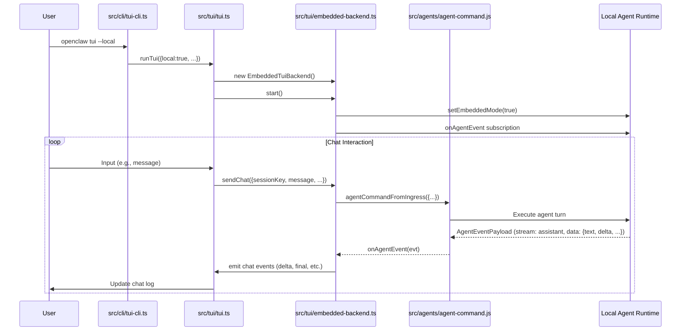

# OpenClaw v2026.4.23 架構分析：TUI 嵌入模式

## 概覽
TUI 嵌入模式（Terminal User Interface Embedded Mode）是一個功能，允許使用者在終端機中直接執行 OpenClaw 聊天介面，而不需要連接到遠端 Gateway。此模式透過本地 agent 執行階段運行，同時保持 plugin  approval 閘道的安全控制。

此功能在 2026.4.22 版本中引入（根據 changelog），並在 2026.4.23 中繼續存在。

## 核心理念 / 系統設計取捨
- **安全性優先**：即使在嵌入模式下，所有透過 TUI 傳送的指令仍需經過 agent 指令驗證層（agentCommandFromIngress），確保 plugin 安全閘道不被繞過。
- **依賴最小化**：嵌入模式移除對遠端 Gateway 的依賴，降低中間人攻擊風險和網路延遲。
- **使用戶體驗一致性**：與 Gateway 模式共享相同的 TUI 前端（佈局、快捷鍵、狀態欄等），只有後端連線方式不同。
- **狀態隔離**：每個嵌入模式的 TUI 會話維護自己的本地運行狀態（runs Map），不影響其他會話或 Gateway 會話。

## 模組依賴圖
```mermaid
graph TD
    A[CLI: openclaw tui --local] --> B[src/cli/tui-cli.ts]
    B --> C[src/tui/tui.ts: runTui]
    C --> D{opts.local?}
    D -->|true| E[src/tui/embedded-backend.ts: EmbeddedTuiBackend]
    D -->|false| F[src/tui/gateway-chat.ts: GatewayChatClient]
    E --> G[Agent Command Processing]
    F --> G
    G --> H[Agent Runtime (Local)]
    G --> I[Gateway (Remote)]
    style E fill:#e3f2fd,stroke:#1565c0
    style F fill:#fff3e0,stroke:#ef6c00
```

## 核心資料流圖


## 功能切片到模組對照表
| 功能切片 | 負責模組 | 說明 |
|----------|----------|------|
| TUI 嵌入模式入口 | src/cli/tui-cli.ts | 解析 `--local` 旗標並呼叫 `runTui` |
| TUI 後端抽象 | src/tui/tui-backend.js (interface) | 定義 `TuiBackend` 介面，由 `EmbeddedTuiBackend` 實作 |
| 嵌入模式後端實作 | src/tui/embedded-backend.ts | 處理本地 agent 執行階段的聊天、事件和狀態 |
| Agent 指令處理 | src/agents/agent-command.js | `agentCommandFromIngress` 函式，實際執行 agent 指令 |
| 本地運行時抑制 | src/tui/tui.ts | 在嵌入模式下重新導向 `defaultRuntime.log/error` 以靜默控制台輸出 |
| 會話管理 | src/gateway/session-utils.js 等 | 載入/儲存會話歷史、設定等（共用與 gateway 模式） |

## 各 workspace package 職責說明
| 路徑 | 職責 |
|------|------|
| src/cli/tui-cli.ts | 定義 `tui` CLI 命令，解析參數（如 `--local`），並委派給 TUI 後端 |
| src/tui/tui.ts | TUI 前端實作（佈局、事件處理、渲染），依照 `local` 選項選擇後端實作 |
| src/tui/embedded-backend.ts | 嵌入模式的後端實作，負責與本地 agent 執行階段溝通 |
| src/agents/agent-command.js | 核心 agent 指令處理函式，被嵌入後端和 gateway 後端共用 |
| src/gateway/session-utils.js | 會話儲存、載入、歷史處理等功能，被嵌入後端用於讀取/寫入會話 |

## 技術棧清單（需附證據來源）
| 技術/庫 | 來源路徑 | 用途 |
|---------|----------|------|
| @mariozechner/pi-tui | src/tui/tui.ts (import) | TUI 前端套件，提供終端機介面元件 |
| node:crypto | src/tui/embedded-backend.ts (import randomUUID) | 生成唯一運行 ID |
| node:child_process | src/tui/tui.ts (import execFileSync, spawn) | 用於解析本地 CLI 二進位檔（如 codex） |
| AbortController | src/tui/embedded-backend.ts | 用於取消本地 agent 執行階段的運行 |

## 已驗證部分 / 尚待補完
### 已驗證
- CLI 到 TUI 後端的控制流程（經由 `runTui`）
- 嵌入模式後端如何啟動/停止（`setEmbeddedMode`、運行時日志抑制）
- 嵌入模式後端如何處理聊天訊息（透過 `agentCommandFromIngress` 呼叫本地 agent）
- 事件流程：agent 事件 → 儲存緩衝 → 發出聊天 delta/final 事件
- 會話歷史載入與快取（`loadHistory` 方法）

### 尚待補完
- 本地 agent 執行階段的具體啟動過程（雖然可以看到 `agentCommandFromIngress` 的呼叫，但未追蹤到建立本地 agent 實例的程式碼）
- 設定如何影響嵌入模式行為（例如 `agents.defaults`、`gateway.remote.url` 在嵌入模式下是否被忽略）
- 測試覆蓋：未檢視相關測試檔案以確認行為是否被測試