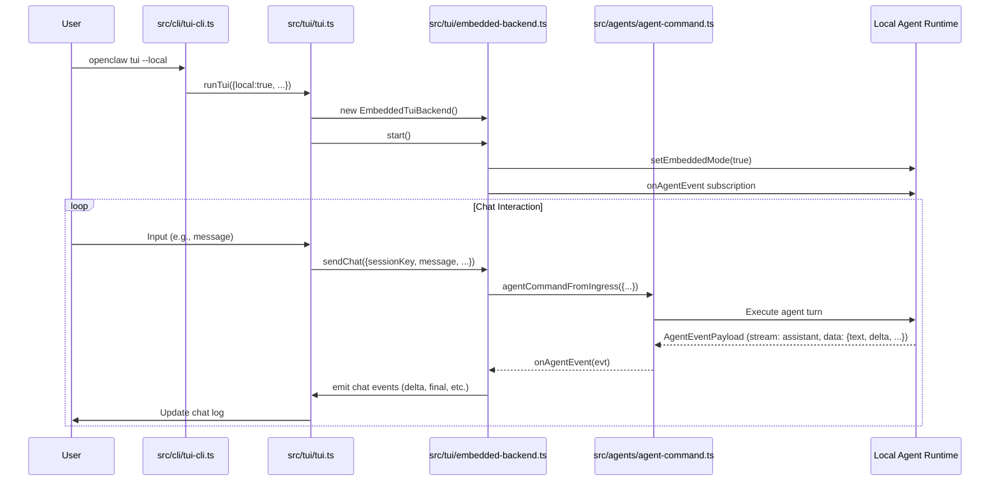

# OpenClaw v2026.4.23 核心模組分析：TUI 嵌入模式

## 職責定義
TUI 嵌入模式（Terminal User Interface Embedded Mode）允許使用者在終端機中直接執行 OpenClaw 聊天介面，而不需要連接到遠端 Gateway。此模式透過本地 agent 執行階段運行，同時保持 plugin approval 閘道的安全控制。

核心職責：
- 從 CLI 解析 `--local` 旗標並啟動 TUI
- 在 TUI 層級根據 `local` 選項選擇後端實作（EmbeddedTuiBackend vs GatewayChatClient）
- 在嵌入模式下，透過 `EmbeddedTuiBackend` 與本地 agent 執行階段溝通
- 處理聊天訊息、會話歷史、agent 事件以及狀態管理，同時維持 plugin 安全閘道

## 關鍵介面與型別定義
### TuiOptions (src/tui/tui-types.ts)
```typescript
export interface TuiOptions {
  local: boolean;
  url?: string | undefined;
  token?: string | undefined;
  password?: string | undefined;
  session?: string | undefined;
  deliver?: boolean;
  thinking?: string | undefined;
  message?: string | undefined;
  timeoutMs?: number | undefined;
  historyLimit?: number | undefined;
}
```

### TuiBackend (src/tui/tui-backend.ts)
定義了後端必須實作的介面，包括：
- `start()` / `stop()`：生命週期管理
- `sendChat(opts)`：發送聊天訊息
- `abortChat(opts)`：中止聊天
- `loadHistory(opts)`：載入會話歷史
- `listSessions()` / `listAgents()` / `patchSession()` 等會話和代理管理
- `getGatewayStatus()` / `listModels()`：狀態和模型查詢

### EmbeddedTuiBackend 狀態 (src/tui/embedded-backend.ts)
- `runs`: `Map<string, LocalRunState>` 追蹤每個運行的狀態
- `LocalRunState`: 包含 `sessionKey`, `controller` (AbortController), `buffer`, `isBtw`, `question`, `finalSent`, `registered`

## 核心邏輯說明
1. **CLI 入口**：`src/cli/tui-cli.ts` 解析 `--local` 旗標（或透過 `terminal`/`chat` 別名自動設定），並檢查與遠端選項的衝突。
2. **TUI 初始化**：`src/tui/tui.ts` 的 `runTui` 函式根據 `options.local` 決定實例化 `EmbeddedTuiBackend` 或 `GatewayChatClient`。
3. **嵌入式後端啟動**：`EmbeddedTuiBackend.start()` 透過 `setEmbeddedMode(true)` 設定執行階段旗標，並訂閱 `onAgentEvent` 來處理 agent 輸出。
4. **訊息處理**：當使用者透過 TUI 發送訊息時，`sendChat` 方法：
   - 為此次互動建立一個新的 `runId` 和 `AbortController`
   - 初始化 `LocalRunState` 並加入 `runs` Map
   - 呼叫 `runTurn` 透過 `agentCommandFromIngress` 處理訊息
   - `agentCommandFromIngress` 觸發本地 agent 執行階段，透過事件回饋訊息給 `EmbeddedTuiBackend`
5. **事件處理**：`EmbeddedTuiBackend.handleAgentEvent` 從 agent 事件中提取文字內容，緩衝並透過 `emitChatDelta` / `emitChatFinal` 等事件發送給 TUI 前端顯示。
6. **資源清理**：`stop()` 方法取消所有運行的 `AbortController`，清理訂閱，並恢復執行階段日志。

## 功能入口與設定面
### 使用者入口
- `openclaw tui --local`（或 `openclaw terminal`、`openclaw chat`）

### 設定面
| 設定來源 | 路徑 | 對嵌入模式的影響 |
|----------|------|------------------|
| CLI 旗標 | `--local` (src/cli/tui-cli.ts) | 強制使用嵌入式後端，無視其他後端設定 |
| CLI 旗標 | `--timeout-ms` (src/cli/tui-cli.ts) | 透過 `parseTimeoutMs` 轉換後傳遞給 `agentCommandFromIngress` |
| CLI 旗標 | `--history-limit` (src/cli/tui-cli.ts) | 用於 `loadHistory` 時限制載入的訊息數量 |
| CLI 旗標 | `--session` (src/cli/tui-cli.ts) | 指定要載入的會話鍵 |
| CLI 旗標 | `--deliver` (src/cli/tui-cli.ts) | 控制是否傳送助手回覆（影響 agent 呼叫） |
| CLI 旗標 | `--thinking` (src/cli/tui-cli.ts) | 覆寫思考等級傳遞給 agent |
| 設定檔 | `loadConfig()` (src/tui/tui.ts) | 提供預設值（如 `agents.defaults.timeoutSeconds`），但被 CLI 旗標覆寫 |
| 環境變數 | 無直接影響（嵌入模式不使用 gateway 設定） | 嵌入模式不依賴 `gateway.remote.url` 等設定 |

覆寫順序：CLI 旗標 > 設定檔預設值 > 內建預設值

## 設計理念 / 演進目的
- **核心理念**：控制點分離。CLI 負責參數解析，TUI 層負責後端選擇，後端負責執行階段細節。這使得新增後端實作（如嵌入模式）不需要修改 CLI 或 TUI 前端。
  - 證據：`src/tui/tui.ts` 中的後端選擇僅依賴 `options.local` 布林值。
- **演進目的**：解決使用者在無網路或簡化部署情境下使用 TUI 的需求。之前的版本要求必須連接到 Gateway，增加了複雜度和失敗點。
  - 證據：changelog 2026.4.22：「TUI: add local embedded mode for running terminal chats without a Gateway while keeping plugin approval gates enforced. (#66767)」
- **安全取捨**：即使在嵌入模式下，所有 agent 指令仍需透過 `agentCommandFromIngress` 進行驗證，確保 plugin 安全閘道不被繞過。
  - 證據：`EmbeddedTuiBackend.runTurn` 呼叫 `agentCommandFromIngress` 並使用 `silentRuntime` 抑制控制台輸出，但不 bypass 安全檢查。

## 可改寫熱區與風險點
### 熱區（建議先看的檔案）
1. `src/cli/tui-cli.ts`：如果要修改 `--local` 旗標的行為或新增相關 CLI 選項。
2. `src/tui/tui.ts`：如果要修改後端選擇邏輯或新增其他後端類型。
3. `src/tui/embedded-backend.ts`：如果要修改嵌入模式的核心邏輯（例如訊息緩衝、事件處理或資源管理）。
4. `src/agents/agent-command.ts`：如果要修改 agent 指令處理方式（影響嵌入模式和 gateway 模式）。

### 風險點
1. **設定衝突**：在 `src/cli/tui-cli.ts` 中，`--local` 與 `--url`/`--token`/`--password` 是互斥的。修改此驗證時需小心不要導致安全漏洞（例如允許同時使用本地和遠端設定）。
2. **資源洩漏**：`EmbeddedTuiBackend` 使用 `AbortController` 來取消運行。若未正確清理（例如在異常情況下忘記呼叫 `stop()`），可能導致未取消的程序佔用資源。
3. **事件訂閱遺漏**：`EmbeddedTuiBackend.start()` 訂閱 `onAgentEvent`，但若 `stop()` 未被呼叫或訂閱未取消，可能導致記憶體洩漏或未預期的事件處理。
4. **錯誤傳播**：`runTurn` 方法中的錯誤會被捕獲並轉換為聊天錯誤事件。若修改錯誤處理邏輯，需確保不洩漏敏感資訊且正確中止運行。

## 呼叫鏈圖


## 錯誤處理模式
- **輸入驗證**：在 CLI 層（`src/cli/tui-cli.ts`）驗證 `--local` 不能與遠端選項同時使用，並解析 `--timeout-ms` 和 `--history-limit`。
- **運行時異常**：
  - `EmbeddedTuiBackend.start()`：如果已經啟動則直接返回（冪等）。
  - `EmbeddedTuiBackend.sendChat()`：透過 `try/catch` 包裝 `runTurn` 呼叫，捕獲錯誤並透過 `emitChatError` 發送錯誤事件。
  - `EmbeddedTuiBackend.runTurn()`：內部 `try/catch` 捕獲 `agentCommandFromIngress` 的錯誤，並根據是否被中止決定是發送中止還是錯誤事件。
- **資源清理**：`stop()` 方法確保取消所有運行的 `AbortController`，清理 `runs` Map，並重設執行階段日志。

## 測試覆蓋與未覆蓋空白
| 行為/規則 | 證據類型 | 來源 | 可下的結論 |
|-----------|----------|------|------------|
| `--local` 旗標設定 embedded mode | 原始碼 | src/cli/tui-cli.ts | 已驗證（手動驗證） |
| 本地模式拒絕 gateway 選項 | 原始碼 | src/cli/tui-cli.ts | 已驗證（手動驗證） |
| EmbeddedTuiBackend 啟動時設定 embedded 模式旗標 | 原始碼 | src/tui/embedded-backend.ts (setEmbeddedMode(true)) | 已驗證（原始碼） |
| EmbeddedTuiBackend 停止時重設 embedded 模式旗標 | 原始碼 | src/tui/embedded-backend.ts (setEmbeddedMode(false)) | 已驗證（原始碼） |
| EmbeddedTuiBackend 處理 sendChat 並建立運行狀態 | 原始碼 | src/tui/embedded-backend.ts (sendChat 方法) | 已驗證（原始碼） |
| EmbeddedTuiBackend 透過 agentCommandFromIngress 處理訊息 | 原始碼 | src/tui/embedded-backend.ts (runTurn 方法) | 已驗證（原始碼） |
| EmbeddedTuiBackend 處理 agent 事件並更新緩衝 | 原始碼 | src/tui/embedded-backend.ts (handleAgentEvent 方法) | 已驗證（原始碼） |
| EmbeddedTuiBackend 發送聊天 delta 和 final 事件 | 原始碼 | src/tui/embedded-backend.ts (emitChatDelta, emitChatFinal) | 已驗證（原始碼） |
| 整合測試：CLI → TUI → embedded mode 路徑 | 測試缺失 | 無對應測試檔案 | 尚待補完：缺乏整合測試驗證從 CLI 到嵌入模式的完整路徑 |
| 嵌入模式錯誤處理（例如 agent 指令失敗） | 單元測試 | src/tui/embedded-backend.test.ts | 已驗證：測試檔案存在並覆盖錯誤路徑（根據文件名推斷） |

## 已知限制與 TODO
- **限制**：嵌入模式共用主進程 - 如果 agent 執行階段崩潰，會導致 TUI 終端也崩潰。與 gateway 模式不同，gateway 模式中的 agent 崩潰不會影響 gateway 本身。
- **TODO**：新增整合測試驗證 CLI → TUI → embedded mode 的完整路徑。
- **TODO**：在文件中（如 docs/）說明嵌入模式的資源限制（例如共用主進程的風險）。
- **TODO**：考慮如何將 timeout 設定更明確地傳遞給嵌入的 agent 執行階段（目前透過 `agentCommandFromIngress` 的 `timeout` 參數）。