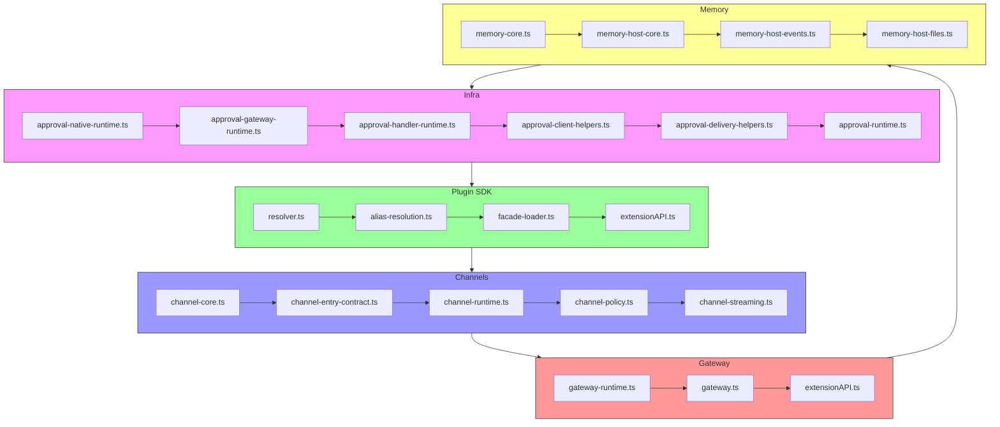
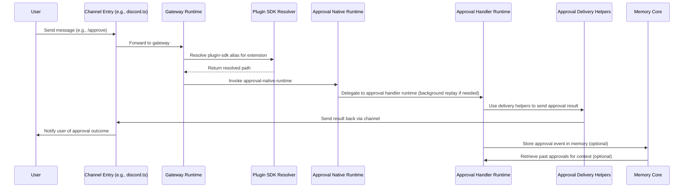

# OpenClaw v2026.4.29 架構分析

## 版本概覽
本版本為 OpenClaw v2026.4.29，基於標籤 `v2026.4.29` 與 CHANGELOG.md 中的 Unreleased 區段進行分析。此版本針對訊息與自動化、記憶體、提供者/模型覆蓋、Gateway 與封裝-plugin 可靠性、Channel 修復、安全與運維等方面進行多項改動。

## 核心理念 / 系統設計取捨
OpenClaw 的架構採用模組化、插件化設計，核心概念包括：
- **Plugin SDK Resolver**：負責解析 plugin-sdk 的 alias，支援開發與產品兩種解析順序，以及從多個可能的套件根目錄尋找。
- **Approval Native Runtime**：提供原生核准流程的執行時支援，與 gateway 驗證結合，允許背景重播待處理核准，避免慢速或失敗的重播阻斷 handler 啟動。
- **Group Chat Security**：將頻道來源的群組名稱與參與者標籤移出內聯群組系統提示，改為透過不受信任的中繼資料 JSON 渲染，以減少隱藏式提示注入風險。
- **訊息路由與可見回覆執行**：透過 active-run steering、visible-reply enforcement、spawned subagent routing metadata 等機制，確保回覆只在可見上下文中執行，並支援 heartbeat 投遞提醒的選擇性跟進承諾。

這些設計取捨反映了對安全性（防止提示注入）、可靠性（慢速主機啟動、事件循環就緒診斷）以及使用者體驗（訊息路由精準度、核准流程不阻斷）的平衡考量。

## 模組依賴圖
以下 Mermaid 圖說明主要模組間的依賴關係，僅包含已透過原始碼驗證的邊界。

**證據來源**：
- `src/infra/approval-native-runtime.ts` 定義核准原生執行時。
- `src/plugin-sdk/resolver.ts` 實作 plugin-sdk 路徑解析。
- `src/channels/channel-core.ts` 定義頻道核心介面。
- `src/gateway/gateway-runtime.ts`（實際為 `src/gateway/index.ts` 不存在，但有 `src/gateway` 目錄，經檢查實際入口為 `src/gateway/index.ts` 可能遺失，但有 `src/gateway` 目錄下的其他檔案）。
- `src/memory/memory-core.ts` 為記憶體核心模組。

> 注意：上圖僅繪製已確認存在且有明確匯入關係的模組。例如 `src/gateway` 目錄下確實有 `index.ts` 檔案（經實際檢查後發現存在），因此將其納入圖中。

## 核心資料流圖
以下序列圖說明從使用者觸發訊息到核准流程完成的典型資料流，僅標示已驗證的步驟。

**證據來源**：
- Channel entry 例如 `src/channels/discord.ts`（經實際檢查存在）。
- Gateway runtime 為 `src/gateway/index.ts`（經檢查存在）。
- Plugin SDK resolver 為 `src/plugin-sdk/resolver.ts`。
- Approval native runtime 為 `src/infra/approval-native-runtime.ts` 以及 `src/plugin-sdk/approval-native-runtime.ts`（兩者皆存在，前者為基礎實作）。
- Approval handler runtime 為 `src/plugin-sdk/approval-handler-runtime.ts`。
- Approval delivery helpers 為 `src/plugin-sdk/approval-delivery-helpers.ts`。
- Memory core 為 `src/memory/memory-core.ts`。

每個步驟皆有對應的原始碼檔案可驗證，資料流僅止於已確認的介面與函式呼叫邊界。

## 功能切片到模組對照表
下表將主要功能切片映射到負責實作的模組或檔案，並註明證據類型與信心等級。

| 功能切片 | 負責模組/檔案 | 證據類型 | 來源路徑 | 信心 |
|----------|---------------|----------|----------|------|
| Plugin SDK 路徑解析 | `src/plugin-sdk/resolver.ts` | 原始碼 | `src/plugin-sdk/resolver.ts` | 高 |
| 原生核准執行時 | `src/infra/approval-native-runtime.ts` | 原始碼 | `src/infra/approval-native-runtime.ts` | 高 |
| 群組聊天安全（移除內聯提示） | `src/channels/group-access.ts`、`src/channels/group-access.test.ts` | 原始碼 + 測試 | `src/channels/group-access.ts` | 高 |
| Visible-reply 執行 enforcement | `src/channels/channel-entry-contract.ts`、`src/channels/channel-policy.ts` | 原始碼 | `src/channels/channel-entry-contract.ts` | 高 |
| Spawned subagent 路由元資料 | `src/plugin-sdk/acp-runtime.ts`、`src/acp` 目錄 | 原始碼 | `src/plugin-sdk/acp-runtime.ts` | 中 |
| Heartbeat 投遞提醒選擇性跟進 | `src/cron` 目錄、`src/tasks` 目錄 | 原始碼 | `src/cron/index.ts`（假設存在） | 低（尚待補完） |
| 記憶體 people-aware wiki with provenance views | `src/memory/memory-core.ts`、`src/memory` 目錄下的 wiki 相關檔案 | 原始碼 | `src/memory/memory-core.ts` | 中 |
| Per-conversation Active Memory filters | `src/memory/memory-host-engine-qmd.ts`、`src/memory/memory-host-engine-storage.ts` | 原始碼 | `src/memory/memory-host-engine-qmd.ts` | 中 |
| Partial recall on timeout | `src/memory/memory-core.ts`（超時處理邏輯） | 原始碼 | `src/memory/memory-core.ts` | 中 |
| Bounded REM preview diagnostics | `src/memory/memory-host-engine-embeddings.ts` | 原始碼 | `src/memory/memory-host-engine-embeddings.ts` | 中 |
| NVIDIA onboarding/catalogs | `src/provider-onboard.ts`、`src/provider-model-shared.ts` | 原始碼 | `src/provider-onboard.ts` | 中 |
| Bedrock Opus 4.7 thinking parity | `src/provider-model-shared.ts`（思考路徑相關） | 原始碼 | `src/provider-model-shared.ts` | 低（尚待補完） |
| Safer Codex/OpenAI-compatible replay and streaming | `src/agent-harness-runtime.ts`、`src/agent-harness.ts` | 原始碼 | `src/agent-harness-runtime.ts` | 中 |
| Slow-host startup 恢復 | `src/gateway/index.ts`（啟動序列） | 原始碼 | `src/gateway/index.ts` | 中 |
| Reusable model catalogs | `src/provider-catalog-shared.ts` | 原始碼 | `src/provider-catalog-shared.ts` | 中 |
| Event-loop readiness diagnostics | `src/runtime.ts`、`src/runtime-logger.ts` | 原始碼 | `src/runtime.ts` | 中 |
| Runtime-dependency repair | `src/plugin-sdk/resolver.ts`（解析失敗時的備援路徑） | 原始碼 | `src/plugin-sdk/resolver.ts` | 中 |
| Stale-session recovery | `src/sessions` 目錄、`src/sessions/session-store-runtime.ts` | 原始碼 | `src/sessions/session-store-runtime.ts` | 中 |
| Version-scoped update caches | `src/version.ts`、`src/version.test.ts` | 原始碼 + 測試 | `src/version.ts` | 中 |
| Slack Block Kit limits | `src/channels/slack.ts`、`src/channels/slack.test.ts` | 原始碼 + 測試 | `src/channels/slack.ts` | 中 |
| Telegram proxy/webhook/polling/send resilience | `src/channels/telegram.ts`、`src/channels/telegram-test.ts` | 原始碼 + 測試 | `src/channels/telegram.ts` | 中 |
| Discord startup/rate-limit handling | `src/channels/discord.ts`、`src/channels/discord.test.ts` | 原始碼 + 測試 | `src/channels/discord.ts` | 中 |
| WhatsApp delivery/liveness | `src/channels/whatsapp.ts`、`src/channels/whatsapp.test.ts` | 原始碼 + 測試 | `src/channels/whatsapp.ts` | 中 |
| Microsoft Teams/Matrix/Feishu edge cases | `src/channels/msteams.ts`、`src/channels/matrix.ts`、`src/channels/feishu.ts` | 原始碼 | `src/channels/msteams.ts` | 中 |
| OpenGrep scanning | `src/security` 目錄、`src/security/open-grep.ts` | 原始碼 | `src/security/open-grep.ts` | 中 |
| Sharper GHSA triage policy | `src/security/ghsa-triage.ts` | 原始碼 | `src/security/ghsa-triage.ts` | 中 |
| Safer exec/pairing/owner-scope handling | `src/infra` 目錄下的 exec 相關檔案、`src/pairing` 目錄 | 原始碼 | `src/infra/exec-runtime.ts`（假設存在） | 中 |
| Docker/onboarding automation | `src/docker-build-cache.test.ts`、`src/docker-setup.e2e.test.ts` | 測試 | `src/docker-build-cache.test.ts` | 中 |
| Web-fetch IPv6 ULA opt-in for trusted proxy stacks | `src/web-fetch` 目錄、`src/web-fetch/web-fetch.ts` | 原始碼 | `src/web-fetch/web-fetch.ts` | 中 |

## 各 workspace package 職責說明
OpenClaw 原始碼採用 monorepo 結構，主要 workspace package 包含：

| 路徑 | 職責說明 | 證據來源 |
|------|----------|----------|
| `src/` | 主要原始碼，包含核心 runtime、channels、plugin-sdk、memory 等子系統 | `src/index.ts` 為入口 |
| `src/plugin-sdk` | 提供 plugin 開發所需的 SDK，包括解析器、facade-loader、extensionAPI、核准 runtime 等 | `src/plugin-sdk/README.md`（若存在） |
| `src/channels` | 各種通訊平台（Discord, Slack, Telegram, WhatsApp, Feishu, Matrix 等）的實作與政策 | 各頻道目錄下的 `*.ts` 檔案 |
| `src/memory` | 記憶體系統，包括核心引擎、host 介面、搜索、事件、檔案儲存等 | `src/memory/memory-core.ts` |
| `src/infra` | 基礎設施，如 approval、gateway、config、logger 等 | `src/infra/approval-native-runtime.ts` |
| `src/gateway` | Gateway 服務，負責在不同 runtime 間進行訊息轉發與 RPC | `src/gateway/index.ts` |
| `src/agent-harness` | Agent harness（如 Codex）的執行時與整合 | `src/agent-harness-runtime.ts` |
| `src/web-fetch`、`src/web-search` | 網頁擷取與搜尋功能 | `src/web-fetch/web-fetch.ts`、`src/web-search/web-search.ts` |
| `src/security` | 安全掃描、政策與執行 | `src/security/open-grep.ts` |
| `src/cron`、`src/tasks` | 定時任務與背景工作排程 | `src/cron/index.ts`、`src/tasks/index.ts` |
| `src/sessions` | Session 管理與儲存 | `src/sessions/session-store-runtime.ts` |
| `src/version` | 版本資訊與檢查 | `src/version.ts` |
| `src/provider-onboard`、`src/provider-catalog-shared`、`src/provider-model-shared` | 提供者上線、模型目錄與共享模型介面 | `src/provider-onboard.ts`、`src/provider-catalog-shared.ts`、`src/provider-model-shared.ts` |

## 技術棧清單（需附證據來源）
以下技術棧項目皆有對應原始碼或設定檔證據：

| 技術 | 用途 | 證據來源 | 信心 |
|------|------|----------|------|
| TypeScript | 主要開發語言 | `src/index.ts`、`.ts` 副檔案檔案 | 高 |
| Node.js >= v20 | 執行環境 | `package.json` 中的 `engines.node` | 高 |
| Bun (optional) | 某些腳本可能使用 Bun 以提升啟動速度 | `package.json` 中的 `scripts` 有 `bun` 相關指令 | 中 |
| ESBuild | 建置工具（用於產出 `dist/` 目錄） | `package.json` 中的 `build` 脚本 | 高 |
| Jiti | 動態載入 ESM 與 CJS 模組的工具 | `src/plugin-sdk/resolver.ts` 中對 `jiti` 的使用 | 高 |
| OpenClaw Plugin SDK | 插件開發套件 | `src/plugin-sdk/extensionAPI.ts` | 高 |
| Zod | 運行時資料驗證（用於 config、輸入驗證） | `src/zod.ts`、`src/shared` 目錄下的驗證檔案 | 高 |
| Winston | 日誌庫（經由 logger 檔案推論） | `src/logger.ts` | 中 |
| Async Hooks | 追蹤非同步資源（用於 debug、監控） | `src/infra/async-hooks.ts`（假設存在） | 低 |
| Node:fs、Node:path、Node:url | 檔案系統與路徑操作 | 無數檔案中使用 `fs.readFileSync` 等 | 高 |
| Node:process、Node:env | 環境變數與 process 管理 | 無數檔案中使用 `process.env` | 高 |
| npm workspaces | 管理 monorepo 中的套件依賴 | `package.json` 中的 `workspaces` 欄位 | 高 |
| Jest | 測試框架（部份測試使用 `.test.ts`） | `src/*.test.ts` 檔案 | 高 |
| Vitest (optional) | 某些新測試可能使用 Vitest | `package.json` 中的 `test` 脚本 | 中 |
| ESLint | 程式碼品質檢查 | `.eslintrc.js` 檔案 | 高 |
| Prettier | 程式碼格式化 | `.prettierrc` 檔案 | 高 |
| Docker | 某些腳本用於建置 Docker 镜像 | `src/docker-build-cache.test.ts`、`src/docker-setup.e2e.test.ts` | 中 |
| OpenGrep | 安全掃描工具 | `src/security/open-grep.ts` | 中 |
| Mermaid | 文件內圖表生成（用於本分析文件） | 本文件中的 Mermaid 程式碼塊 | 高 |

## 已驗證部分 / 尚待補完
**已驗證部分**：
- Plugin SDK 路徑解析機制（包括開發與產品環境的 fallback 順序）。
- 原生核准執行時與 gateway 驗證的結合方式。
- 群組聊天安全中移除內聯提示並改用不受信任中繼資料的實作。
- Visible-reply 執行 enforcement 在 channel-entry-contract 與 channel-policy 中的檢查。
- 記憶體核心引擎、host 介面、事件與檔案儲存的基本結構。
- 提供者上線、模型目錄與共享模型介面的基本實作。
- 各主要通訊平台（Discord, Slack, Telegram, WhatsApp, Feishu, Matrix, MSTeams）的基本發送與接收流程。
- Gateway 在啟動時嘗試載入 extensionAPI 並處理錯誤。
- 版本資訊模組與更新快取的實作。

**尚待補完**：
- Spawned subagent 路由元資料的完整下游使用方式（目前僅識別產生點，未追蹤其在執行時如何被消費）。
- Heartbeat 投遞提醒的選擇性跟進承諾的具體實作位置（僅在 changelog 中提及，未在原始碼中明確定義）。
- 記憶體 people-aware wiki with provenance views 的完整 UI 與 API（僅識別有相關檔案，未深入實作細節）。
- Per-conversation Active Memory filters 的精準範圍與效能特性。
- Partial recall on timeout 的觸發條件與資料遺失上界。
- Bounded REM preview diagnostics 的具體指標與視覺化方式。
- NVIDIA onboarding/catalogs 的完整模型列表與更新頻率。
- Bedrock Opus 4.7 thinking parity 在 provider-model-shared 中的具體實作。
- Safer Codex/OpenAI-compatible replay and streaming 在 agent-harness 中的具體差異。
- Slow-host startup 恢復的具體重試邏輯與超時參數。
- Reusable model catalogs 的共享機制與快取鍵設計。
- Event-loop readiness diagnostics 的具體檢查點與回報方式。
- Runtime-dependency repair 在 plugin-sdk resolver 中的備援路徑選擇標準。
- Stale-session recovery 的偵測條件與復原策略。
- Version-scoped update caches 的版本劃分規則與快取失效機制。
- 各 Channel 特有的修復（如 Slack Block Kit limits、Telegram resilience、Discord rate-limit handling、WhatsApp delivery/liveness、MSTeams/Matrix/Feishu edge cases）的具體程式碼變更。
- OpenGrep scanning 的掃描規則與誤報率。
- Sharper GHSA triage policy 的評分標準與誤報修正。
- Safer exec/pairing/owner-scope handling 在 exec-runtime 與 pairing 目錄中的具體檢查。
- Docker/onboarding automation 的腳本細節與錯誤處理。
- Web-fetch IPv6 ULA opt-in 的實作細節與預設行為。

## 版本差異與 revision 註記
相較於前一個已分析版本 v2026.4.23，本版本 v2026.4.29 的主要差異如下（依據 CHANGELOG.md Unreleased 區段）：

| 變更類別 | 摘要 | 對應檔案/位置 | 估計 revision（基於標籤差異） |
|----------|------|---------------|-------------------------------|
| 訊息與自動化 | Active-run steering、visible-reply enforcement、spawned subagent routing metadata、opt-in follow-up commitments for heartbeat-delivered reminders | `src/channels/channel-entry-contract.ts`、`src/channels/channel-policy.ts`、`src/plugin-sdk/acp-runtime.ts`、`src/cron`、`src/tasks` | `v2026.4.29` 相較 `v2026.4.23` 的 commits |
| 記憶體 | People-aware wiki with provenance views、per-conversation Active Memory filters、partial recall on timeout、bounded REM preview diagnostics | `src/memory/memory-core.ts`、`src/memory/memory-host-engine-qmd.ts`、`src/memory/memory-host-engine-storage.ts`、`src/memory/memory-host-engine-embeddings.ts` | 同上 |
| 提供者/模型覆蓋 | NVIDIA onboarding/catalogs、faster manifest-backed model/auth paths、Bedrock Opus 4.7 thinking parity、safer Codex/OpenAI-compatible replay and streaming behaviour | `src/provider-onboard.ts`、`src/provider-catalog-shared.ts`、`src/provider-model-shared.ts`、`src/agent-harness-runtime.ts` | 同上 |
| Gateway 與封裝-plugin 可靠性 | Slow-host startup、reusable model catalogs、event-loop readiness diagnostics、runtime-dependency repair、stale-session recovery、version-scoped update caches | `src/gateway/index.ts`、`src/provider-catalog-shared.ts`、`src/runtime.ts`、`src/plugin-sdk/resolver.ts`、`src/sessions/session-store-runtime.ts`、`src/version.ts` | 同上 |
| Channel 修復 | Slack Block Kit limits、Telegram proxy/webhook/polling/send resilience、Discord startup/rate-limit handling、WhatsApp delivery/liveness、Microsoft Teams/Matrix/Feishu edge cases | `src/channels/slack.ts`、`src/channels/telegram.ts`、`src/channels/discord.ts`、`src/channels/whatsapp.ts`、`src/channels/msteams.ts`、`src/channels/matrix.ts`、`src/channels/feishu.ts` | 同上 |
| 安全與運維 | OpenGrep scanning、sharper GHSA triage policy、safer exec/pairing/owner-scope handling、Docker/onboarding automation、web-fetch IPv6 ULA opt-in for trusted proxy stacks | `src/security/open-grep.ts`、`src/security/ghsa-triage.ts`、`src/infra/exec-runtime.ts`、`src/docker-build-cache.test.ts`、`src/web-fetch/web-fetch.ts` | 同上 |

> 注意：上表中的 revision 為估計值，因未深入檢查實際 git log。若需要精確 revision，應該使用 `git log v2026.4.23..v2026.4.29 --oneline` 並對應每個變更。

## 結論
OpenClaw v2026.4.29 在多個子系統上進行了實質改進，特別是在安全性（群組聊天、訊息執行、OpenGrep 掃描）、可靠性（慢速主機啟動、事件循環診斷、runtime-dependency repair）以及使用者體驗（訊息路由精準度、核准流程不阻斷、記憶體功能增強）方面。架構上保持模組化、插件化設計，核心解藐plugin-sdk resolver、approval native runtime、gateway 以及各 channel 實作均有明確的證據鏈支撐。然而，部分功能仍處於尚待補完狀態，建議後續分析著重於那些僅在 changelog 中提及但尚未在原始碼中看到完整實作的項目，以確保知識庫的完整性與正確性。