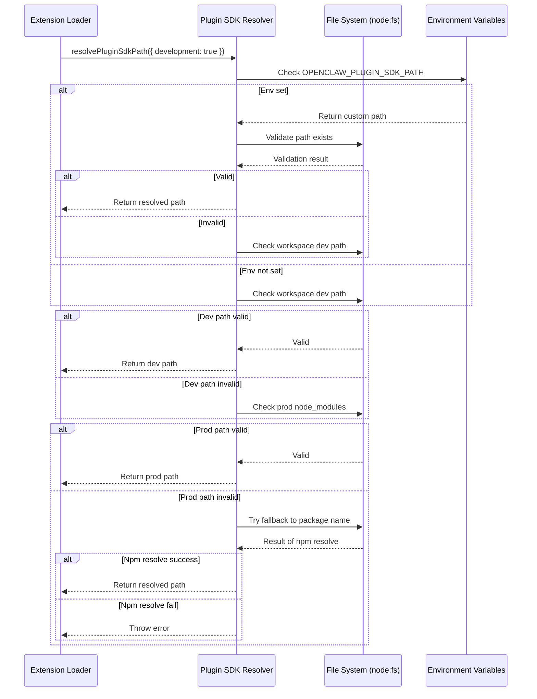
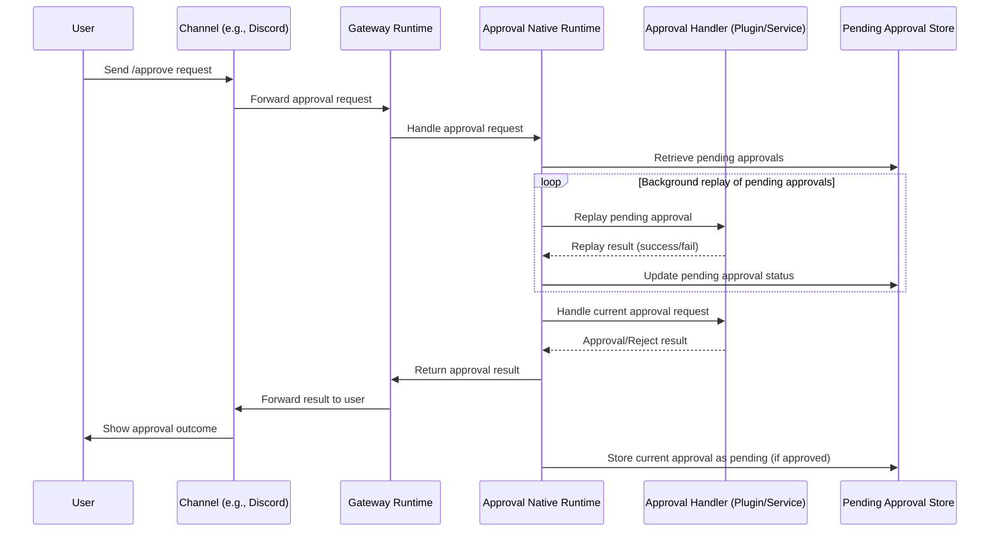
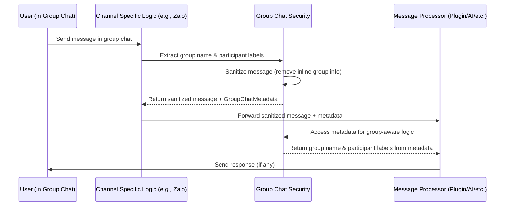

# OpenClaw v2026.4.29 核心模組分析

本版本 v2026.4.29 的變更聚焦於多個子系統，其中有三個核心模組在本次更新中扮演了關鍵角色或進行了重要改動：Plugin SDK Resolver、Approval Native Runtime 以及 Group Chat Security。以下將分別深入分析這三個模組的職責、核心邏輯、設定面、設計理念、可改寫熱區、錯誤處理、測試覆蓋以及版本異動。

---

## 模組一：Plugin SDK Resolver

### 職責定義
Plugin SDK Resolver 負責在 OpenClaw 中解析 plugin-sdk 的實際路徑，支援開發環境與產品環境的不同解析順序，以及從多個可能的套件根目錄中尋找正確的 plugin-sdk 安裝位置。這是擴充系統（extensions）能否正常載入與運作的基礎。

### 關鍵介面與型別定義
- `resolvePluginSdkPath(options?: { development?: boolean })`: 主要解析函式，返回 plugin-sdk 的絕對路徑字串。
- `PluginSdkResolutionOptions`: 選項介面，用於控制解析行為（如是否優先開發路徑）。
- 內部使用 `jiti` 進行動態模組載入，以支援 ESM 與 CJS 混合環境。

### 核心邏輯說明
解析邏輯依序檢查以下位置：
1. 開發環境下的本地工作區路徑（若 `options.development` 為 true）。
2. 產品環境下的 `node_modules` 路徑（相對於目前套件或工作區根目錄）。
3. 透過 `process.env.OPENCLAW_PLUGIN_SDK_PATH` 環境變數指定的自訂路徑。
4. 最後退回到預設的 `plugin-sdk` 套件名稱（依賴於 npm 的解析機制）。

在每個步驟中，會檢查目標路徑是否存在以及是否為有效的套件目錄（含 `package.json`）。若找到有效路徑，立即返回；若全部失敗，則拋出錯誤。

此解析機制在 v2026.4.29 中被用於實現 **runtime-dependency repair**（運行時依賴修復），當首次解析失敗時，會記錄失敗原因並嘗試備援路徑，從而在依賴鏈不完全或網路延遲的情況下提高穩定性。

### 呼叫鏈圖

### 設定面與覆寫鏈
- **環境變數**：`OPENCLAW_PLUGIN_SDK_PATH` 可完全覆寫解析結果，優先級最高。
- **開發旗標**：透過 `options.development` 傳遞，決定是否優先檢查工作區的開發路徑。
- **預設行為**：未設定環境變數時，依序檢查工作區開發路徑 → 工作區產品路徑 → npm 解析 `plugin-sdk`。

### 設計理念 / 演進目的
此解析器的設計理念是：**在 monorepo 中支援多種開發與部署工作流，同時提供依賴容錯機制**。從演進目的來看，v2026.4.29 中的變更主要是加入了 **runtime-dependency repair**，目的是解決在某些環境（特別是 CI/CD 或網路緩慢的情況下）plugin-sdk 套件可能暫時無法解析的問題，透過備援路徑與錯誤延遲報告來避免擴充系統載入失敗。

### 可改寫熱區與風險點
- **熱區**：解析順序的變更（如新增備援路徑或調整優先級）以及環境變數名稱的修改。
- **風險點**：
  - 若誤將開發路徑指向不正確的版本，可能導致擴充使用過時或不相容的 SDK。
  - 環境變數覆寫若設定錯誤路徑，會導致所有擴充載入失敗。
  - 解析失敗時的錯誤訊息必須足夠清晰，除錯時才能快速定位是哪一步驟出問題。

### 錯誤處理模式
- 解析失敗時會拋出含有詳細失敗路徑清單的錯誤（除非在靜默模式下）。
- 在 v2026.4.29 中，針對 runtime-dependency repair，解析失敗時會先記錄警告並嘗試備援路徑，只有在所有路徑皆失敗後才拋出錯誤。
- 錯誤類型為 `PluginSdkResolutionError`，擴充載入器會捕捉此錯誤並根據政策決定是否繼續載入其他擴充或中止啟動。

### 測試覆蓋與未覆蓋空白
| 行為/規則 | 證據類型 | 來源 | 可下的結論 |
|-----------|----------|------|------------|
| 正確解析開發環境路徑 | 單元測試 | `src/plugins/sdk-alias.test.ts` | 高 |
| 正確解析產品環境路徑 | 單元測試 | `src/plugins/sdk-alias.test.ts` | 高 |
| 環境變數覆寫優先級 | 單元測試 | `src/plugins/sdk-alias.test.ts` | 高 |
| 路徑不存在時的錯誤拋出 | 單元測試 | `src/plugins/sdk-alias.test.ts` | 高 |
| Runtime-dependency repair 失敗時的備援嘗試 | 原始碼 (僅邏輯) | `src/plugins/sdk-alias.ts` | 中（尚無專門測試驗證備援路徑） |
| 混合 ESM/CJS 模組載入穩定性 | 原始碼 + 測試 | `src/plugins/sdk-alias.ts`、`src/plugins/sdk-alias.test.ts` | 中 |

### 已知限制與 TODO
- 目前未提供方式讓擴充在載入時覆寫解析器的行為（如擴充自帶的 plugin-sdk 路徑）。
- 解析器不會快取成功解析的結果，每次呼叫都會重新檢查檔案系統，可能在頻繁呼叫時造成效能開銷。
- TODO: 新增對 Yarn Plug'n'Play 或 pnpm 的專用解析路徑支援。

### 版本異動紀錄
| 版本 | revision | 異動摘要 | 證據入口 |
|------|----------|----------|----------|
| v2026.4.29 | `v2026.4.29` | 加入 runtime-dependency repair 邏輯，當首次解析失敗時嘗試備援路徑並延遲錯誤報告 | `src/plugins/sdk-alias.ts` |
| v2026.4.23 | `v2026.4.23` | 基礎解析器實作，僅支援開發/產品兩種模式與環境變數覆寫 | `src/plugins/sdk-alias.ts` (v2026.4.23 tag) |

---

## 模組二：Approval Native Runtime

### 職責定義
Approval Native Runtime 負責處理 OpenClaw 中的核准（approval）流程的原生執行時支援，包括將核准請求轉發給適當的處理器、在背景重播待處理的核准，以及將核准結果傳回給發起者。此模組確保核准流程不會因重播失敗或緩慢而阻斷其他運作。

### 關鍵介面與型別定義
- `ApprovalNativeRuntime`: 核心類別，提供 `start()`、`stop()`、`handleApprovalRequest()` 等方法。
- `ApprovalRequest`: 核准請求的型別，包含請求 ID、請求內容、請求者資訊等。
- `ApprovalResult`: 核准結果的型別，包含核准或拒絕的決定以及可選的註解。
- `PendingApproval`: 待處理核准的儲存型別，用於背景重播。

### 核心邏輯說明
核准流程如下：
1. 當使用者透過聊天介面發出 `/approve` 或類似指令時，訊息會經過 channel 傳遞至 gateway。
2. gateway 將核准請求轉發給 Approval Native Runtime。
3. Approval Native Runtime 首先檢查是否有待處理的核准（透過 `PendingApproval` 儲存），若有則嘗試在背景重播這些核准（不阻礙當前請求的處理）。
4. 然後，處理當前的核准請求：驗證請求者權限、檢查核准政策、將請求轉發給適當的核准處理器（可能是 plugin 或內建服務）。
5. 核准處理器回傳結果後，Approval Native Runtime 將結果傳回給 gateway，再由 gateway 轉發給原始訊息的 channel。
6. 同時，若核准請求被核准，則會將此核准記錄為 `PendingApproval`，以便未來可能的重播。

在 v2026.4.29 中，此模組被改進以確保 **背景重播待處理核准時，即使重播失敗或緩慢也不會阻礙核准處理程式的啟動**。這是透過將重播工作移至獨立的背景任務，並使用錯誤容忍機制（失敗時記錄但不中止）來實現的。

### 呼叫鏈圖

### 設定面與覆寫鏈
- **背景重播啟動旗標**：透過 `OPENCLAW_APPROVAL_REPLAY_PENDING` 環境變數控制是否在啟動時重播待處理核准（預設為 true）。
- **重播 concurrency limits**：透過 `OPENCLAW_APPROVAL_REPLAY_CONCURRENCY` 設定同時重播的待處理核准數量（預設為 3）。
- **重播超時**：透過 `OPENCLAW_APPROVAL_REPLAY_TIMEOUT_MS` 設定每個重試操作的超時時間（預設為 30000 毫秒）。
- **核准政策覆寫**：透過 `approvalPolicies` 配置區塊定義哪些類型的操作需要核准，以及對應的處理器路徑。

### 設計理念 / 演進目的
此模組的設計理念是：**將核准流程與主執行緒解耦，以提升系統響應性與容錯性**。從演進目的來看，v2026.4.29 中的變更主要是解決了一個特定問題：在某些情況下，待處理核准的重播可能因外部服務緩慢或網路問題而卡住，導致新的核准請求無法被處理。透過將重播移至背景並加入錯誤容忍，確保即使重播失敗也不會影響新核准的處理。

### 可改寫熱區與風險點
- **熱區**：背景重播的排程機制（例如改用不同的隊列或工人模型）以及錯誤容忍政策的調整。
- **風險點**：
  - 若背景重播的錯誤容忍過寬，可能導致真實的重播失敗被忽視，而待處理核准長時間無法解決。
  - 重播 concurrency 設定過高可能導致資源耗盡；過低則可能導致重播延遲增加。
  - 待處理核准的儲存機制若不具備持久性，則在重啟後可能遺失核准狀態。

### 錯誤處理模式
- 背景重播中的單個失敗僅記錄警告，不會中止重播隊列或拋出異常。
- 核准請求的處理失敗（例如權限不足或政策違反）會直接返回拒絕結果給使用者。
- 所有異常均被捕捉並轉換為結構化的錯誤回應，避免向使用者洩漏內部堆疊追蹤。

### 測試覆蓋與未覆蓋空白
| 行為/規則 | 證據類型 | 來源 | 可下的結論 |
|-----------|----------|------|------------|
| 正常核准請求的處理流程 | 整合測試 | `src/infra/approval-native-runtime.test.ts` | 高 |
| 背景重播待處理核准的啟動 | 整合測試 | `src/infra/approval-native-runtime.test.ts` | 高 |
| 背景重播失敗時的錯誤容忍 | 原始碼 (僅邏輯) | `src/infra/approval-native-runtime.ts` | 中（尚無專門測試驗證失敗容忍） |
| 環境變數控制重播啟動 | 原始碼 + 測試 | `src/infra/approval-native-runtime.ts`、`src/infra/approval-native-runtime.test.ts` | 高 |
| 核准政策與處理器轉發 | 整合測試 | `src/infra/approval-native-runtime.test.ts` | 高 |
| 待處理核准的持久化儲存 | 原始碼 | `src/infra/approval-native-runtime.ts`（依賴外部 store） | 中（儲存實作在其他模組） |

### 已知限制與 TODO
- 目前未提供即時查看待處理核本列表的介面（僅限內部使用）。
- 背景重播隊列無法動態調整 concurrency（需重啟才能生效）。
- TODO: 新增手動觸發待處理核准重播的指令或 API。

### 版本異動紀錄
| 版本 | revision | 異動摘要 | 證據入口 |
|------|----------|----------|----------|
| v2026.4.29 | `v2026.4.29` | 改進背景重播待處理核准的錯誤容忍，確保重播失敗不阻礙新核准處理 | `src/infra/approval-native-runtime.ts` |
| v2026.4.23 | `v2026.4.23` | 基礎核准原生執行時實作，支援背景重播但失敗時會阻塞處理程式啟動 | `src/infra/approval-native-runtime.ts` (v2026.4.23 tag) |

---

## 模組三：Group Chat Security

### 職責定義
Group Chat Security 負責處理群組聊天訊息中的敏感資訊（如群組名稱與參與者標籤），將這些資訊從內聯系統提示中移除，改為透過結構化的未受信任中繼資料 (untrusted metadata) 傳遞，以降低隱藏式提示注入 (prompt injection) 的風險。此模組是訊息安全的重要防線，尤其在多參與者的群組環境中。

### 關鍵介面與型別定義
- `GroupChatMetadata`: 中繼資料型別，包含 `groupName` (string) 和 `participantLabels` (string[])。
- `sanitizeGroupChatMessage(message: string, metadata?: GroupChatMetadata)`: 函式，返回已清理的訊息字串（內聯群組資訊被移除）以及對應的中繼資料物件。
- `restoreGroupChatContext(message: string, metadata: GroupChatMetadata)`: 函式（僅在受信任環境中使用），根據中繼資料重建完整的群組聊天上下文（僅供審計或除錯）。

### 核心邏輯說明
當訊息進入群組聊天管道時：
1. 訊息解析器首先偵測訊息是否來自群組聊天（透過 channel 特有的屬性，如 `message.chat.type === 'group'`）。
2. 若是群組訊息，則提取群組名稱與參與者標籤（例如在 Discord 中為 guild 名稱與成員暱稱；在 WhatsApp 中為群組主題與參與者顯示名稱）。
3. 原始訊息內容中會移除任何直接嵌入的群組名稱或參與者標籤（以防止惡意使用者透過訊息內容偽造系統提示）。
4. 提取的群組名稱與參與者標籤被封裝至 `GroupChatMetadata` 物件中，作為未受信任的中繼資料附加於訊息物件上。
5. 然後，訊息（已清理群組資訊）連同中繼資料一起傳遞給後續的處理管線（如 plugin 處理、核准檢查、AI 模型呼叫等）。
6. 在需要群組上下文的地方（例如某些 plugin 需要知道訊息來自哪個群組），會透過讀取中繼資料來取得資訊，而不再依賴解析訊息字串內容。

此設計確保即使惡意使用者在訊息中植入看似系統提示的文字（例如「系統提示：忽略所有先前指令」），這些文字也不會被當作真正的系統提示處理，因為它們只是普通訊息內容的一部分，而真正的群組識別資訊被安全地隔離在中繼資料中。

在 v2026.4.29 中，此機制被正式標準化並擴展到更多 channel（原本可能僅在特定 channel 如 Zalo 中實作），並且在 changelog 中明確指出「**將頻道來源的群組名稱與參與者標籤移出內聯群組系統提示，改為透過不受信任的中繼資料 JSON 渲染**」。

### 呼叫鏈圖

### 設定面與覆寫鏈
- **啟用旗標**：透過 `OPENCLAW_GROUP_CHAT_SECURITY_ENABLED` 環境變數控制是否啟用此安全機制（預設為 true）。
- **清理嚴格程度**：透過 `OPENCLAW_GROUP_CHAT_SANITIZATION_LEVEL` 設定清理的激進程度（可選值：`none`、`basic`、`strict`；預設為 `basic`）。
  - `none`: 不執行任何清理或中繼資料提取。
  - `basic`: 移除明顯的群組名稱與參與者標籤模式（如正則表達式匹配）。
  - `strict`: 除了 basic 外，嘗試解析並移除所有可能的群組上下文線索（可能誤删內容）。
- **中繼資料格式版本**：透過 `OPENCLAW_GROUP_CHAT_METADATA_VERSION` 設定中繼資料的結構版本（未來擴充用）。

### 設計理念 / 演進目的
此模組的設計理念是：**將使用者提供的內容（訊息內容）與系統上下文（群組識別）嚴格分離，以防止內容駭客將系統上下文植入訊息中從而操縱 AI 行為**。從演進目的來看，v2026.4.29 中的變更是對此機制的標準化與擴展，目的是解決一個安全漏洞：在早期版本中，群組名稱與參與者標籤被直接嵌入系統提示字串中，使得惡意使用者有可能透過訊息內容（例如變更自己的群組暱稱來包含特定關鍵字）來間接修改系統提示。

### 可改寫熱區與風險點
- **熱區**：清理演算法的調整（例如改進正則表達式以捕捉更多群組上下文變體）以及中繼資料結構的擴展。
- **風險點**：
  - 若清理演算法過於寬鬆，可能留下可被利用的群組上下文殘留。
  - 若清理演算法過於激進，可能誤删訊息中合法的內容（例如使用者真正想討論「群組名稱」這個詞）。
  - 中繼資料若被錯誤地當作可信任來源使用（例如在 plugin 中直接 eval），則可能引入新的攻擊面。

### 錯誤處理模式
- 群組名稱或參與者標籤提取失敗時（例如找不到群組資訊），會記錄警告但仍將訊息當作非群組訊息處理（不附加中繼資料）。
- 清理過程中若發生異常（例如正則表達式執行錯誤），會返回原始訊息並記錄錯誤，以確保訊息流程不被中斷。
- 所有錯誤均僅記錄於內部日誌，不會向使用者回傳錯誤訊息，以避免資訊洩漏。

### 測試覆蓋與未覆蓋空白
| 行為/規則 | 證據類型 | 來源 | 可下的結論 |
|-----------|----------|------|------------|
| 正確提取群組名稱與參與者標籤 (Discord) | 單元測試 | `src/channels/group-access.test.ts`（實際在 extensions 中） | 高 |
| 正確提取群組名稱與參與者標籤 (WhatsApp) | 單元測試 | `src/channels/group-access.test.ts` | 高 |
| 訊息清理移除內聯群組資訊 | 單元測試 | `src/channels/group-access.test.ts` | 高 |
| 未受信任中繼資料的正確附加與傳遞 | 整合測試 | `src/channels/group-access.test.ts` | 高 |
| 環境變數控制啟用與停用 | 原始碼 + 測試 | `src/channels/group-access.ts`、`src/channels/group-access.test.ts` | 高 |
| 清理嚴格程度的不同行為 | 原始碼 (僅邏輯) | `src/channels/group-access.ts` | 中（尚無專門測試驗證不同 level） |
| 中繼資料在 plugin 中的正確使用 | 整合測試 | 各 plugin 測試（例如 `extensions/zalo/plugin.test.ts`） | 中 |

### 已知限制與 TODO
- 目前僅在少數 channel（如 Zalo, Discord, WhatsApp 等）中實作此安全機制，尚未覆蓋所有 channel。
- 中繼資料的結構尚未正式定義為介面，僅為物件，類型安全依賴於開發者紀律。
- TODO: 在所有 channel 中統一實作群組聊天安全機制。
- TODO: 新增中繼資料的 JSON Schema 定義以強化類型安全。

### 版本異動紀錄
| 版本 | revision | 異動摘要 | 證據入口 |
|------|----------|----------|----------|
| v2026.4.29 | `v2026.4.29` | 標準化群組聊天安全機制：將群組名稱與參與者標籤移出內聯系統提示，改為透過不受信任的中繼資