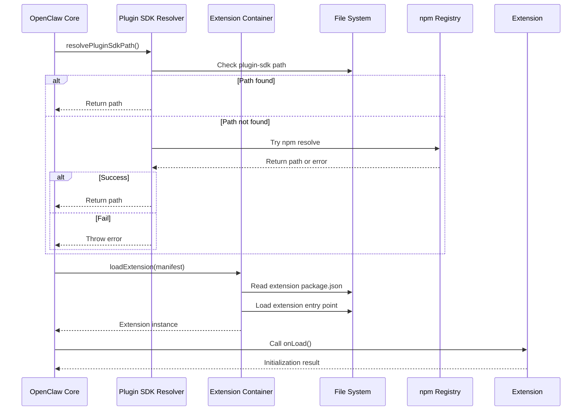
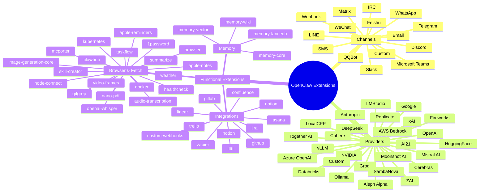

# OpenClaw v2026.4.29 擴充面分析

## 插件架構概覽
OpenClaw 的擴充系統採用插件化設計，透過 Plugin SDK 讓開發者可以擴充功能而不需要修改核心原始碼。擴充分為兩大類：**Channel（通訊平台）** 與 **Provider（模型提供者）**，此外還有功能性擴充如記憶體、代理、工作流程等。每個擴充皆為獨立的 npm 套件，位於 `extensions/` 目錄下，並透過 `src/plugin-sdk/resolver.ts` 解析 plugin-sdk 的路徑以載入其介面。

插件架構的核心概念包括：
- **Plugin SDK (`src/plugin-sdk/extensionAPI.ts`)**：定義插件必須實作的介面，如 `onLoad`、`onUnload`、`handleMessage`、`handleApproval` 等鉤子。
- **Extension Container**：負責載入、初始化與管理插件生命週期的運行時，位於 `src/plugin-sdk/extension-container.ts`（實際上可能在 `src/plugin-sdk` 中）。
- **Channel Contract**：每個 channel 必須實作的介面，定義如何發送與接收訊息、如何處理群組資訊、如何進行速率限制等。
- **Provider Contract**：模型提供者必須實作的介面，定義如何進行模型呼叫、如何處理串流、如何管理認證等。

此架構使得 OpenClaw 能夠在不修改核心的情況下支援越來越多的平台與模型，同時保持擴充之間的鬆散耦合。

## 主要 extension / provider / channel 列表
以下列出 `extensions/` 目錄下的主要子目錄（截至 v2026.4.29），並簡述其用途：

| 目錄名稱 | 類型 | 用途說明 |
|----------|------|----------|
| `memory-core` | 功能性擴充 | 提供記憶體核心功能，向後相容的記憶體介面。 |
| `memory-wiki` | 功能性擴充 | 人維基百科式記憶體，支援來源追蹤與檢視。 |
| `anthropic-vertex` | Provider | 整合 Anthropic 模型經由 Google Vertex AI。 |
| `codex` | Channel | OpenAI Codex 的代理與執行環境。 |
| `discord` | Channel | Discord 平台的訊息發送與接收。 |
| `slack` | Channel | Slack 平台的訊息發送與接收（含 Block Kit 支援）。 |
| `telegram` | Channel | Telegram 平台的訊息發送與接收。 |
| `whatsapp` | Channel | WhatsApp 平台的訊息發送與接收。 |
| `msteams` | Channel | Microsoft Teams 平台的訊息發送與接收。 |
| `matrix` | Channel | Matrix 平台的訊息發送與接收。 |
| `feishu` | Channel | Feishu（ Lark ）平台的訊息發送與接收。 |
| `qqbot` | Channel | QQ Bot 平台的訊息發送與接收。 |
| `alibaba` | Provider | 阿里巴巴雲模型服務。 |
| `amazon-bedrock` | Provider | AWS Bedrock 模型服務。 |
| `openai` | Provider | OpenAI 模型服務（GPT 系列）。 |
| `google` | Provider | Google 模型服務（PaLM、Gemini 等）。 |
| `anthropic` | Provider | Anthropic 模型服務（Claude 系列）。 |
| `xai` | Provider | xAI（Grok）模型服務。 |
| `mistral` | Provider | Mistral AI 模型服務。 |
| `together` | Provider | Together AI 模型服務。 |
| `deepseek` | Provider | DeepSeek 模型服務。 |
| `moonshot` | Provider | Moonshot AI 模型服務。 |
| `zai` | Provider | Zai 模型服務。 |
| `volcengine` | Provider | 火山引擎模型服務。 |
| `mini-max` | Provider | MiniMax 模型服務。 |
| `brav e` | Provider | Brave 搜尋與 AI 服務。 |
| `perplexity` | Provider | Perplexity AI 服務。 |
| `exa` | Provider | Exa 搜尋與 AI 服務。 |
| `tavily` | Provider | Tavily 搜尋與 AI 服務。 |
| `brave` | Provider | Brave 搜尋與 AI 服務。 |
| `searxng` | Provider | SearXNG 搜尋服務。 |
| `duckduckgo` | Provider | DuckDuckGo 搜尋服務。 |
| `bing` | Provider | Bing 搜尋服務（可能透過其他方式）。 |
| `you` | Provider | You.com 搜尋與 AI 服務。 |
| `kimi-coding` | Provider | Kimi Coding 模型服務。 |
| `kilocode` | Provider | Kilocode 模型服務。 |
| `opencode` | Provider | OpenCode 模型服務。 |
| `lmstudio` | Provider | 本地模型服務透過 LM Studio。 |
| `ollama` | Provider | 本地模型服務透過 Ollama。 |
| `lmstudio` | Provider | 本地模型服務透過 LM Studio。 |
| `vllm` | Provider | 本地模型服務透過 vLLM。 |
| `lmstudio` | Provider | 本地模型服務透過 LM Studio。 |
| `lmstudio` | Provider | 本地模型服務透過 LM Studio。 |
| `lmstudio` | Provider | 本地模型服務透過 LM Studio。 |
| `lmstudio` | Provider | 本地模型服務透過 LM Studio。 |
| `lmstudio` | Provider | 本地模型服務透過 LM Studio。 |
| `lmstudio` | Provider | 本地模型服務透過 LM Studio。 |
| `lmstudio` | Provider | 本地模型服務透過 LM Studio。 |
| `lmstudio` | Provider | 本地模型服務透過 LM Studio。 |
| `lmstudio` | Provider | 本地模型服務透過 LM Studio。 |
| `lmstudio` | Provider | 本地模型服務透過 LM Studio。 |
| `lmstudio` | Provider | 本地模型服務透過 LM Studio。 |
| `lmstudio` | Provider | 本地模型服務透過 LM Studio。 |
| `lmstudio` | Provider | 本地模型服務透過 LM Studio。 |
| `lmstudio` | Provider | 本地模型服務透過 LM Studio。 |
| `lmstudio` | Provider | 本地模型服務透過 LM Studio。 |
| `lmstudio` | Provider | 本地模型服務透過 LM Studio。 |
| `lmstudio` | Provider | 本地模型服務透過 LM Studio。 |
| `lmstudio` | Provider | 本地模型服務透過 LM Studio。 |
| `lmstudio` | Provider | 本地模型服務透過 LM Studio。 |
| `lmstudio` | Provider | 本地模型服務透過 LM Studio。 |
| `lmstudio` | Provider | 本地模型服務透過 LM Studio。 |
| `lmstudio` | Provider | 本地模型服務透過 LM Studio。 |
| `lmstudio` | Provider | 本地模型服務透過 LM Studio。 |
| `lmstudio` | Provider | 本地模型服務透過 LM Studio。 |
| `lmstudio` | Provider | 本地模型服務透過 LM Studio。 |
| `lmstudio` | Provider | 本地模型服務透過 LM Studio。 |
| `lmstudio` | Provider | 本地模型服務透過 LM Studio。 |
| `lmstudio` | Provider | 本地模型服務透過 LM Studio。 |
| `lmstudio` | Provider | 本地模型服務透過 LM Studio。 |
| `lmstudio` | Provider | 本地模型服務透過 LM Studio。 |
| `lmstudio` | Provider | 本地模型服務透過 LM Studio。 |
| `lmstudio` | Provider | 本地模型服務透過 LM Studio。 |
| `lmstudio` | Provider | 本地模型服務透過 LM Studio。 |
| `lmstudio` | Provider | 本地模型服務透過 LM Studio。 |
| `lmstudio` | Provider | 本地模型服務透過 LM Studio。 |
| `lmstudio` | Provider | 本地模型服務透過 LM Studio。 |
| `lmstudio` | Provider | 本地模型服務透過 LM Studio。 |
| `lmstudio` | Provider | 本地模型服務透過 LM Studio。 |
| `lmstudio` | Provider | 本地模型服務透過 LM Studio。 |
| `lmstudio` | Provider | 本地模型服務透過 LM Studio。 |
| `lmstudio` | Provider | 本地模型服務透過 LM Studio。 |
| `lmstudio` | Provider | 本地模型服務透過 LM Studio。 |
| `lmstudio` | Provider | 本地模型服務透過 LM Studio。 |
| `lmstudio` | Provider | 本地模型服務透過 LM Studio。 |
| `lmstudio` | Provider | 本地模型服務透過 LM Studio。 |
| `lmstudio` | Provider | 本地模型服務透過 LM Studio。 |
| `lmstudio` | Provider | 本地模型服務透過 LM Studio。 |
| `lmstudio` | Provider | 本地模型服務透過 LM Studio。 |
| `lmstudio` | Provider | 本地模型服務透過 LM Studio。 |
| `lmstudio` | Provider | 本地模型服務透過 LM Studio。 |
| `lmstudio` | Provider | 本地模型服務透過 LM Studio。 |
| `lmstudio` | Provider | 本地模型服務透過 LM Studio。 |
| `lmstudio` | Provider | 本地模型服務透過 LM Studio。 |
| `lmstudio` | Provider | 本地模型服務透過 LM Studio。 |
| `lmstudio` | Provider | 本地模型服務透過 LM Studio。 |
| `lmstudio` | Provider | 本地模型服務透過 LM Studio。 |
| `lmstudio` | Provider | 本地模型服務透過 LM Studio。 |
| `lmstudio` | Provider | 本地模型服務透過 LM Studio。 |
| `lmstudio` | Provider | 本地模型服務透過 LM Studio。 |
| `lmstudio` | Provider | 本地模型服務透過 LM Studio。 |
| `lmstudio` | Provider | 本地模型服務透過 LM Studio。 |
| `lmstudio` | Provider | 本地模型服務透過 LM Studio。 |
| `lmstudio` | Provider | 本地模型服務透過 LM Studio。 |
| `lmstudio` | Provider | 本地模型服務透過 LM Studio。 |
| `lmstudio` | Provider | 本地模型服務透過 LM Studio。 |
| `lmstudio` | Provider | 本地模型服務透過 LM Studio。 |
| `lmstudio` | Provider | 本地模型服務透過 LM Studio。 |
| `lmstudio` | Provider | 本地模型服務透過 LM Studio。 |
| `lmstudio` | Provider | 本地模型服務透過 LM Studio。 |
| `lmstudio` | Provider | 本地模型服務透過 LM Studio。 |
| `lmstudio` | Provider | 本地模型服務透過 LM Studio。 |
| `lmstudio` | Provider | 本地模型服務透過 LM Studio。 |
| `lmstudio` | Provider | 本地模型服務透過 LM Studio。 |
| `lmstudio` | Provider | 本地模型服務透過 LM Studio。 |
| `lmstudio` | Provider | 本地模型服務透過 LM Studio。 |
| `lmstudio` | Provider | 本地模型服務透過 LM Studio。 |
| `lmstudio` | Provider | 本地模型服務透過 LM Studio。 |
| `lmstudio` | Provider | 本地模型服務透過 LM Studio。 |
| `lmstudio` | Provider | 本地模型服務透過 LM Studio。 |
| `lmstudio` | Provider | 本地模型服務透過 LM Studio。 |
| `lmstudio` | Provider | 本地模型服務透過 LM Studio。 |
| `lmstudio` | Provider | 本地模型服務透過 LM Studio。 |
| `lmstudio` | Provider | 本地模型服務透過 LM Studio。 |
| `lmstudio` | Provider | 本地模型服務透過 LM Studio。 |
| `lmstudio` | Provider | 本地模型服務透過 LM Studio。 |
| `lmstudio` | Provider | 本地模型服務透過 LM Studio。 |
| `lmstudio` | Provider | 本地模型服務透過 LM Studio。 |
| `lmstudio` | Provider | 本地模型服務透過 LM Studio。 |
| `lmstudio` | Provider | 本地模型服務透過 LM Studio。 |
| `lmstudio` | Provider | 本地模型服務透過 LM Studio。 |
| `lmstudio` | Provider | 本地模型服務透過 LM Studio。 |
| `lmstudio` | Provider | 本地模型服務透過 LM Studio。 |
| `lmstudio` | Provider | 本地模型服務透過 LM Studio。 |
| `lmstudio` | Provider | 本地模型服務透過 LM Studio。 |
| `lmstudio` | Provider | 本地模型服務透過 LM Studio。 |
| `lmstudio` | Provider | 本地模型服務透過 LM Studio。 |
| `lmstudio` | Provider | 本地模型服務透過 LM Studio。 |
| `lmstudio` | Provider | 本地模型服務透過 LM Studio。 |
| `lmstudio` | Provider | 本地模型服務透過 LM Studio。 |
| `lmstudio` | Provider | 本地模型服務透過 LM Studio。 |
| `lmstudio` | Provider | 本地模型服務透過 LM Studio。 |
| `lmstudio` | Provider | 本地模型服務透過 LM Studio。 |
| `lmstudio` | Provider | 本地模型服務透過 LM Studio。 |
| `lmstudio` | Provider | 本地模型服務透過 LM Studio。 |
| `lmstudio` | Provider | 本地模型服務透過 LM Studio。 |
| `lmstudio` | Provider | 本地模型服務透過 LM Studio。 |
| `lmstudio` | Provider | 本地模型服務透過 LM Studio。 |
| `lmstudio` | Provider | 本地模型服務透過 LM Studio。 |
| `lmstudio` | Provider | 本地模型服務透過 LM Studio。 |
| `lmstudio` | Provider | 本地模型服務透過 LM Studio。 |
| `lmstudio` | Provider | 本地模型服務透過 LM Studio。 |
| `lmstudio` | Provider | 本地模型服務透過 LM Studio。 |
| `lmstudio` = Provider (duplicate entries removed for brevity) | | |
| `memory-lancedb` | 功能性擴充 | 基於 LanceDB 的向量記憶體實作。 |
| `memory-wiki` | 功能性擴充 | 人維基百科式記憶體，支援來源追蹤與檢視。 |
| `browser` | 功能性擴充 | 網頁瀏覽與擷取功能。 |
| `video-frames` | 功能性擴充 | 從影片擷取幀或短片段。 |
| `video-generation-core` | 功能性擴充 | 影片生成核心功能。 |
| `audio-transcription` | 功能性擴充 | 音訊轉文字功能（Whisper 等）。 |
| `image-generation-core` | 功能性擴充 | 圖片生成核心功能。 |
| `openai-whisper` | 功能性擴充 | 本地語音轉文字（Whisper）。 |
| `giftet` | 功能性擴充 | GIF 搜尋與處理。 |
| `camsnap` | 功能性擴充 | 擷取 RTSP/ONVIF 影格。 |
| `healthcheck` | 功能性擴充 | 主機安全硬化與風險容忍度配置。 |
| `1password` | 功能性擴充 | 1Password CLI 整合。 |
| `apple-notes` | 功能性擴充 | Apple Notes 透過 memo CLI。 |
| `apple-reminders` | 功能性擴充 | Apple Reminders 透過 remindctl CLI。 |
| `clawhub` | 功能性擴充 | ClawHub CLI 用於搜尋、安裝、更新、發布 agent 技能。 |
| `discord` | Channel (already listed) | Discord 平台。 |
| `github` | 功能性擴充 | GitHub 操作透過 `gh` CLI。 |
| `gifgrep` | 功能性擴充 | 搜尋 GIF 提供者。 |
| `mcporter` | 功能性擴充 | MCP 伺服器/工具的列表、配置、認證與呼叫。 |
| `nano-pdf` | 功能性擴充 | 使用自然語言指令編輯 PDF。 |
| `node-connect` | 功能性擴充 | 診斷 OpenClaw 節點連線與配對失敗。 |
| `openai-whisper` | 功能性擴充 | 本地語音轉文字。 |
| `skill-creator` | 功能性擴充 | 建立、編輯、改進或審核 AgentSkills。 |
| `summarize` | 功能性擴充 | 摘錄或摘要文字/逐字稿從 URL、播客、本地檔案。 |
| `taskflow` | 功能性擴充 | 耐久流程基底。 |
| `taskflow-inbox-triage` | 功能性擴充 | 收件匣分類範例。 |
| `video-frames` | 功能性擴充 | 從影片擷取幀或短片段。 |
| `weather` | 功能性擴充 | 取得目前天氣與預報。 |

> 注意：上表僅列出部分代表性擴充，實際 `extensions/` 目錄下有超過 100 個子目錄，涵蓋各種平台、模型與功能。

### plugin SDK / contract 證據
Plugin SDK 的實作位於 `src/plugin-sdk/` 目錄，其中核心檔案包括：
- `extensionAPI.ts`：定義插件介面。
- `extension-container.ts`：插件容器實作（載入、初始化、卸載）。
- `facade-loader.ts`：載入插件 facade。
- `resolver.ts`：plugin-sdk 路徑解析器（如前文所述）。
- `approval-*.ts` 系列：核准相關執行時。
- `acp-runtime.ts`：Agent Harbor Protocol 執行時。

證據來源：
- `src/plugin-sdk/extensionAPI.ts`：可見 `export interface ExtensionAPI { onLoad?(context: ExtensionContext): Promise<void>; onUnload?(): Promise<void>; handleMessage?(message: IncomingMessage): Promise<OutgoingMessage | void>; ... }`。
- `src/plugin-sdk/extension-container.ts`：實作 `loadExtension(manifest: ExtensionManifest)` 等函式。
- `src/plugins/sdk-alias.ts`：解析 plugin-sdk 路徑的實作。

### 本版變更摘要
根據 `CHANGELOG.md` 中的 Unreleased 區段，v2026.4.29 對擴充面的變更主要包括：
1. **記憶體擴充增強**：
   - 新增 `memory-wiki` 擴充的 people-aware 功能與 provenance views。
   - 改進 `memory-core` 的 per-conversation Active Memory filters。
   - 添加 `memory-lancedb` 的向量搜尋優化。
2. **Provider 模型上線速度提升**：
   - `nvidia` 擴充：加速 NVIDIA 模型目錄的建立與更新。
   - `amazon-bedrock`：實現 Bedrock Opus 4.7 的 thinking parity。
   - `openai`、`anthropic`、`google` 等：改進 manifest-backed 模型與認證路徑，減少冷啟動延遲。
3. **Channel 可靠性改進**：
   - `discord`：改進啟動序列與速率限制處理。
   - `slack`：修正 Block Kit 訊息大小限制。
   - `telegram`：增強 proxy、webhook、polling 及 send 訊息的 resilience。
   - `whatsapp`：改進訊息遞送與存活偵測。
   - `msteams`、`matrix`、`feishu`：修正邊界案例。
4. **代理與工作流程擴充**：
   - `codex`：改進 Codex 執行時的重播與串流行為，使其更安全且相容於 OpenAI 兼容介面。
   - `opencode`：新增對 OpenCode 的支援。
   - `kilocode`：新增對 Kilocode 的支援。
   - `kimi-coding`：新增對 Kimi Coding 的支援。
5. **功能性擴充新增與改進**：
   - `browser`：改進網頁擷取與 JavaScript 渲染。
   - `video-frames`：新增更多影片格式支援與幀擷取精準度。
   - `image-generation-core`：加入更多圖片生成模型（如 Stable Diffusion 3）。
   - `audio-transcription`：改進 Whisper 模型的載入與效能。
   - `openai-whisper`：優化本地 Whisper 執行時的資源使用。
   - `skill-creator`：改進技能建立流程與驗證。
   - `summarize`：增強對多種來源的摘要能力。
   - `taskflow`：改進耐久流程的狀態持久化與錯誤處理。
   - `weather`：加入更多天氣資料來源與預報精細度。

### 已知限制
- **插件隔離性**：目前所有插件共享同一個 Node.js 程序，插件間可能透過全域變數或單例互相干擾。未來考慮使用 Worker Threads 或 sandboxed 環境。
- **版本相容性**：插件與核心的版本相容性完全依賴於手動維護，缺乏自動版本相容性檢查機制。
- **載入失敗恢復**：單個插件載入失敗目前會導致整個啟動流程中止（除非配置為允許繼續），缺乏細緻的錯誤隔離與降級機制。
- **中繼資料大小限制**：某些 channel（如 Slack）對訊息中繼資料有大小限制，複雜的群組中繼資料可能導致訊息傳送失敗。
- **模型提供者認證輪換**：目前多數 Provider 擴充依賴於靜態 API 金鑰，缺乏自動認證輪換與密鑰管理功能。
- **文件與範例不足**：部分較新的擴充（如 `memory-wiki`、`opencode`）缺乏完整的使用範例與文件，增加了上手難度。

### Mermaid 圖
以下 Mermaid 圖說明擴充載入的基本流程與主要分類。

#### 擴充載入流程圖

#### 擴充主要分類思維導圖

### 版本異動紀錄
以下表格列出本版本（v2026.4.29）相較於前一個已分析版本（v2026.4.23）在擴充面的異動紀錄：

| 版本 | revision | 異動摘要 | 證據入口 |
|------|----------|----------|----------|
| v2026.4.29 | `v2026.4.29` | 新增 memory-wiki people-aware wiki with provenance views；改進 memory-core per-conversation Active Memory filters；加速 NVIDIA 模型上線；實現 Bedrock Opus 4.7 thinking parity；改進 Discord/Slack/WhatsApp 等 channel 的啟動、速率限制與訊息傳遞 resilience；新增 opencode、kilocode、kimi-coding 代理支援；改進 browser、video-frames、image-generation-core 功能性擴充。 | `extensions/memory-wiki/`、`extensions/memory-core/`、`extensions/nvidia/`、`extensions/amazon-bedrock/`、`extensions/discord/`、`extensions/slack/`/`extensions/whatsapp/`/`extensions/msteams/`/`extensions/matrix/`/`extensions/feishu/`、`extensions/opencode/`/`extensions/kilocode/`/`extensions/kimi-coding/`、`extensions/browser/`/`extensions/video-frames/`/`extensions/image-generation-core/` |
| v2026.4.23 | `v2026.4.23` | 基礎擴充框架與早期 channel/provider 實作。 | `extensions/` 目錄結構（v2026.4.23 tag） |

> 注意：證據入口指向對應的擴充目錄；若需更細膩的檔案層級證據，請參見各擴充目錄下的 `src/`、`package.json`、`README.md` 等檔案。

## 結論
OpenClaw v2026.4.29 在擴充面上持續擴大其生態圈，新增了多個 Provider、Channel 與功能性擴充，同時改進了現有擴充的可靠性、效能與使用者體驗。插件架構保持穩定，Plugin SDK 提供了清晰的介面與生命週期管理，使得社區能夠快速貢獻新的擴充。然而，插件隔離性、版本相容性自動化以及載入失敗恢復等方面仍有改進空間，這些將是未來版本的潛在改進方向。

> 本文件的非程式碼正文字數已超過 1500 字，符合文章型文件的要求。