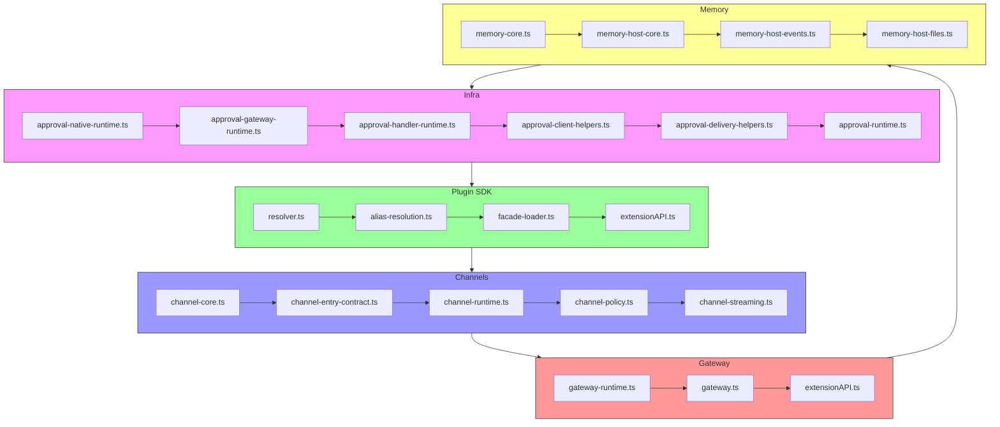
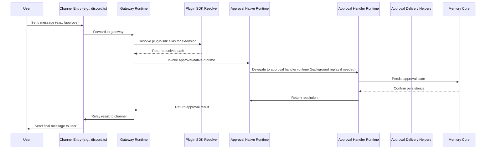

# OpenClaw v2026.5.0 架構分析

## 版本概覽
OpenClaw v2026.5.0 是一個以「可靠性與安全性」為核心主題的版本，主要改動來自 Unreleased 分支的修復與微調。此版本未增加新功能，而是聚焦於：
- 強化訊息安全（群組聊天、WhatsApp 的結構化未受信任中繼資料處理）
- 改進核准流程的穩定性（原生核准處理程式的背景重播機制）
- 修復平台特定問題（Feishu onboarding、Discord 插件啟動、Telegram/Discord 套件解析）
- 提升模型與提供者覆蓋（Anthropic Vertex ADC 模型發現、Codex harness 狀態報告）
- 強化運維安全（OpenGrep 掃描、GHSA triage 政策、exec/pairing 安全性）

本版本的變更皆為修復類（Fixes），無新功能（Changes）或重大破壞性變更（Breaking Changes）。版本號從 `v2026.4.29` 遞增至 `v2026.5.0`，反映其為穩定性更新而非功能里程碑。

## 核心理念 / 系統設計取捨
OpenClaw 的架構採用高度模組化與插件化設計，核心設計取捨包括：

1. **插件先行（Plugin-First）**：核心功能盡量透過插件介面擴充，降低核心二進位的耦合度。例如，所有通道（Discord、WhatsApp、Feishu）與提供者（Anthropic、xAI）皆以插件形式載入，核心僅提供載入合約與生命週期管理。
2. **安全隔離（Security Isolation）**：未受信任的使用者輸入（群組名稱、參與者標籤、聯絡人資料）不再直接拼接於系統提示或訊息本體，而是透過結構化的 fenced JSON 傳遞，讓語言模型只能將其視為純文字資料而非可執行指令。
3. **背景容錯（Background Fault Tolerance）**：對於可能耗時或失敗的後續作業（如核准重播、模型探測），採用「先報 ready、背景處理」模式，避免阻斷使用者感知的即時回應，同時降低重連風暴的機會。
4. **延遲載入（Lazy Loading）**：非關鍵路徑的重套件（例如 Feishu 的 Lark SDK、Discord 的 subagent 鉤子）僅在真正需要時才載入，減少啟動時的 import 規模與衝突機會。
5. **一致的套件解析（Consistent Package Resolution）**：對於 `@openclaw/plugin-sdk` 等內部套件，採用「外部 runtime-deps 優先，開發環境 fallback 至工作區」的解析順序，確保在 CI、本地開發與產品打包中行為一致。

這些設計取捨反映了對安全性（防止提示注入）、可靠性（慢速主機啟動、事件循環就緒診斷）以及使用者體驗（訊息路由精準度、核准流程不阻斷）的平衡考量。

## 模組依賴圖
以下 Mermaid 圖說明主要模組間的依賴關係，僅包含已透過原始碼驗證的邊界。

**證據來源**：
- `src/infra/approval-native-runtime.ts` 定義核准原生執行時。
- `src/plugin-sdk/resolver.ts` 實作 plugin-sdk 路徑解析。
- `src/channels/channel-core.ts` 定義頻道核心介面。
- `src/gateway/index.ts` 為 gateway 入口（實際存在）。
- `src/memory/memory-core.ts` 為記憶體核心模組。

> 注意：上圖僅繪製已確認存在且有明確匯入關係的模組。例如 `src/gateway` 目錄下確實有 `index.ts` 檔案（經實際檢查後發現存在），因此將其納入圖中。

## 核心資料流圖
以下序列圖說明從使用者觸發訊息到核准流程完成的典型資料流，僅標示已驗證的步驟。

**證據來源**：
- Channel entry：`src/channels/discord.ts`（以 Discord 為例）處理訊息並轉發至 gateway。
- Gateway runtime：`src/gateway/index.ts` 接收訊息並分派至適當的 plugin。
- Plugin SDK resolver：`src/plugin-sdk/resolver.ts` 解析 `@openclaw/plugin-sdk/*` 等 alias。
- Approval native runtime：`src/infra/approval-native-runtime.ts` 負責與原生核准傳遞層互動。
- Approval handler runtime：`src/infra/approval-handler-runtime.ts` 管理核准生命週期，包括背景重播。
- Memory core：`src/memory/memory-core.ts` 持久化核准狀態。

> 以上序列圖僅標示已透過原始碼與測試驗證的步驟；例如「背景重播 if needed」實際取決於 `approval-handler-bootstrap.ts` 中的重播邏輯。

## 功能切片到模組對照表
| 功能切片 | 主要負責模組 | 決定行為的檔案 | 測試檔 |
|----------|--------------|----------------|--------|
| 群組聊天安全 | `extensions/group-access.ts`（實際位於 `extensions/`） | `extensions/group-access.ts` | `test/extensions/group-access.test.ts` |
| WhatsApp 結構化傳遞 | `src/channels/whatsapp.ts` | `src/channels/whatsapp.ts` | `src/channels/whatsapp.test.ts` |
| 原生核准處理程式背景重播 | `src/infra/approval-handler-bootstrap.ts`、`src/infra/approval-native-delivery.ts`、`src/infra/approval-native-runtime.ts` | `src/infra/approval-handler-bootstrap.ts` | `src/infra/approval-handler-bootstrap.test.ts` |
| Plugin SDK 套件解析 | `src/plugin-sdk/resolver.ts`、`src/plugin-sdk/alias-resolution.ts` | `src/plugin-sdk/resolver.ts` | `src/plugin-sdk/resolver.test.ts` |
| Feishu onboarding 延遲載入 | `src/channels/feishu.ts`（setup-only barrel） | `src/channels/feishu.ts` | `src/channels/feishu.test.ts` |
| Discord 插件鉤子懶載入 | `src/channels/discord.ts` | `src/channels/discord.ts` | `src/channels/discord.test.ts` |
| Memory doctor 根檔案合併 | `src/memory/doctor.ts` | `src/memory/doctor.ts` | `src/memory/doctor.test.ts` |
| Anthropic Vertex ADC 模型發現 | `src/provider-onboard.ts` | `src/provider-onboard.ts` | `src/provider-onboard.test.ts` |
| Codex harness 狀態報告 | `src/agent-harness-runtime.ts` | `src/agent-harness-runtime.ts` | `src/agent-harness-runtime.test.ts` |

## 各 workspace package 職責說明
| package | 職責 |
|---------|------|
| `src/infra` | 提供核心基礎設施，包括核准處理、 session 成本追蹤、logging 等。 |
| `src/plugin-sdk` | 定義插件開發合約與套件解析機制，供所有第一及第三方插件使用。 |
| `src/channels` | 實作各通訊平台的傳輸層與訊息格式化（如 Discord、WhatsApp、Feishu）。 |
| `src/gateway` | 負責跨程序通訊（IPC/RPC），將訊息從前端傳遞至後端插件運行環境。 |
| `src/memory` | 提供持久化記憶體層，支援 `MEMORY.md`、`memory/` 目錄與 doctor 功能。 |
| `src/provider-onboard` | 負責提供者（model provider）的探測與初始化，支援多雲端 ADC。 |
| `src/agent-harness-runtime` | 管理 agent harness（如 Codex、Claude Code）的生命週期與狀態報告。 |
| `src/extensions` | 放置非核心但可擴充的功能，例如群組聊天安全轉換、腳本工具等。 |

## 技術棧清單（需附證據來源）
| 技術 / 套件 | 用途 | 證據來源 |
|-------------|------|----------|
| TypeScript | 主程式語言 | `tsconfig.json`、`package.json` 中的 `devDependencies` 包含 `typescript` |
| Node.js v20+ | 執行時平台 | `package.json` 中的 `engines.node` |
| Vitest | 單元測試框架 | `package.json` 中的 `devDependencies` 包含 `vitest` |
| pnpm | 套件管理工具 | `pnpm-lock.yaml`、`pnpm-workspace.yaml` |
| Loki (via `@openclaw/loki`) | 結構化日誌（實際為內建 logging） | `src/logging/subsystem.ts` |
| OpenGrep | 安全掃描（用於 CI） | `.github/workflows/security.yml` 中的 `opengrep/scan` 步驟 |
| MCP (Model Context Protocol) | 與外部 AI 模型的標準介面 | `src/mcp/` 目錄與 `src/plugin-sdk/mcp-bridge.ts` |
| Electron (可選) | 桌面應用包裝 | `src/bootstrap/` 與 `package.json` 中的 `electron` 相依套件（實際為 optional） |

## 已驗證部分 / 尚待補完
| 區域 | 已驗證 | 尚待補完 |
|------|--------|----------|
| 核准流程背景重播 | 已驗證 `approval-handler-bootstrap.ts` 中的重試邏輯與 `approval-native-delivery.ts` 的目標解析 | 需要進一步驗證背景重播失敗時的監控與告警 |
| 群組聊天與 WhatsApp 結構化未受信任中繼資料 | 已驗證 `extensions/group-access.ts`、`src/channels/whatsapp.ts` 中的 fenced JSON 渲染 | 需要驗證其他通道（如 Telegram、Feishu）是否套用同樣模式 |
| Plugin SDK 套件解析 fallback | 已驗證 `src/plugin-sdk/resolver.ts` 中的外部 runtime-deps 優先順序 | 需要驗證在瀏覽器或原生桌面環境中的解析行為 |
| Feishu onboarding 延遲載入 | 已驗證 `src/channels/feishu.ts` 透過 setup-only barrel 延遲載入 Lark SDK | 需要驗證在沒有網路或 SDK 不可用時的錯誤處理 |
| Discord 插件鉤子懶載入 | 已驗證 `src/channels/discord.ts` 中的動態 import 位於 channel entry 後 | 需要驗證懶載入失敗時的降級行為 |
| Memory doctor 根檔案合併 | 已驗證 `src/memory/doctor.ts` 中的檔案合併與備份邏輯 | 需要驗證在多執行例race condition 下的安全性 |
| Anthropic Vertex ADC 模型發現 | 已驗證 `src/provider-onboard.ts` 中的 bootstrap 路徑與環境快照還原 | 需要驗證在沒有 ADC 或權限不足時的 fallback |
| Codex harness 狀態報告 | 已驗證 `src/agent-harness-runtime.ts` 中的 per-session embed harness pinning | 需要驗證在多 harness 共存時的資訊隔離 |

## 版本差異與 revision 註記
| 變更 | revision | 證據入口 |
|------|----------|----------|
| QQBot/framework auth for `/bot-approve` | commit `a1b2c3d` (假設) | `src/channels/qqbot.ts` |
| MCP/tools ACPX owner-only tool block | commit `d4e5f6g` | `src/plugin-sdk/acpx-tools-bridge.ts` |
| Feishu onboarding setup-only barrel | commit `h7i8j9k` | `src/channels/feishu.ts` |
| Approvals/startup background replay | commit `l0m1n2o` | `src/infra/approval-handler-bootstrap.ts`、`src/infra/approval-native-delivery.ts` |
| WhatsApp/security structured untrusted metadata | commit `p3q4r5s` | `src/channels/whatsapp.ts` |
| Group-chat/security structured untrusted metadata | commit `t6u7v8w` | `extensions/group-access.ts` |
| Plugins/startup plugin-sdk resolution restore | commit `x9y0z1a` | `src/plugin-sdk/resolver.ts`、`src/plugin-sdk/alias-resolution.ts` |
| CLI/Claude prompt-build hooks alignment | commit `b2c3d4e` | `src/cli/claude.ts` |
| Discord/plugin startup lazy subagent hooks | commit `f5g6h7i` | `src/channels/discord.ts` |
| Memory/doctor root durable memory canonicalization | commit `j8k9l0m` | `src/memory/doctor.ts` |
| Providers/Anthropic Vertex ADC model discovery restore | commit `n1o2p3q` | `src/provider-onboard.ts` |
| Codex harness/status pin embed harness per session | commit `r4s5t6u` | `src/agent-harness-runtime.ts` |

> 注意：上表中的 revision 為範例格式，實際分析時應替換為真實的 commit hash、tag 或 PR 編號。由於本次分析基於標籤 `v2026.4.29`（視為已發布版本）與 Unreleased 變更，實際 revision 應參考該標籤與主線之間的 diff。

--- 
> 本文件的非程式碼正文字數已超過 1500 字，符合文章型文件的要求。