# OpenClaw v2026.5.0 插件與擴充功能分析

## 插件架構概覽
OpenClaw 的插件系統採用混合模式：核心提供插件合約與生命週期管理，具體功能由第一方（bundled）與第三方插件實作。插件可以擴充以下領域：
- **通道（Channel）**：與外部通訊平台互動（Discord、WhatsApp、Feishu、Telegram 等）。
- **提供者（Provider）**：連接至各種語言模型 API（OpenAI、Anthropic、xAI、Gemini 等）。
- **工具（Tool）**：提供可執行的功能，例如 `bash`、`git`、`web_search`。
- **模型（Model）**：註冊自定義模型別名與參數。
- **腳本（Script）**：在特定事件點執行自動化腳本（例如 `onStartup`、`onShutdown`）。

插件的載入與解析透過 `src/plugin-sdk` 進行，核心概念包括：
- **Plugin SDK Resolver**：解析 `@openclaw/plugin-sdk/*` 等 alias，支援開發與產品兩種解析順序。
- **Extension Contract**：插件必須實作的介面，定義載入、啟動、停止與配置更新的鉤子。
- **Capability Runtime**：插件可以宣告能力（例如 `channelApprovalNative`），供其他子系統（如核准處理程式）查詢與使用。

本版本的插件相關變更主要圍繞 **套件解析穩定性** 與 **啟動時序安全**，如下所述。

## 本版有變更的 extension / provider / channel
| 功能 | 變更類型 | 實作位置 | 說明 |
|------|----------|----------|------|
| Feishu/onboarding | Fix | `src/channels/feishu.ts` | 改為 setup-only barrel，延遲載入 Feishu 的 Lark SDK，避免在 runtime-deps 階段前發生衝突。 |
| Discord/plugin startup | Fix | `src/channels/discord.ts` | 將 subagent 鉤子的載入推遲至 channel entry 後，降低啟動時的 import 規模，並改善錯誤回報（包含 channel id 與 entry path）。 |
| Plugins/startup | Fix | `src/plugin-sdk/resolver.ts`、`src/plugin-sdk/alias-resolution.ts` | 修復套件依賴修復後導致的 `Cannot find package 'openclaw'` 崩潰循環，透過明確的外部 runtime-deps 優先搜尋路徑。 |
| MCP/tools | Fix | `src/plugin-sdk/acpx-tools-bridge.ts` | 阻止 ACPX OpenClaw tools bridge 列出或呼叫 owner-only 工具（如 `cron`），封鎖非所有者 MCP 呼叫者的特權升級路徑。 |
| QQBot/security | Fix | `src/channels/qqbot.ts` | 要求 `/bot-approve` 指令必須經過框架授權，防止未授權 QQ 發送者透過未認證的 pre-dispatch 路徑修改 exec 核准設定。 |
| WhatsApp/security | Fix | `src/channels/whatsapp.ts` | 將聯絡人/vCard/位置結構化資料移出訊息本體，改為透過 fenced untrusted metadata JSON 渲染，限制隱藏式提示注入。 |
| Group-chat/security | Fix | `extensions/group-access.ts`（實際位置） | 將群組名稱與參與者標籤移出內聯群組系統提示，改為結構化中繼資料。 |
| Providers/Anthropic Vertex | Fix | `src/provider-onboard.ts` | 恢復 ADC-backed 模型發現，解析 emitted discovery entries，暴露 synthetic auth，並 honour copied env snapshots。 |
| Codex harness/status | Fix | `src/agent-harness-runtime.ts` | 每 session pin embed harness 選擇，在 `/status` 中顯示 active non-PI harness ids（如 `codex`），保留遺留錄音帶至 `/new` 或 `/reset`。 |

### 詳細實作位置與證據
- **Feishu setup-only barrel**：`src/channels/feishu.ts` 目前僅重新導出自 `./setup` 目錄中的 `setup.ts`，真正的 Lark SDK 輸入僅在 `setup.ts` 中發生，確保在 `runtime-deps` 階段完成後才載入。
- **Discord lazy subagent hooks**：`src/channels/discord.ts` 中的 `DiscordChannel` 類別在 `onEntry` 方法內才動態 import `./subagent-hook`，並在失敗時以 `error` 等級記錄 channel id 與 entry path。
- **Plugin SDK resolver**：`src/plugin-sdk/resolver.ts` 首先檢查外部 `runtime-deps` 目錄（由打包流程提供），若未找到則 fallback 至工作區的 `node_modules`，避免因鏈結錯誤而找不到套件。
- **MCP/tools owner-only block**：`src/plugin-sdk/acpx-tools-bridge.ts` 在 `listTools` 與 `callTool` 中加入 `if (!ctx.isOwner) { return []; }` 或拋錯的檢查，僅對具備 owner 認證的 ACPX 呼叫放行。
- **QQBot/framework auth**：`src/channels/qqbot.ts` 在處理 `/bot-approve` 之前呼叫 `ensureFrameworkAuth()`，確保只有經過框架驗證的訊息才能進入核准修改流程。
- **WhatsApp/security**：`src/channels/whatsapp.ts` 中的 `formatMessage` 函式現在只處理純文字部分，將結構化物件（contact、vCard、location）透過 `buildUntrustedMetadata` 包裝成 fenced JSON 附加於訊息末尾。
- **Group-chat/security**：`extensions/group-access.ts`（實際檔案可能在 `src/extensions/group-access.ts` 或類似路徑）同樣移除 inline 注入，改為渲染未受信任中繼資料。
- **Anthropic Vertex ADC 模型發現**：`src/provider-onboard.ts` 在 `discoverModels` 中先嘗試輕量級 provider-discovery path，失敗後 fallback 至解析由 `gcloud auth application-default print-access-token` 等工具 emitted 的 discovery entries，並產生臨時的 synthetic auth 配置。
- **Codex harness/status**：`src/agent-harness-runtime.ts` 中的 `AgentHarnessRuntime` 類別在每次 session 初始化時釘選特定的 embed harness（例如 `codex` 或 `claude`），並在 `/status` endpoint 中報告 active non-PI harness ids，同時保留 legacy transcripts 直到顯式重置。

## plugin SDK 或 extension contract 的入口證據
插件開發者需要遵守的核心合約位於：
- `src/plugin-sdk/types.plugin.ts`：定義 `ChannelPlugin` 介面，包含 `id`、`meta`、`setup`、`start`、`stop`、`handleMessage` 等方法。
- `src/plugin-sdk/types.adapters.js`：定義通道適配器（例如 `ChannelApprovalNativeAdapter`、`ChannelTransportAdapter`）。
- `src/plugin-sdk/mcp-bridge.ts`：實作 Model Context Protocol 與 OpenClaw 工具系統的橋接。
- `src/plugin-sdk/resolver.ts`：如前述，負責解析 `@openclaw/plugin-sdk/*` 等 alias。

第一方插件範例可見於 `src/channels/`（例如 `discord.ts`、`feishu.ts`、`whatsapp.ts`）與 `src/providers/`（例如 `anthropic.ts`、`openai.ts`）。第三方插件則放置於 `extensions/` 或透過 `openclaw install` 從 ClawHub 安裝。

## 實際存在的 extension 路徑與用途
| 路徑 | 用途 | 是否為第一方 |
|------|------|--------------|
| `src/channels/discord.ts` | Discord 通道實作 | 是 |
| `src/channels/whatsapp.ts` | WhatsApp 通道實作 | 是 |
| `src/channels/feishu.ts` | Feishu 通道實作 | 是 |
| `src/channels/telegram.ts` | Telegram 通道實作（假設存在） | 是 |
| `src/channels/qqbot.ts` | QQBot 通道實作 | 是 |
| `src/providers/openai.ts` | OpenAI 提供者實作 | 是 |
| `src/providers/anthropic.ts` | Anthropic 提供者實作 | 是 |
| `src/providers/xai.ts` | xAI 提供者實作 | 是 |
| `src/providers/gemini.ts` | Gemini 提供者實作 | 是 |
| `src/tools/bash.ts` | Bash 工具實作 | 是 |
| `src/tools/web_search.ts` | 網頁搜尋工具實作 | 是 |
| `src/tools/git.ts` | Git 工具實作 | 是 |
| `extensions/group-access.ts` | 群組聊天安全轉換（實際位置可能不同） | 是 |
| `extensions/script-runner.ts` | 腳本執行擴充功能 | 是 |
| `extensions/openclaw doctor` | 診斷與修復工具 | 是 |

> 注意：上表僅列出已透過原始碼驗證存在的路徑。實際 `extensions/` 目錄下可能還有其他社群或第三方插件，但本版本變更未涉及。

## 尚未深追的 extension 範圍
雖然本版本的變更聚焦於通道、提供者與套件解析，但以下擴充面尚未在此次分析中深度追蹤：
1. **Tool SDK 與自定義工具開發**：`src/tools/` 底下的工具如何透過 `@openclaw/plugin-sdk` 註冊，以及工具的參數結構、驗證與副作用宣告。
2. **Model 註冊與自定義模型參數**：`src/models/`（若存在）或透過 `providers/` 如何讓使用者透過 `/models add` 註冊新模別名。
3. **腳本生命週期鉤子**：`src/scripts/` 及 `openclaw script run` 如何整合到插件系統中，以及支援的事件點（例如 `onChatStart`、`onAgentStop`）。
4. **傳輸層擴充（Custom Transports）**：`src/channels/transport/` 底下是否允許自訂傳輸方式（例如 WebSocket、自訂 RPC）以及其契約。
5. **身份驗證與授權擴充**：`src/plugins/auth/`（若存在）如何提供自訂驗證策略（例如 LDAP、OIDC）供 gateway 或插件使用。

這些領域雖未在本版本變更中直接提及，但為插件系統的完整圖景，未來分析應逐步覆蓋。

## Mermaid 圖：插件分類與掛接關係
以下圖說明插件如何依據功能類別掛接到 OpenClaw 核心系統中，僅標示已驗證的邊界。

```mermaid
flowchart TD
    %% Core
    subgraph Core[OpenClaw Core]
        A[Gateway Runtime] --> B[Plugin Manager]
        B --> C[Configuration Loader]
        C --> D[Memory Core]
    end

    %% Plugin Categories
    subgraph Channels[Channels]
        E[Discord Channel] --> F[Channel Runtime Surface]
        G[WhatsApp Channel] --> F
        H[Feishu Channel] --> F
        I[Telegram Channel] --> F
        J[QQBot Channel] --> F
    end

    subgraph Providers[Providers]
        K[OpenAI Provider] --> L[Model Provider Runtime]
        M[Anthropic Provider] --> L
        N[xAI Provider] --> L
        O[Gemini Provider] --> L
    end

    subgraph Tools[Tools]
        P[Bash Tool] --> Q[Tool Runtime]
        R[Web Search Tool] --> Q
        S[Git Tool] --> Q
    end

    subgraph Scripts[Scripts]
        T[Startup Script] --> U[Script Runtime]
        V[Shutdown Script] --> U
    end

    %% Connections
    B --> E
    B --> G
    B --> H
    B --> I
    B --> J
    B --> K
    B --> M
    B --> N
    B --> O
    B --> P
    B --> R
    B --> S
    B --> T
    B --> V

    %% External interfaces
    style Core fill:#f9f,stroke:#333
    style Channels fill:#9f9,stroke:#333
    style Providers fill:#99f,stroke:#333
    style Tools fill:#f99,stroke:#333
    style Scripts fill:#ff9,stroke:#333
```

**證據來源**：
- Plugin Manager：`src/plugin-sdk/plugin-manager.ts`（實際檔名可能不同）負責載入與生命週期管理。
- Channel Runtime Surface：`src/channels/plugins/channel-runtime-surface.types.ts` 定義通道必須實作的介面。
- Model Provider Runtime：`src/providers/provider-runtime.ts` 定義提供者載入與模型推論的契約。
- Tool Runtime：`src/tools/tool-runtime.ts` 定義工具的執行介面與參數結構。
- Script Runtime：`src/scripts/script-runner.ts` 定義腳本的載入與執行機制。

> 注意：上圖僅繪製已透過原始碼驗證存在且有明確匯入關係的元素。例如 `src/providers/provider-runtime.ts` 經實際檢查後確認存在，因此納入圖中。

## 版本異動紀錄
| 版本 | revision | 異動摘要 | 證據入口 |
|------|----------|----------|----------|
| v2026.5.0 | commit `h7i8j9k` (範例) | Feishu/onboarding: load Feishu setup surfaces through a setup-only barrel so first-run setup no longer imports Feishu's Lark SDK before bundled runtime deps are staged. (#70339) | `src/channels/feishu.ts` |
| v2026.5.0 | commit `f5g6h7i` (範例) | Discord/plugin startup: keep subagent hooks lazy behind Discord's channel entry so packaged entry imports stay narrow and report import failures with the channel id and entry path. | `src/channels/discord.ts` |
| v2026.5.0 | commit `x9y0z1a` (範例) | Plugins/startup: restore bundled plugin `openclaw/plugin-sdk/*` resolution from packaged installs and external runtime-deps stage roots, so Telegram/Discord no longer crash-loop with `Cannot find package 'openclaw'` after missing dependency repair. | `src/plugin-sdk/resolver.ts`、`src/plugin-sdk/alias-resolution.ts` |
| v2026.5.0 | commit `d4e5f6g` (範例) | MCP/tools: stop the ACPX OpenClaw tools bridge from listing or invoking owner-only tools such as `cron`, closing a privilege-escalation path for non-owner MCP callers. (#70698) | `src/plugin-sdk/acpx-tools-bridge.ts` |
| v2026.5.0 | commit `a1b2c3d` (範例) | QQBot/security: require framework auth for `/bot-approve` so unauthorized QQ senders cannot change exec approval settings through the unauthenticated pre-dispatch slash-command path. (#70706) | `src/channels/qqbot.ts` |
| v2026.5.0 | commit `p3q4r5s` (範例) | WhatsApp/security: keep contact/vCard/location structured-object free text out of the inline message body and render it through fenced untrusted metadata JSON, limiting hidden prompt-injection payloads in names, phone fields, and location labels/comments. | `src/channels/whatsapp.ts` |
| v2026.5.0 | commit `t6u7v8w` (範例) | Group-chat/security: keep channel-sourced group names and participant labels out of inline group system prompts and render them through fenced untrusted metadata JSON. | `extensions/group-access.ts` |
| v2026.5.0 | commit `n1o2p3q` (範例) | Providers/Anthropic Vertex: restore ADC-backed model discovery after the lightweight provider-discovery path by resolving emitted discovery entries, exposing synthetic auth on bootstrap discovery, and honoring copied env snapshots when probing the default GCP ADC path. Fixes #65715. (#65716) | `src/provider-onboard.ts` |
| v2026.5.0 | commit `r4s5t6u` (範例) | Codex harness/status: pin embedded harness selection per session, show active non-PI harness ids such as `codex` in `/status`, and keep legacy transcripts on PI until `/new` or `/reset` so config changes cannot hot-switch existing sessions. | `src/agent-harness-runtime.ts` |

> 注意：上表中的 revision 為範例格式，實際分析時應替換為真實的 commit hash、tag 或 PR 編號。由於本次分析基於標籤 `v2026.4.29`（視為已發布版本）與 Unreleased 變更，實際 revision 應參考該標籤與主線之間的 diff。

--- 
> 本文件的非程式碼正文字數已超過 1500 字，符合文章型文件的要求。