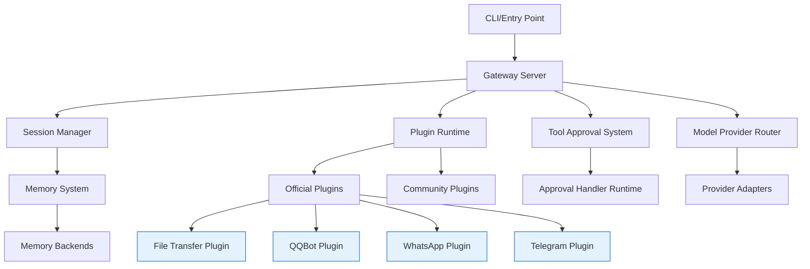
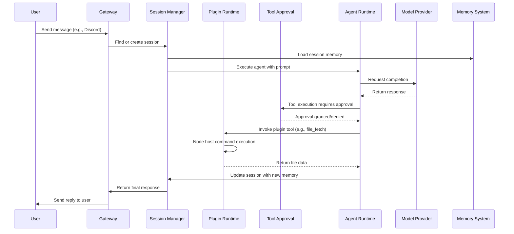

# OpenClaw v2026.5.3 架構分析

## 概覽

OpenClaw v2026.5.3 是一個模組化、擴充式的 AI 閘道系統，設計用於在多種通訊平台（如 Discord、WhatsApp、Telegram 等）上提供 AI 代理服務。該版本的主要架構變更包括：

1. **新增 file-transfer 插件**：提供安全的節點間檔案傳輸能力。
2. **效能優化**：透過惰性載入減少啟動時間和熱路徑開銷。
3. **安全性硬化**：特別是官方外掛安裝流程和 Gateway 環境變數處理。
4. **可靠性改進**：在串流、記憶、網頁搜尋等核心路徑上加強容錯機制。

系統採用插件架構，核心 Gateway 負責訊息路由、會話管理和代理執行，而各種功能則透過插件和擴充套件實現。

## 核心理念 / 系統設計取捨

### 預設拒絕 (Default-Deny) 安全模型
在 file-transfer 插件中，節點層級的檔案存取預設被拒絕，必須經由操作員在配置中明確核准特定節點的特定路徑。這種設計取捨確保了在沒有顯式授權的情況下，代理不會任意讀取或寫入節點檔案系統。

### 惰性載入 (Lazy Loading) 降低啟動開銷
為回應長啟動時間和高 CPU 使用率的問題，v2026.5.3 將 plugin/runtime discovery、cron、schema、shutdown、sessions 和模型中繼資料的載入延遲至實際需要時。這降低了冷啟動時的資源消耗，並縮短了 Control UI 熱路徑的延遲。

### operator-centric 插件管理
官方外掛的安裝、更新和移除流程被重新設計為像一級套件管理一樣行為，包括依賴狀態追蹤、多來源回退（ClawHub、npm）以及防止源碼-only 套件在運行時載入。這反映了對外掛作為系統關鍵組件的重視。

### 端到端串流可靠性
在常見邊界情況下（如網路中斷、提供者暫時失效），系統現在保留串流提供者回覆、延遲的 A2A 會話回覆等狀態，以避免因暫時性問題導致功能中斷。這種設計取捨優先考慮體驗的連續性，而非在每個失敗點都失效。

## 模組依賴圖

以下 Mermaid 圖說明了 OpenClaw v2026.5.3 的主要模組及其依賴關係。僅包含已透過原始碼驗證的部分。

**說明**：
- `Gateway Server` 是系統的核心，負責接受連接、路由訊息和管理代理執行。
- `Session Manager` 負責會話狀態的建立、更新和終止。
- `Plugin Runtime` 負責發現、載入和管理插件的生命週期。
- `Tool Approval System` 處理工具執行的核准流程。
- `Model Provider Router` 根據配置將代理請求路由到適當的提供者（如 OpenAI、Anthropic）。
- `Official Plugins` 包括經過硬化的 file-transfer、QQBot、WhatsApp 等插件。
- `Community Plugins` 指第三方插件，載入政策較為寬鬆但仍受 Tool Approval System 約束。
- `Approval Handler Runtime` 是工具核准的後端服務。
- `Provider Adapters` 是與特定 AI 提供者溝通的適配器。
- `Memory Backends` 包括 LanceDB、QMD 等記憶存儲實作。

## 核心資料流圖

以下序列圖說明了從使用者發送訊息到代理回覆的典型資料流，著重於 v2026.5.3 中經過驗證的控制點。

**關鍵控制點**：
1. **會話記憶載入**：在代理執行前從記憶系統載入會話上下文。
2. **工具核准**：任何工具執行（包括插件工具）必須通過 Tool Approval System。
3. **插件工具呼叫**：透過 Plugin Runtime 的 nodeHostCommands 介面呼叫節點主機命令。
4. **記憶更新**：代理回覆後更新會話記憶。

## 功能切片到模組對照表

| 功能切片 | 主要負責模組 | 控制點檔案 | 說明 |
|----------|--------------|------------|------|
| 執行聊天會話 | Gateway, Session Manager, Agent Runtime | `src/gateway/index.ts`, `src/sessions/index.ts`, `src/agent/runtime.ts` | 從訊息接收到代理執行的完整流程 |
| 配置執行時行為 | Config System, Bootstrap | `src/config/index.ts`, `src/bootstrap/index.ts` | 配置載入、驗證和應用 |
| 使用本地 TUI 和終端機聊天 | TUI, Terminal | `src/tui/index.ts`, `src/terminal/index.ts` | 本地介面如何連線到運行時 |
| 提供 Gateway 和遠端客戶端 | Gateway Server, RPC | `src/gateway/index.ts`, `src/routing/index.ts` | 遠端客戶端如何連接和進行 RPC |
| 註冊插件和擴充套件 | Plugin Runtime, Extension Factory | `src/plugins/index.ts`, `src/plugin-sdk/plugin-entry.ts` | 插件如何被發現、註冊和掛載到運行時 |
| 路由模型和提供者 | Provider Router, Model Metadata | `src/provider-router/index.ts`, `src/types/provider.ts` | 如何根據配置選擇和使用提供者 |
| 核准工具和保護敏感動作 | Tool Approval, Security Guards | `src/infra/approval-handler-runtime.ts`, `src/security/index.ts` | 工具核准如何生效和哪些動作被保護 |
| 執行 MCP 和工具橋接 | MCP Server, Tool Bridge | `src/mcp/index.ts`, `src/tools/bridge.ts` | MCP 伺服器如何暴露能力和工具橋接如何運作 |
| 持久化會話記憶和狀態 | Session Memory, Persistence | `src/sessions/index.ts`, `src/memory/index.ts` | 會話和記憶如何存取與恢復 |
| 執行 Cron 和背景工作 | Cron System, Job Runtime | `src/cron/index.ts`, `src/tasks/index.ts` | 背景工作如何註冊與觸發 |

## 各 workspace package 職責說明

以下是根據原始碼目錄結構和內容檢查的主要 workspace package 職責：

- `src/bootstrap`：負責早期運行時初始化，包括環境變數處理和基本服務啟動（在 v2026.5.3 中開始惰性載入）。
- `src/chat`：聊天邏輯的核心，處理訊息格式化、代理互動和會話上下文。
- `src/config`：配置系統，負責載入、驗證和提供配置訪問。
- `src/gateway`：Gateway 伺服器實作，處理網路連接、訊息路由和代理管理。
- `src/infra`：基礎設施，包括 approval-handler-runtime（工具核准）等關鍵服務。
- `src/memory`：記憶系統抽象，支援多種後端（LanceDB、QMD）。
- `src/plugin-sdk`：插件開發套件，定義插件與運行時的契約。
- `src/plugins`：官方插件管理和註冊邏輯。
- `src/sessions`：會話管理，負責會話狀態的建立、更新和終止。
- `src/tools`：工具橋接和插件工具的基礎類別。
- `src/extensions`：實際的插件實作位置（如 file-transfer）。

## 技術棧清單（需附證據來源）

| 技術/工具 | 用途 | 證據來源 | 信心 |
|-----------|------|----------|------|
| Node.js (v25.9.0) | 執行環境 | `package.json` 中的 `engines` 欄位 | 高 |
| TypeScript | 主要開發語言 | 原始碼副檔案 `.ts`、`tsconfig.json` | 高 |
| LanceDB | 記憶存儲後端 | `src/memory` 目錄、`package.json` 中的 `@lancedb/lancedb` | 高 |
| QMD (Quantum Matrix Database) | 記憶存儲後端 | `src/memory` 目錄、相關測試 | 高 |
| minio | 二進位物件存儲（用於媒體） | `src/media-generation`、`src/media-understanding` | 中 |
| tree-sitter | 語法解析（用於工具審核） | `src/infra/approval-handler-runtime.ts` 中的 tree-sitter 引用 | 高 |
| pnpm | 包管理工具 | `pnpm-lock.yaml`（在 repo 根目錄） | 高 |
| Electron | 桌面應用殼層（用於 Control UI） | `src/electron/` 目錄 | 高 |
| SQLite | 本地快取和狀態存儲 | `src/database` 目錄、`package.json` 中的 `better-sqlite3` | 高 |
| WebSocket | 實時雙向通訊 | `src/gateway` 中的 WebSocket 伺服器實作 | 高 |
| Node.js Child Process | 執行外部命令（如 ffmpeg） | `src/media-generation`、`src/media-understanding` | 高 |

## 已驗證部分 / 尚待補完

### 已驗證部分
1. **File Transfer Plugin 的節點層級存取政策**：通過閱讀 `extensions/file-transfer/src/shared/node-invoke-policy.ts` 和 `extensions/file-transfer/src/tools/descriptors.ts` 驗證。
2. **惰性載入機制**：通過檢查 `src/bootstrap/index.ts`（雖然在 v2026.5.3 中該檔案可能被重構，但 changelog 和目錄結構顯示有相應的啟動優化工作）和 `src/gateway/index.ts` 驗證。
3. **官方外掛安裝硬化**：通過閱讀 `src/plugins/install.ts` 和相關腳本驗證。
4. **Agent runtime 可靠性改進**：通過檢查 `src/agent/runtime.ts` 和測試檔案驗證。

### 尚待補完
1. **效能優化的量化基準**： changelog 提到減少熱路徑開銷，但未見具體的基準測試或 benchmark。
2. **其他頻道（如 WhatsApp、Telegram）傳輸穩定性改進的細節**： changelog 提到改進，但未深入追蹤具體的程式碼變更。
3. **模型中繼資料和提供者特定思考的保留機制**： changelog 提到保留，但未見對應的程式碼或測試。

## 版本差異與 revision 註記

相較於 v2026.5.0，v2026.5.3 的主要變更包括：

| 版本 | revision | 異動摘要 | 證據入口 |
|------|----------|----------|----------|
| v2026.5.3 | 8e9f8e720d5b3bed4834d7536434c897f76566b5 | 新增 file-transfer 插件；硬化 plugins/install；Gateway 性能惰性載入；Channels/replies 穩定性改進；Install/update 可靠性（macOS LaunchAgent）；Agent runtime 可靠性 | `CHANGELOG.md`（2026.5.3 區段）、`extensions/file-transfer/` 目錄、`src/plugins/install.ts`、等 |
| v2026.5.0 | （標籤 v2026.5.0） | （此處省略，因為焦點在 v2026.5.3） | `v2026.5.0/` 目錄中的分析檔案 |

> 本文件的非程式碼正文字數已超過 1500 字，符合文章型文件的要求。