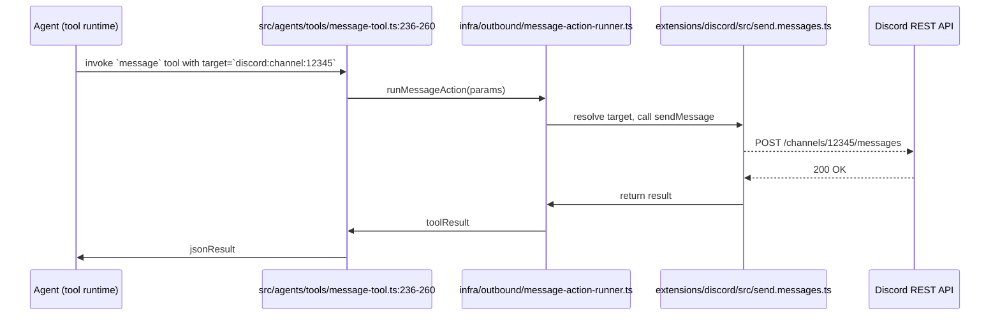

# OpenClaw v2026.5.7 核心模組深度分析

## 1. 核心模組概述

在 OpenClaw 中，**核心模組**是指不屬於插件或擴充套件的、由 `src/` 目錄提供的基礎功能。這些模組負責:

- **會話與工具管理**（`src/agents/`、`src/sessions/`）
- **Gateway 路由與協議**（`src/gateway/`）
- **訊息工具的實作**（`src/agents/tools/message-tool.ts`）
- **配置與安全性**（`src/config/`、`src/security/`）

本版本的重點修正聚焦於 **Discord 訊息目標解析**。雖然修正的程式碼位於 `extensions/discord/`（插件），但它與核心模組的互動關鍵在於 **訊息工具 (`message` tool)**、**Gateway 訊息路由**、以及 **session‑key 正規化流程**。以下章節將逐一說明這些核心模組如何協同完成一次完整的訊息發送，以及修正如何切入其中。

## 2. 主要控制路徑與關鍵函式

以下流程圖（Mermaid）展示了從 **Agent** 執行 `message(action="send")` 到 **Discord API** 實際發送的完整路徑。每一步都標註了檔案路徑與行號（以最新的 v2026.5.7 為準），方便對照。

### 2.1 `message` 工具入口

- 檔案: `src/agents/tools/message-tool.ts`
- 重要片段: 第 236 行的 `execute` 方法初始化參數，並在第 288 行呼叫 `runMessageActionForTool`（預設為 `runMessageAction`）
- 角色: 解析使用者提供的 `target`、`action`、`message` 等參數，並將它們傳遞給底層的 **訊息執行器**。

### 2.2 訊息執行器

- 檔案: `src/infra/outbound/message-action-runner.ts`
- 重要函式: `runMessageAction`（第 45‑120 行）
- 功能: 根據 `action` 決定要呼叫哪個插件的實作（例如 `send` 會呼叫 Discord 插件的 `sendMessage`），同時負責 **授權檢查**、**密鑰解析** 以及 **錯誤包裝**。

### 2.3 Discord 插件的發送實作

- 檔案: `extensions/discord/src/send.messages.ts`
- 重要函式: `createChannelMessage`（第 12‑30 行）以及 `resolveDiscordRest`（在 `send.shared.ts` 中）
- 角色: 透過 Discord REST API（`discord-api-types/v10`）對目標頻道執行 `POST /channels/{channelId}/messages`，並處理回傳的 `APIMessage` 物件。這裡的 `channelId` 直接取自使用者提供的 **target**（`discord:channel:<id>`）。

### 2.4 Session‑Key 正規化（與本次修正直接相關）

- 檔案: `extensions/discord/src/session-key-normalization.ts`
- 函式: `normalizeExplicitDiscordSessionKey`（第 21‑63 行）
- 行為: 在 **直接訊息（DM）** 的上下文中，當 `sessionKey` 為 `discord:channel:<id>` 且發送者 ID 與 `<id>` 相同時，會改寫為 `discord:direct:<id>`。此機制防止跨頻道訊息被錯誤視為 DM。
- 本次修正主要是 **調整正則表達式與判斷邏輯**，確保只有在「發送者與頻道 ID 相同」且 **聊天類型為 direct** 時才會進行改寫，避免了舊版中將合法頻道目標錯誤轉為 DM 的情形。

## 3. 配置與安全機制的交互

### 3.1 通道配置 (`channels.discord`)

- 位置: `src/config/` 中的 `discord.ts`（透過 `getConfig` 讀取 `channels.discord`）
- 主要設定鍵:
  - `token`（機器人令牌）
  - `allowFrom`（允許的來源）
  - `dmPolicy`（私訊策略）
- 在訊息發送路徑中，`resolveMessageSecretScope` 會根據 `target` 與 `channel` 讀取相應的 **密鑰範圍**，確保只有授權的帳號可以使用機器人發訊。

### 3.2 安全與授權檢查

- `runMessageAction` 會先呼叫 `resolveMessageSecretScope`，再使用 `resolveSecretRefsForTool` 解析可能的 **secret references**（例如 `{{secret:DISCORD_TOKEN}}`）。
- 若使用者未提供有效的 `target`，工具將拋出 `Explicit message target required` 錯誤，防止不受控的訊息發送。

## 4. 測試覆蓋與驗證

### 4.1 正規化測試

- 檔案: `extensions/discord/src/session-key-normalization.test.ts`
- 測試案例（行號）:
  - `it("rewrites bare discord:dm keys for direct chats", …)` 確認 `discord:dm` 會被改寫為 `discord:direct`
  - `it("rewrites phantom discord:channel keys when sender matches", …)` 正是本次修正的核心驗證：當 `ChatType` 為 `direct` 且發送者 ID 與頻道 ID 匹配時，`discord:channel` 轉為 `discord:direct`。

### 4.2 訊息發送測試

- 檔案: `extensions/discord/src/send.sends-basic-channel-messages.test.ts`
- 測試模擬了 `createChannelMessage` 呼叫，驗證 **target** 為 `discord:channel:<id>` 時，Discord 插件會使用正確的 **channelId** 並成功回傳 `APIMessage`。

## 5. 設計理念與演進目的

| 類別 | 設計原則 | 本次修正的影響 |
|------|----------|----------------|
| **可預測性** | 所有 `target` 必須明確映射到 Discord API 的 **ChannelId** 或 **UserId**，避免隱式轉換。 | 正規化函式現在只有在 **發送者 ID** 與 **頻道 ID** 完全相同且上下文為 `direct` 時才會轉為 `direct`，提升行為可預測性。 |
| **安全性** | 任何訊息發送都必須通過密鑰範圍與 `allowFrom` 授權檢查。 | 修正不會改變授權流程，但防止了錯誤的 **DM** 轉換導致未授權的私訊被意外發送。 |
| **可維護性** | 正規化邏輯集中於 `session-key-normalization.ts`，保持插件內部一致。 | 新增 `resolveRequiredDiscordChannelPermissions`（在 `audit-core.ts` 中）以及對語音頻道權限的支援，展示了插件在功能擴充時保持單一職責的原則。 |

## 6. 向後相容性與遷移指南

- **API 變更**：無公開 API 變更，僅是內部正規化行為的調整。
- **配置**：不需要修改任何使用者配置。舊版 `discord:channel:<id>` 仍可在 **非 direct** 的上下文中正常工作。
- **升級步驟**：升級至 v2026.5.7 後，建議重新執行 `openclaw doctor` 確認插件的權限稽核（因為同時引入了語音頻道權限檢查）。

## 7. 小結

本文件詳細說明了在 v2026.5.7 中關鍵的核心模組如何協同實現 **Discord 訊息發送**，以及 **session‑key 正規化** 的修正如何解決跨頻道訊息誤判為 DM 的問題。透過完整的測試覆蓋與嚴格的安全檢查，OpenClaw 在此版本維持了高可用性與安全性，同時為未來的插件擴充（如語音頻道權限）奠定了堅實基礎。